# tcp 进阶

#### 我们已经介绍了以下几种分组格式： I P、I C M P、I G M P、U D P和T C P。每一种格式的首部中均包含一个检验和。对每种分组，说明检验和包括I P数据报中的哪些部分，以及该检验和是强制的还是可选的

除了UDP的检验和，其他都是必需的。IP检验和只覆盖了IP首部，而其他字段都紧接着IP首部开始。

#### 为什么我们已经讨论的所有I n t e r n e t协议（I P, ICMP, IGMP, UDP, TCP）收到有检验和错的分组都仅作丢弃处理？

源IP地址、源端口号或者协议字段可能被破坏了。

#### T C P提供了一种字节流服务，而收发双方都不保持记录的边界。应用程序如何提供它们自己的记录标识？

很多Internet应用使用一个回车和换行来标记每个应用记录的结束。这是NVT ASCII采用的编码（26.4节）。另外一种技术是在每个记录之前加上一个记录的字节计数，DNS（习题14.4）和Sun RPC（29.2节）采用了这种技术。

#### 为什么在T C P首部的开始便是源和目的的端口号？

就像我们在6.5节所看到的，一个ICMP差错报文必须至少返回引起差错的IP数据报中除了IP首部的前8个字节。当TCP收到一个ICMP差错报文时，它需要检查两个端口号以决定差错对应于哪个连接。因此，端口号必须包含在TCP首部的前8个字节里。

#### 为什么TCP 首部有一个首部长度字段而UDP首部中却没有？

TCP首部的最后有一些选项，但UDP首部中没有选项。

#### SYN 初始值 ISN 规律

当一端为建立连接而发送它的S Y N时，它为连接选择一个初始序号。I S N随时间而变化，因此每个连接都将具有不同的I S N。RFC 793 指出ISN可看作是一个 32 比特的计数器，每4 ms加1。这样选择序号的目的在于防止在网络中被延迟的分组在以后又被传送，而导致某个连接的一方对它作错误的解释。

#### 全双工的体现

既然一个T C P连接是全双工（即数据在两个方向上能同时传递），因此每个方向必须单独地进行关闭。这原则就是当一方完成它的数据发送任务后就能发送一个F I N来终止这个方向连接。当一端收到一个F I N，它必须通知应用层另一端几经终止了那个方向的数据传送。发送F I N通常是应用层进行关闭的结果。收到一个F I N只意味着在这一方向上没有数据流动。一个T C P连接在收到一个F I N后仍能发送数据。而这对利用半关闭的应用来说是可能的，尽管在实际应用中只有很少的T C P应用程序这样做。


#### MSS 多大？怎么确定的？

它并不是任何条件下都可协商。当建立一个连接时，每一方都有用于通告它期望接收的M S S选项（M S S选项只能出现在S Y N报文段中）。如果一方不接收来自另一方的MSS值，则MSS就定为默认值536字节（这个默认值允许2 0字节的I P首部和20字节的TCP首部以适合576字节I P数据报)。

#### time_wait 的坏处

当T C P执行一个主动关闭，并发回最后一个A C K，该连接必须在T I M E_WA I T状态停留的时间为2倍的M S L。这样可让T C P再次发送最后的A C K以防这个A C K丢失（另一端超时并重发最后的F I N）。

这种2 MSL等待的另一个结果是这个TCP连接在2 MSL等待期间，定义这个连接的插口（客户的I P地址和端口号，服务器的I P地址和端口号）不能再被使用。这个连接只能在2 MSL结束后才能再被使用。服务器通常执行被动关闭，不会进入TIME_WAIT状态。这暗示如果我们终止一个客户程序，并立即重新启动这个客户程序，则这个新客户程序将不能重用相同的本地端口。这不会带来什么问题，因为客户使用本地端口，而并不关心这个端口号是什么。然而，对于服务器，情况就有所不同，因为服务器使用熟知端口。如果我们终止一个已经建立连接的服务器程序，并试图立即重新启动这个服务器程序，服务器程序将不能把它的这个熟知端口赋值给它的端点，因为那个端口是处于2 MSL连接的一部分。在重新启动服务器程序前，它需要在1 ~ 4分钟。

#### RST 复位什么时候发出

一般说来，**无论何时一个报文段发往基准的连接（ referenced connection）出现错误， T C P都会发出一个复位报文段（这里提到的“基准的连接”是指由目的I P地址和目的端口号以及源I P地址和源端口号指明的连接。这就是为什么RFC 793称之为插口）。**

产生复位的一种常见情况是当连接请求到达时，目的端口没有进程正在听。

发送一个复位报文段而不是F I N来中途释放一个连接。有时称这为异常释放（abortive release）。异常终止一个连接对应用程序来说有两个优点：（1）丢弃任何待发数据并立即发送复位报文段；（2）R S T的接收方会区分另一端执行的是异常关闭还是正常关闭。应用程序使用的A P I必须提供产生异常关闭而不是正常关闭的手段，R S T报文段中包含一个序号和确认序号。需要注意的是R S T报文段不会导致另一端产生任何响应，另一端根本不进行确认。收到R S T的一方将终止该连接，并通知应用层连接复位。

#### TCP 选项有什么


1. 窗口扩大选项使T C P的窗口定义从16 bit增加为32 bit。这并不是通过修改T C P首部来实现的， T C P首部仍然使用16 bit ，而是通过定义一个选项实现对16 bit 的扩大操作( s c a l i n go p e r a t i o n )来完成的。于是T C P在内部将实际的窗口大小维持为32 bit的值。
2. 时间戳选项使发送方在每个报文段中放置一个时间戳值。接收方在确认中返回这个数值，从而允许发送方为每一个收到的A C K计算RT T（我们必须说“每一个收到的A C K”而不是“每一个报文段”，是因为T C P通常用一个A C K来确认多个报文段）。我们提到过目前许多实现为每一个窗口只计算一个RT T，对于包含8个报文段的窗口而言这是正确的。然而，较大的窗口大小则需要进行更好的RT T计算。
3. 最大报文传输段（Maximum Segment Size ---MSS）
4. 选择确认选项（Selective Acknowledgements --SACK）

#### 半打开连接和半关闭连接的区别是什么？

在一个**半关闭**的连接上，一个端点已经发送了一个FIN，正等待另一端的数据或者一个FIN。

一个**半打开**的连接是当一个端点崩溃了，而另一端还不知道的情况。

**未连接队列**：在三次握手协议中，服务器维护一个未连接队列，该队列为每个客户端的SYN包（syn=j）开设一个条目，该条目表明服务器已收到 SYN包，并向客户发出确认，正在等待客户的确认包。这些条目所标识的连接在服务器处于Syn_RECV状态，当服务器收到客户的确认包时，删除该条目， 服务器进入ESTABLISHED状态。

#### ACK延迟确认机制

接收方在收到数据后，并不会立即回复ACK，而是延迟一定时间。一般ACK延迟发送时间为200ms，但是这个200ms并非收到数据后需要延迟的时间。系统有一个固定的定时器每隔200ms会来检查是否需要发送ACK包。这样做有2个目的：

1. 这样做的目的是ACK是可以合并的，也就是指如果连续收到两个TCP包，并不一定需要ACK两次，只要回复最终的ACK就可以了，可以降低网络流量。
2. 如果接收方有数据要发送，那么就会在发送数据的TCP数据包里，带上ACK信息。这样做，可以避免大量的ACK以一个单独的TCP包发送，减少了网络流量。

#### SACK(Selective Acknowledgment)

SACK是一个TCP的选项，来允许TCP单独确认非连续的片段，用于告知真正丢失的包，只重传丢失的片段。要使用SACK，2个设备必须同时支持SACK才可以，建立连接的时候需要使用SACK Permitted的option，如果允许，后续的传输过程中TCP segment中的可以携带SACK option，这个option内容包含**一系列的非连续的没有确认的数据的seq range**。

TCP收到乱序数据后会将其放到乱序序列中，然后发送重复ACK给对端。对端如果收到多个重复的ACK，认为发生丢包，TCP会重传最后确认的包开始的后续包。这样原先已经正确传输的包，可能会重复发送，降低了TCP性能。为改善这种情况，发展出SACK技术，使用SACK选项可以告知发包方收到了哪些数据，发包方收到这些信息后就会知道哪些数据丢失，然后立即重传丢失的部分。


#### **SACK 重传**

1. 未启用 SACK 时，TCP 重复 ACK 定义为收到连续相同的 ACK seq。[RFC5681]
2. 启用 SACK 时，携带 SACK 的 ACK 也被认为重复 ACK。[RFC6675]

SACK option格式

Kind 5  Length  剩下的都是没有确认的segment的range了 比如说segment 501-600 没有被确认，那么Left Edge of 1st Block = 501，Right Edge of 1st Block = 600，**TCP的选项不能超过40个字节，所以边界不能超过4组**。

#### Nagle算法

在局域网上，小分组（被称为微小分组（ t i n y g r a m））通常不会引起麻烦，因为局域网一般不会出现拥塞。但在广域网上，这些小分组则会增加拥塞出现的可能。

该算法要求一个T C P连接上最多只能有一个未被确认的未完成的小分组，在该分组的确认到达之前不能发送其他的小分组。相反， T C P收集这些少量的分组，并在确认到来时以一个分组的方式发出去。该算法的优越之处在于它是自适应的：确认到达得越快，数据也就发送得越快。而在希望减少微小分组数目的低速广域网上，则会发送更少的分组。

插口API用户可以使用 **TCP_NODELAY** 选项来关闭Nagle算法。

#### Karn算法

当一个超时和重传发生时，在重传数据的确认最后到达之前，不能更新RT T估计器，因为我们并不知道A C K对应哪次传输（也许第一次传输被延迟而并没有被丢弃，也有可能第一次传输的A C K被延迟）并且，由于数据被重传， RTO已经得到了一个指数退避，我们在下一次传输时使用这个退避后的RTO。对一个没有被重传的报文段而言，除非收到了一个确认，否则不要计算新的RTO。

K a r n算法在分组丢失时可以不测量RT T就能解决重传的二义性问题。

#### 快重传：3次相同的ack后会进入慢启动吗？

No，在这种情况下没有执行慢启动的原因是由于收到重复的A C K不仅仅告诉我们一个分组丢失了。由于接收方只有在收到另一个报文段时才会产生重复的A C K，而该报文段已经离开了网络并进入了接收方的缓存。也就是说，在收发两端之间仍然有流动的数据，而我们不想执行慢启动来突然减少数据流。


流程

1) 当收到第3个重复的A C K时，将s s t h re s h设置为当前拥塞窗口c w n d的一半。重传丢失的报文段。设置c w n d为s s t h r e s h加上3倍的报文段大小。

2) 每次收到另一个重复的A C K时， c w n d增加1个报文段大小并发送1个分组（如果新的 c w n d允许发送）。

3) 当下一个确认新数据的A C K到达时，设置c w n d为s s t h re s h（在第1步中设置的值）。这个A C K应该是在进行重传后的一个往返时间内对步骤1中重传的确认。另外，这个A C K也应该是对丢失的分组和收到的第1个重复的A C K之间的所有中间报文段的确认。这一步采用的是拥塞避免，因为当分组丢失时我们将当前的速率减半。

#### 保活计时器的作用？

TCP的Keepalive，目的在于看看对方有没有发生异常，如果有异常就及时关闭连接。当传输双方不主动关闭连接时，就算双方没有交换任何数据，连接也是一直有效的。保活定时器每隔一段时间会超时，超时后会检查连接是否空闲太久了，如果空闲的时间超过了设置时间，就会发送探测报文。然后通过对端是否响应、响应是否符合预期，来判断对端是否正常，如果不正常，就主动关闭连接，而不用等待HTTP层的关闭了。

参考 ： https://blog.csdn.net/zhangskd/article/details/44177475

#### SYN Cookies

在最常见的SYN Flood攻击中，攻击者在短时间内发送大量的TCP SYN包给受害者。受害者(服务器)为每个TCP SYN包分配一个特定的数据区，只要这些SYN包具有不同的源地址(攻击者很容易伪造)。这将给TCP服务器造成很大的系统负担，最终导致系统不能正常工作。

SYN Cookie是对TCP服务器端的三次握手做一些修改，专门用来防范SYN Flood攻击的一种手段。它的原理是，在TCP服务器接收到TCP SYN包并返回TCP SYN + ACK包时，**不分配一个专门的数据区，而是根据这个SYN包计算出一个cookie值**。这个cookie作为将要返回的SYN ACK包的初始序列号。当客户端返回一个ACK包时，根据包头信息计算cookie，与返回的确认序列号(初始序列号 + 1)进行对比，如果相同，则是一个正常连接，然后，分配资源，建立连接。

cookie的计算：服务器收到一个SYN包，计算一个消息摘要mac。

#### TIME_WAIT快速回收与重用

https://blog.csdn.net/dog250/article/details/13760985

Linux实现了一个TIME_WAIT状态**快速回收**的机制，即无需等待两倍的MSL这么久的时间，而是等待一个Retrans时间即释放，也就是等待一个重传时间(一般超级短，以至于你都来不及能在netstat -ant中看到TIME_WAIT状态)随即释放。释放了之后，一个连接的tuple元素信息就都没有了。在快速释放掉TIME_WAIT连接之后，peer依然保留着。丢失的仅仅是端口信息。不过有了peer的IP地址信息以及TCP最后一次触摸它的时间戳就足够了，TCP规范给出一个优化，即一个新的连接除了同时触犯了以下几点，其它的均可以快速接入，即使它本应该处在TIME_WAIT状态(但是被即快速回收了)：
**1.来自同一台机器的TCP连接携带时间戳；
2.之前同一台peer机器(仅仅识别IP地址，因为连接被快速释放了，没了端口信息)的某个TCP数据在MSL秒之内到过本机；
3.新连接的时间戳小于peer机器上次TCP到来时的时间戳，且差值大于重放窗口戳。**

**建议：**如果前端部署了三/四层NAT设备，尽量关闭快速回收，以免发生NAT背后真实机器由于时间戳混乱导致的SYN拒绝问题。

TW**重用** 有相关的规范，即：如果能保证以下任意一点，一个TW状态的四元组(即一个socket连接)可以重新被新到来的SYN连接使用：

**1.初始序列号比TW老连接的末序列号大**
**2.如果使能了时间戳，那么新到来的连接的时间戳比老连接的时间戳大**

#### BBR 算法

BBR 全称 bottleneck bandwidth and round-trip propagation time。基于包丢失检测的 Reno、NewReno 或者 cubic 为代表，其主要问题有 Buffer bloat 和长肥管道两种。和这些算法不同，bbr 算法会时间窗口内的最大带宽 max_bw 和最小 RTT min_rtt，并以此计算发送速率和拥塞窗口。

当没有足够的数据来填满管道时，RTprop 决定了流的行为；当有足够的数据填满时，那就变成了 BtlBw 来决定。这两条约束交汇在点 **inflight =BtlBw\*RTprop，也就是管道的 BDP（带宽与时延的乘积）**。当管道被填满时，那些超过的部分（inflight-BDP）就会在瓶颈链路中制造了一个队列，从而导致了 RTT 的增大。当数据继续增加直到填满了缓存时，多余的报文就会被丢弃了。拥塞就是发生在 BDP 点的右边，而拥塞控制算法就是来控制流的平均工作点离 BDP 点有多远。


#### TCP 参数

**Backlog**参数：表示未连接队列的最大容纳数目。

**SYN-ACK 重传次数**：　服务器发送完SYN－ACK包，如果未收到客户确认包，服务器进行首次重传，等待一段时间仍未收到客户确认包，进行第二次重传，如果重传次数超 过系统规定的最大重传次数，系统将该连接信息从半连接队列中删除。注意，每次重传等待的时间不一定相同。

**半连接存活时间**：是指半连接队列的条目存活的最长时间，也即服务从收到SYN包到确认这个报文无效的最长时间，该时间值是所有重传请求包的最长等待时间总和。有时我们也称半连接存活时间为Timeout时间、SYN_RECV存活时间。

**开启SYN Cookies** ： net.ipv4.tcp_syncookies = 1

**开启timewait重用**。允许将TIME-WAIT sockets重新用于新的TCP连接，默认为0 ：net.ipv4.tcp_tw_reuse = 1

**开启TCP连接中TIME-WAIT sockets的快速回收**，默认为0，表示关闭；net.ipv4.tcp_tw_recycle = 1

tw 时间 ： net.ipv4.tcp_fin_timeout 修改系統默认的 TIMEOUT 时间

当keepalive起用的时候，**TCP发送keepalive消息的频度**。缺省是2小时，改为20分钟(20*60s)
net.ipv4.tcp_keepalive_time = 1200

参考https://blog.csdn.net/abv123456789/article/details/50236919


# IQ

如果你是一名艾滋病患者，那么经过检测后，结果显示为阳性的概率为 99% 。如果你并 没有携带艾滋病毒，经过检测后，结果显示为阳性的概率仅为 1% 。也就是说，这种设备较为可靠， 不论你是否患有艾滋病，它基本能作出正确的判断。假如现在，用艾滋病检测试纸对自己进行一次 检测，检测结果显示是阳性，那请问你觉得自己得艾滋病的概率是多大？患艾滋病的概率是 1/10000 . 

https://bayes-stat.github.io/download/largescale/%E7%96%BE%E7%97%85%E6%A3%80%E6%B5%8B%E4%B8%8E%E8%B4%9D%E5%8F%B6%E6%96%AF%E5%85%AC%E5%BC%8F.pdf

> 当随机从总体中抽出一个人，利用检测试纸进行检 测，如果检测结果呈阳性，并不意味着这个人一定患病，他患病的可能性仅有 1%。


# NAT


#### Linux 配置SNAT上网

https://www.voidking.com/dev-linux-snat/

# 网络


## 概述

**物理层** OSI 模型的最低层或第一层，该层包括物理连网媒介，如电缆连线连接器。物理层的协议产生并检测电压以便发送和接收携带数据的信号。在你的[桌面](http://baike.baidu.com/view/79807.htm)PC 上插入[网络接口卡](http://baike.baidu.com/view/547393.htm)，你就建立了计算机连网的基础。换言之，你提供了一个物理层。尽管物理层不提供纠错服务，但它能够设定[数据传输速率](http://baike.baidu.com/view/434019.htm)并监测数据出错率。网络物理问题，如电线断开，将影响物理层。用户要传递信息就要利用一些物理媒体，如双绞线、同轴电缆等，但具体的物理媒体并不在OSI的7层之内，有人把物理媒体当做第0层，物理层的任务就是为它的上一层提供一个物理连接，以及它们的机械、电气、功能和过程特性。如规定使用电缆和接头的类型、传送信号的电压等。在这一层，数据还没有被组织，仅作为原始的位流或电气电压处理，单位是bit比特。 

**数据链路层** OSI模型的第二层，它控制[网络层](http://baike.baidu.com/view/239600.htm)与物理层之间的通信。它的主要功能是如何在不可靠的物理线路上进行数据的可靠传递。为了保证传输，从网络层接收到的数据被分割成特定的可被物理层传输的帧。帧是用来移动数据的结构包，它不仅包括原始数据，还包括发送方和接收方的物理地址以及检错和控制信息。其中的地址确定了帧将发送到何处，而纠错和控制信息则确保帧无差错到达。 如果在传送数据时，接收点检测到所传数据中有差错，就要通知发送方重发这一帧。数据链路层的功能独立于网络和它的节点和所采用的物理层类型，它也不关心是否正在运行 Word 、Excel 或使用Internet。有一些连接设备，如[交换机](http://baike.baidu.com/view/1077.htm)，由于它们要对帧解码并使用帧信息将数据发送到正确的接收方，所以它们是工作在数据链路层的。在物理层提供比特流服务的基础上，建立相邻结点之间的数据链路，通过差错控制提供数据帧（Frame）在信道上无差错的传输，并进行各电路上的动作系列。数据链路层在不可靠的物理介质上提供可靠的传输。该层的作用包括：物理地址寻址、数据的[成帧](http://baike.baidu.com/view/3871125.htm)、流量控制、数据的检错、重发等。数据链路层协议的代表包括：[SDLC](http://baike.baidu.com/view/206610.htm)、[HDLC](http://baike.baidu.com/view/89174.htm)、[PPP](http://baike.baidu.com/view/30514.htm)、[STP](http://baike.baidu.com/view/28816.htm)、[帧中继](http://baike.baidu.com/view/21773.htm)等。

 **网络层** OSI 模型的第三层，其主要功能是决定如何将数据从发送方路由到接收方。网络层通过综合考虑发送优先权、[网络拥塞](http://baike.baidu.com/view/1452069.htm)程度、服务质量以及可选路由的花费来决定从一个网络中节点A 到另一个网络中节点B 的最佳路径。由于网络层处理，并智能指导数据传送，[路由器](http://baike.baidu.com/view/1360.htm)连接网络各段，所以路由器属于网络层。在网络中，“路由”是基于编址方案、使用模式以及可达性来指引数据的发送。网络层负责在源机器和目标机器之间建立它们所使用的路由。这一层本身没有任何错误检测和修正机制，因此，网络层必须依赖于端端之间的由DLL提供的可靠传输服务。网络层用于本地LAN网段之上的[计算机系统](http://baike.baidu.com/view/1130583.htm)建立通信，它之所以可以这样做，是因为它有自己的路由地址结构，这种结构与第二层机器地址是分开的、独立的。这种协议称为路由或可路由协议。路由协议包括IP、Novell公司的IPX以及Apple Talk协议。网络层是可选的，它只用于当两个计算机系统处于不同的由路由器分割开的网段这种情况，或者当通信应用要求某种网络层或传输层提供的服务、特性或者能力时。例如，当两台主机处于同一个LAN网段的直接相连这种情况，它们之间的通信只使用LAN的通信机制就可以了(即OSI 参考模型的一二层)。

**传输层** 传输协议同时进行流量控制或是基于接收方可接收数据的快慢程度规定适当的发送速率。除此之外，传输层按照网络能处理的最大尺寸将较长的数据包进行强制分割。例如，以太网无法接收大于1500字节的数据包。发送方节点的传输层将[数据分割](http://baike.baidu.com/view/4466818.htm)成较小的数据片，同时对每一数据片安排一序列号，以便数据到达接收方节点的传输层时，能以正确的顺序重组。该过程即被称为排序。工作在传输层的一种服务是 TCP/IP 协议套中的TCP （Transport Control Protocol，[传输控制协议](http://baike.baidu.com/view/544903.htm)），UDP (User Packet Data，用户数据报协议)，另一项传输层服务是IPX/SPX协议集的SPX（序列包交换）。

### 物理层和链路层

物理层的线路有传输介质与通信设备组成，比特流在传输介质上传输时肯定会存在误差的。这样就引入了数据链路层在物理层之上，采用差错检测、差错控制和流量控制等方法，向网络层提供高质量的数据传输服务。对于网络层，由于链路层的存在，而不需要关心物理层具体采用了那种传输介质和通信设备。

## **那链路层的功能有哪些呢？需要完成哪些事情呢？**

1. 链路管理，帧同步
2. 流量控制，差错控制
3. 数据和控制信息分开
4. 透明传输和**寻址**

## 网络层和传输层的作用

网络层只把分组发送到目的主机，但是真正通信的并不是主机而是主机中的进程。传输层提供了进程间的逻辑通信，传输层向高层用户屏蔽了下面网络层的核心细节，使应用程序看起来像是在两个传输层实体之间有一条端到端的逻辑通信信道。


## PPP

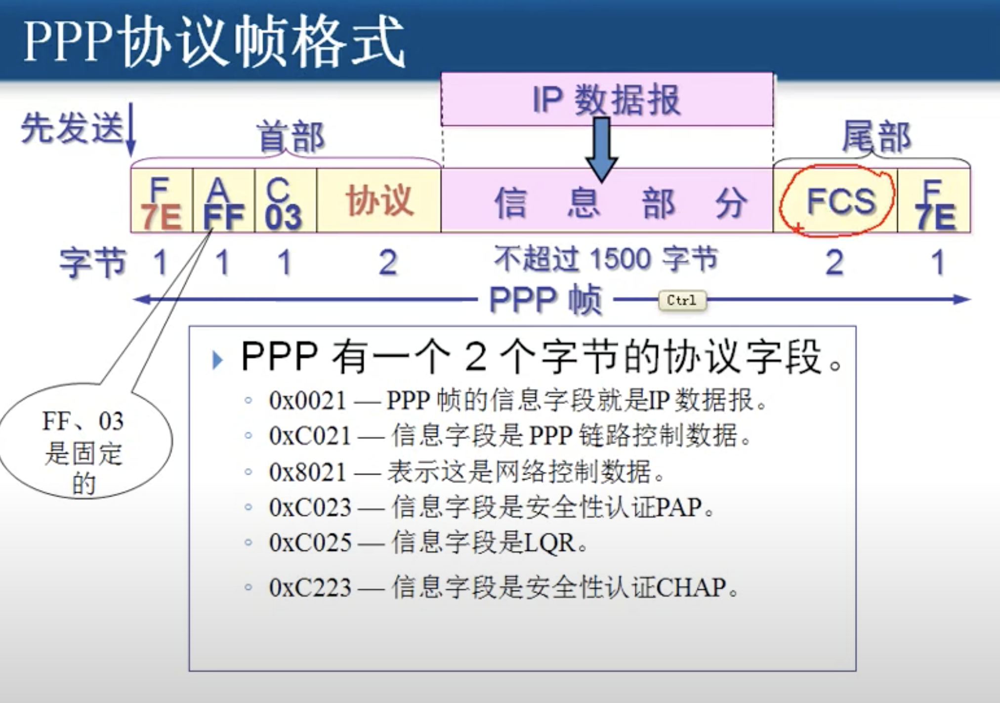

### 透明传输的基本概念：

数据透明传输就是用户不受协议中的任何限制，可随机的传输任意比特编码的信息
用户可以完全不必知道协议中所规定的结束段的比特编码或者其他的控制字符，因而不受限制的进行传输。
数据透明传输技术：

转义字符填充法
零比特填充法
采用特殊的信号与编码法：IEEE802.3(由于使用CSMA/CD协议，没有结束字符段；IEEE802.4（令牌总线，在起始定界符SD/结束定界符ED这两个字段被使用模拟编码，而不是0和1）；IEEE802.5（令牌环，违例的曼切斯特码）
确定长度法，固定数据段长度法：各控制字段的长度固定，数据段长度也是固定的，那么在帧格式中就不必设结束符，也不必设数据长度字段。
————————————————
原文链接：https://blog.csdn.net/xie294777315/java/article/details/24176611

## MAC 地址

MAC 地址是链路层地址，长度为 6 字节（48 位），用于唯一标识网络适配器（网卡）。一台主机拥有多少个网络适配器就有多少个 MAC 地址。例如笔记本电脑普遍存在无线网络适配器和有线网络适配器，因此就有两个 MAC 地址。


### 链路层三个基本问题

1. 将网络层传下来的分组添加首部和尾部，用于标记帧的开始和结束。

2. 透明表示一个实际存在的事物看起来好像不存在一样。帧使用首部和尾部进行定界，如果帧的数据部分含有和首部尾部相同的内容，那么帧的开始和结束位置就会被错误的判定。需要在数据部分出现首部尾部相同的内容前面插入转义字符。如果数据部分出现转义字符，那么就在转义字符前面再加个转义字符。在接收端进行处理之后可以还原出原始数据。这个过程透明传输的内容是转义字符，用户察觉不到转义字符的存在。


3. 差错校验目前数据链路层广泛使用了循环冗余检验（CRC）来检查比特差错。

## ip数据报


- **版本** : 有 4（IPv4）和 6（IPv6）两个值；
- **首部长度** : 占 4 位，因此最大值为 15。值为 1 表示的是 1 个 32 位字的长度，也就是 4 字节。因为固定部分长度为 20 字节，因此该值最小为 5。如果可选字段的长度不是 4 字节的整数倍，就用尾部的填充部分来填充。
- **区分服务** : 用来获得更好的服务，一般情况下不使用。
- **总长度** : 包括首部长度和数据部分长度。
- **生存时间** ：TTL，它的存在是为了防止无法交付的数据报在互联网中不断兜圈子。以路由器跳数为单位，当 TTL 为 0 时就丢弃数据报。
- **协议** ：指出携带的数据应该上交给哪个协议进行处理，例如 ICMP、TCP、UDP 等。
- **首部检验和** ：因为数据报每经过一个路由器，都要重新计算检验和，因此检验和不包含数据部分可以减少计算的工作量。
- **标识** : 在数据报长度过长从而发生分片的情况下，相同数据报的不同分片具有相同的标识符。
- **片偏移** : 和标识符一起，用于发生分片的情况。片偏移的单位为 8 字节。
- 

### ip 地址分类

IP 地址 ::= {< 网络号 >, < 主机号 >}


10. ### 子网

   通过在主机号字段中拿一部分作为子网号，把两级 IP 地址划分为三级 IP 地址。

   IP 地址 ::= {< 网络号 >, < 子网号 >, < 主机号 >}

   要使用子网，必须配置子网掩码。一个 B 类地址的默认子网掩码为 255.255.0.0，如果 B 类地址的子网占两个比特，那么子网掩码为 11111111 11111111 11000000 00000000，也就是 255.255.192.0。

   注意，外部网络看不到子网的存在。

11. ### ICMP

   ICMP 是为了更有效地转发 IP 数据报和提高交付成功的机会。它封装在 IP 数据报中，但是不属于高层协议。

   

   

   ICMP 报文分为差错报告报文和询问报文。

   

## ARP(Address Resolution Protocol，地址解析协议) 

在局域网中获取目的 IP 地址对应的 MAC 地址：源主机会向当前局域网中发送 ARP 请求，目标的 MAC 地址是 `FF-FF-FF-FF-FF-FF`，这表示当前请求是一个广播请求，局域网内的所有设备都会收到该请求；接收到 ARP 请求的主机都会检查目的 IP 和自己的 IP 地址是否一致；

1. 如果 IP 地址不一致，主机会忽略当前的 ARP 请求；
2. 如果 IP 地址一致，主机会直接向源主机发送 ARP 响应；

源主机在接收到 ARP 的响应之后，会更新本地的缓存表并继续向目的主机发送数据；

## [1. Ping]

Ping 是 ICMP 的一个重要应用，主要用来测试两台主机之间的连通性。

Ping 的原理是通过向目的主机发送 ICMP Echo 请求报文，目的主机收到之后会发送 Echo 回答报文。Ping 会根据时间和成功响应的次数估算出数据包往返时间以及丢包率。

ping+一个公网地址，网络层及以下会发生什么

1. 判断是不是外网；

2. arp 找路由器的mac地址，ping -> icmp request, mac destination  

3. 当路由器收到主机A发过来的ICMP报文，发现自己的目的地址是其本身MAC地址，根据目的的IP2.1.1.1，查路由表，发现2.1.1.1/24的路由表项，得到一个出口指针，去掉原来的MAC头部，加上自己的MAC地址向主机C转发。(如果网关也没有主机C的MAC地址，还是要向前面一个步骤一样，ARP广播一下即可相互学到。路由器2端口能学到主机D的MAC地址，主机D也能学到路由器2端口的MAC地址。)报文格式如下：

   

4. 最后，在主机C已学到路由器2端口MAC地址，路由器2端口转发给路由器1端口，路由1端口学到主机A的MAC地址的情况下，他们就不需要再做ARP解析，就将ICMP的回显请求回复过来。报文格式大致如下: 

5. 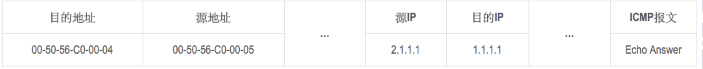


三层转发
 三层转发是什么？简单来说就是通过路由器的在不同网段间的转发。工作在TCP/IP网络模型的第三层。

 三层转发可以很复杂，也可以很简单。

其实打开网页，进入百度的过程就是一个三层转发，因为这个过程肯定使用了路由器，并且肯定是进入了不同的网段。但是这个过程十分复杂，需要涉及多个路由器（少则十几，多则几十。），并且涉及到了路由器的另一大功能nat，即网络地址转换。

 当然也有简单的三层转发，可以使用能够配置VLAN的路由器，连接两台设备。这样数据报通过路由器，并且还设计到不同的网段（子网）。VALN和子网的关系另外再介绍

PC1（192.168.0.2）----------------(eth0（192.168.0.1） 路由器 eth1（192.168.1.1）)------------------PC2（192.168.1.2）

则过程

1、  PC1想要ping PC2。

2、  PC1上层已知PC2的IP地址，并将数据报配置完毕。但是需要查询路由表，确认路径

3、  通过查询PC1的路由表，通过路由表选路原则，从众多的路由条目中确认，必须从接口（192.168.0.2）发出，发送到网关（192.168.0.1）。

4、  然后必须知道网关的MAC地址（路由器的IP地址）。从ARP缓存中去查询，没有就发送ARP广播

5、  接口eht0获得广播报文，并将报文上传给路由器的CPU。路由器判断是在询问它的MAC地址，然后发送ARP应答报文，并将PC1的IP地址和MAC地址学习到路由器的ARP缓存中。（这里涉及到了另一个问题，路由器有ARP缓存么？嘿嘿，看下图。）

路由器会根据cef和arp的cache维护一个所谓的adjacency table 来提高转发时候的速度。

6、  有了路由器的MAC地址，然后PC1就可以向路由器发送ICMP回显请求报文了（目的IP地址还是PC2的IP地址。三层转发不会动IP数据报里的东西，只是改变以太网首部）

7、  路由器拿到这个数据报，解析后发现，通过查询FIB表（可以看做路由表的升级），发现原来在eth1口，所连的1网段内。然后确认了路径192.168.1.1 -- 192.168.1.2。

8、  有了路径，就去路由器的ARP表（可能是FIB表）中查询路径终端192.168.1.2对应的MAC地址，没有就发送ARP请求广播。这个过程与PC1的广播一样。

9、  获得了PC1的MAC地址，并学习到ARP缓存中。然后将目的MAC地址改为PC2的MAC地址，将源MAC地址改为路由器的MAC地址。

10、然后就发送给了PC2。PC2再发送ICMP应答报文。去查询路由表。。。。。。所有过程与ICMP请求到PC2的过程一样

路由器的几张表一直没搞太清楚。所以可能会有一些问题。附带两张图

 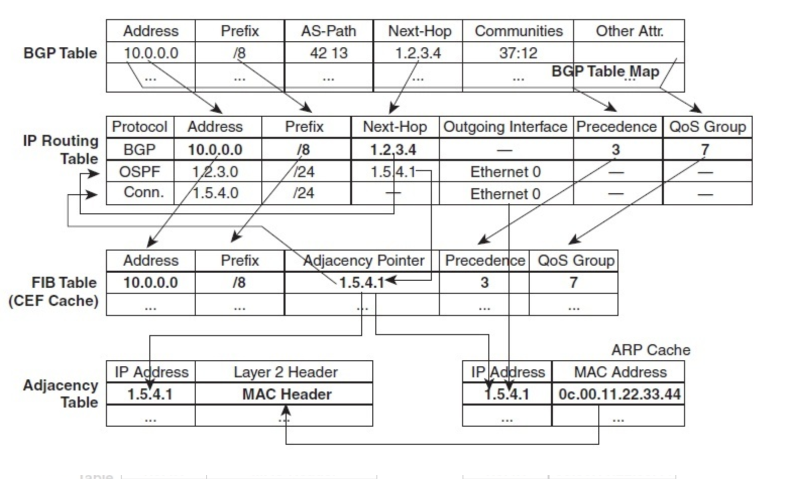


上图为路由器中各表的关系图

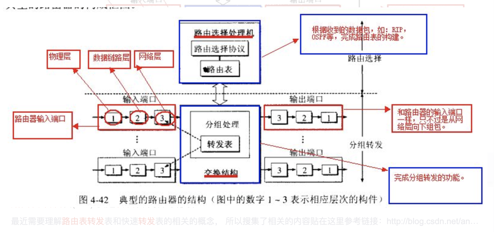

上图为路由器内部转发图


   ## [2. Traceroute]

   Traceroute 是 ICMP 的另一个应用，用来跟踪一个分组从源点到终点的路径。

   Traceroute 发送的 IP 数据报封装的是无法交付的 UDP 用户数据报，并由目的主机发送终点不可达差错报告报文。

   - 源主机向目的主机发送一连串的 IP 数据报。第一个数据报 P1 的生存时间 TTL 设置为 1，当 P1 到达路径上的第一个路由器 R1 时，R1 收下它并把 TTL 减 1，此时 TTL 等于 0，R1 就把 P1 丢弃，并向源主机发送一个 ICMP 时间超过差错报告报文；

   - 源主机接着发送第二个数据报 P2，并把 TTL 设置为 2。P2 先到达 R1，R1 收下后把 TTL 减 1 再转发给 R2，R2 收下后也把 TTL 减 1，由于此时 TTL 等于 0，R2 就丢弃 P2，并向源主机发送一个 ICMP 时间超过差错报文。

   - 不断执行这样的步骤，直到最后一个数据报刚刚到达目的主机，主机不转发数据报，也不把 TTL 值减 1。但是因为数据报封装的是无法交付的 UDP，因此目的主机要向源主机发送 ICMP 终点不可达差错报告报文。

   - 之后源主机知道了到达目的主机所经过的路由器 IP 地址以及到达每个路由器的往返时间。

     

## 路由算法

### RIP 


##    


### OSPF


## RTT测量原理

 

RTT的测量可以采用两种方法：

（1）TCP Timestamp选项
在前面的blog中有详细的介绍过这个选项，TCP时间戳选项可以用来精确的测量RTT。RTT = 当前时间 - 数据包中Timestamp选项的回显时间，这个回显时间是该数据包发出去的时间，知道了数据包的接收时间（当前时间）和发送时间
（回显时间），就可以轻松的得到RTT的一个测量值。

（2）重传队列中数据包的TCP控制块
在TCP重传队列中保存着发送而未被确认的数据包，数据包skb中的TCP控制块包含着一个变量，tcp_skb_cb->when，记录了该数据包的第一次发送时间。RTT = 当前时间 - when

有人可能会问：既然不用TCP Timestamp选项就能测量出RTT，为什么还要多此一举？
这是因为方法一比方法二的功能更加强大，它们是有区别的。
“TCP must use Karn's algorithm for taking RTT samples. That is, RTT samples MUST NOT
be made using segments that were retransmitted (and thus for which it is ambiguious whether
the reply was for the first instance of the packet or a later instance). The only case when TCP
can safely take RTT samples from retransmitted segments is when the TCP timestamp option
is employed, since the timestamp option removes the ambiguity regarding which instance of
the data segment triggered the acknowledgement.”
对于重传的数据包的响应，方法1可以用它来采集一个新的RTT测量样本，而方法二则不能。因为
TCP Timestamp选项可以区分这个响应是原始数据包还是重传数据包触发的，从而计算出准确的
RTT值。

## Tcp UDP 区别

   * 用户数据报协议 UDP（User Datagram Protocol）是无连接的，尽最大可能交付，没有拥塞控制，面向报文（对于应用程序传下来的报文不合并也不拆分，只是添加 UDP 首部），支持一对一、一对多、多对一和多对多的交互通信。

   * 传输控制协议 TCP（Transmission Control Protocol）是面向连接的，提供可靠交付，有流量控制，拥塞控制，提供全双工通信，面向字节流（把应用层传下来的报文看成字节流，把字节流组织成大小不等的数据块），每一条 TCP 连接只能是点对点的（一对一）。

## UDP 首部格式


首部字段只有 8 个字节，包括源端口、目的端口、长度、检验和。12 字节的伪首部是为了计算检验和临时添加的。

## TCP 首部格式


- **序号** ：用于对字节流进行编号，例如序号为 301，表示第一个字节的编号为 301，如果携带的数据长度为 100 字节，那么下一个报文段的序号应为 401。

- **确认号** ：期望收到的下一个报文段的序号。例如 B 正确收到 A 发送来的一个报文段，序号为 501，携带的数据长度为 200 字节，因此 B 期望下一个报文段的序号为 701，B 发送给 A 的确认报文段中确认号就为 701。

- **数据偏移** ：指的是数据部分距离报文段起始处的偏移量，实际上指的是首部的长度。

- **确认 ACK** ：当 ACK=1 时确认号字段有效，否则无效。TCP 规定，在连接建立后所有传送的报文段都必须把 ACK 置 1。

- **同步 SYN** ：在连接建立时用来同步序号。当 SYN=1，ACK=0 时表示这是一个连接请求报文段。若对方同意建立连接，则响应报文中 SYN=1，ACK=1。

- **终止 FIN** ：用来释放一个连接，当 FIN=1 时，表示此报文段的发送方的数据已发送完毕，并要求释放连接。

- **窗口** ：窗口值作为接收方让发送方设置其发送窗口的依据。之所以要有这个限制，是因为接收方的数据缓存空间是有限的。

  

## TCP层的分段和IP层的分片之间的关系 & MTU和MSS之间的关系

分组可以发生在运输层和网络层，运输层中的TCP会分段，网络层中的IP会分片。IP层的分片更多的是为运输层的UDP服务的，由于TCP自己会避免IP的分片，所以使用TCP传输在IP层都不会发生分片的现象。

MTU（Maximum Transmission Unit，MTU），最大传输单元

（1）以太网和802.3对数据帧的长度都有一个限制，其最大 值分别是1500和1492个字节。链路层的这个特性称作MTU。不同类型的网络大多数都有一个上限。如果IP层有一个数据要传，且数据的长度比链路层的 MTU还大，那么IP层就要进行分片（fragmentation），把数据报分成若干片，这样每一个分片都小于MTU。

（2）把一份IP数据报进行分片以后，由到达目的端的IP层来进行重新组装，其目的是使分片和重新组装过程对运输层（TCP/UDP）是透明的。由于每一分片都是一个独立的包，当这些数据报的片到达目的端时有可能会失序，但是在IP首部中有足够的信息让接收端能正确组装这些数据报片。

（3）尽管IP分片过程看起来透明的，但有一点让人不想使用它：即使只丢失一片数据也要重新传整个数据报。why？因为IP层本身没有超时重传机制------由更高层（比如TCP）来负责超时和重传。当来自TCP报文段的某一片丢失后，TCP在超时后会重发整个TCP报文段，该报文段对应于一份IP数据报（而不是一个分片），没有办法只重传数据报中的一个数据分片。 

（4）使用UDP很容易导致IP分片，TCP试图避免IP分片。 那么TCP是如何试图避免IP分片的呢？其实说白了，采用TCP协议进行数据传输是不会造成IP分片的，因为一旦TCP数据过大，超过了MSS，则在传输层会对TCP包进行分段（如何分，见下文！），自然到了IP层的数据报肯定不会超过MTU，当然也就不用分片了。而对于UDP数据报，如果UDP组成的 IP数据报长度超过了1500，那么IP数据报显然就要进行分片，因为UDP不能像TCP一样自己进行分段。总结：UDP不会分段，就由我IP来分。TCP会分段，当然也就不用我IP来分了！

MSS（Maxitum Segment Size）最大分段大小的缩写，是TCP协议里面的一个概念

MSS就是TCP数据包每次能够传输的最大数据分段。为了达到最佳的传输效能TCP协议在建立连接的时候通常要协商双方的MSS值，这个值TCP协议在实现的时候往往用MTU值代替（需要减去IP数据包包头的大小20Bytes和TCP数据段的包头20Bytes）所以往往MSS为1460。通讯双方会根据双方提供的MSS值得最小值确定为这次连接的最大MSS值。


### 三次握手的原因

第三次握手是为了防止失效的连接请求到达服务器，让服务器错误打开连接。

客户端发送的连接请求如果在网络中滞留，那么就会隔很长一段时间才能收到服务器端发回的连接确认。客户端等待一个超时重传时间之后，就会重新请求连接。但是这个滞留的连接请求最后还是会到达服务器，如果不进行三次握手，那么服务器就会打开两个连接。如果有第三次握手，客户端会忽略服务器之后发送的对滞留连接请求的连接确认，不进行第三次握手，因此就不会再次打开连接。

### 为什么在TIME-WAIT状态必须等待2MSL的时间？

MSL最长报文段寿命Maximum Segment Lifetime，MSL=2

两个理由：

**1**）保证**A**发送的最后一个ACK报文段能够到达B。

**2**）防止“已失效的连接请求报文段”出现在本连接中。

- 1）这个ACK报文段有可能丢失，使得处于LAST-ACK状态的B收不到对已发送的FIN+ACK报文段的确认，B超时重传FIN+ACK报文段，而A能在2MSL时间内收到这个重传的FIN+ACK报文段，接着A重传一次确认，重新启动2MSL计时器，最后A和B都进入到CLOSED状态，**若A在TIME-WAIT状态不等待一段时间，而是发送完ACK报文段后立即释放连接，则无法收到B重传的FIN+ACK报文段，所以不会再发送一次确认报文段，则B无法正常进入到CLOSED状态。**
- 2）A在发送完最后一个ACK报文段后，再经过2MSL，就可以使本连接持续的时间内所产生的所有报文段都从网络中消失，使下一个新的连接中不会出现这种旧的连接请求报文段。

15. ## **为什么A还要发送一次确认呢？可以二次握手吗？**

    为了**实现可靠数据传输**， TCP 协议的通信双方， 都**必须维护一个序列号， 以标识发送出去的数据包中， 哪些是已经被对方收到**的。 三次握手的过程即是通信双方相互告知序列号起始值， 并确认对方已经收到了序列号起始值的必经步骤 **如果只是两次握手， 至多只有连接发起方的起始序列号能被确认， 另一方选择的序列号则得不到确认**

16. ## **Server端易受到SYN攻击？**

    服务器端的资源分配是在二次握手时分配的，而客户端的资源是在完成三次握手时分配的，所以服务器容易受到SYN洪泛攻击，SYN攻击就是Client在短时间内伪造大量不存在的IP地址，并向Server不断地发送SYN包，Server则回复确认包，并等待Client确认，由于源地址不存在，因此Server需要不断重发直至超时，这些伪造的SYN包将长时间占用未连接队列，导致正常的SYN请求因为队列满而被丢弃，从而引起网络拥塞甚至系统瘫痪。

    防范SYN攻击措施：降低主机的等待时间使主机尽快的释放半连接的占用，短时间受到某IP的重复SYN则丢弃后续请求。

17. ## **TIME_WAIT**

   客户端接收到服务器端的 FIN 报文后进入此状态，此时并不是直接进入 CLOSED 状态，还需要等待一个时间计时器设置的时间 2MSL。这么做有两个理由：

   - 确保最后一个确认报文能够到达。如果 B 没收到 A 发送来的确认报文，那么就会重新发送连接释放请求报文，A 等待一段时间就是为了处理这种情况的发生。
   - 等待一段时间是为了让本连接持续时间内所产生的所有报文都从网络中消失，使得下一个新的连接不会出现旧的连接请求报文。

     **Maximum Segment Lifetime** 报文最大生存时间，它是任何报文在网络上存在的最长时间，超过这个时间报文将被丢弃

## 大量Time—wait 怎么解决

解决思路： 让服务器能够快速回收和重用那些TIME_WAIT的资源。

## TIME_WAIT的快速回收

https://www.cnblogs.com/pangblog/p/3400297.html

Linux实现了一个TIME_WAIT状态快速回收的机制，即无需等待两倍的MSL这么久的时间，而是等待一个Retrans时间即释放，也就是等待一个重传时间(一般超级短，以至于你都来不及能在netstat -ant中看到TIME_WAIT状态)随即释放。释放了之后，一个连接的tuple元素信息就都没有了，而此时，新建立的TCP却面临着危险，什么危险呢？即：
1.可能被之前迟到的FIN包给终止的危险；
2.被之前连接劫持的危险；

## TIME_WAIT重用

如果说TIME_WAIT(输入法切换太烦人了，后面简称TW)回收只是一种特定系统的优化实现的话，那么TW重用则有相关的规范，即：如果能保证以下任意一点，一个TW状态的四元组(即一个socket连接)可以重新被新到来的SYN连接使用：
**1.初始序列号比TW老连接的末序列号大**
**2.如果使能了时间戳，那么新到来的连接的时间戳比老连接的时间戳大**


## 从外部干掉TIME_WAIT

TIME_WAIT状态时则一个阑尾！Linux系统上，除了使能recycle tw，在Linux系统上你无法更简单地缩短TW状态的时间，但是80%的问题却都是由TW状态引发，在Windows系统上，你需要在注册表添加一个隐式的项，稍微拼写错误都会引发沉默的失败！TW确实让人生气，因此我一直都希望干掉TW状态的连接，特别是干掉服务端TW状态的连接！我们可以通过TCP的RESET来干死TW连接。这个怎么说呢？
    根据TCP规范，收到任何的发送到未侦听端口或者序列号乱掉(窗口外)的数据，都要回执以RESET，这就是可以利用的！一个连接等待在TW，它自身无能为力，但是可以从外部间接杀掉它！具体来讲就是利用了IP_TRANSPARENT这个socket选项，它可以bind不属于本地的地址，因此可以从任意机器绑定TW连接的peer地址以及端口，然后发起一个连接，TW连接收到后由于序列号乱序会直接发送一个ACK，该ACK会回到TW连接的peer处，由于99%的可能该peer已经释放了连接(对端由于不能收到FIN-ACK的ACK，进而不放心ACK是否已经到达对端，等待MSL以便所有的老数据均已经丢失)，因此peer由于没有该连接会回复RESET，TW连接收到RESET后会释放连接，进而为后续的连接腾出地方！


## Linux实现Tips

Linux照顾到了一种特殊情况，即杀死进程的情况，在系统kill进程的时候，会直接调用连接的close函数单方面关闭一个方向的连接，然后并不会等待对端关闭另一个方向的连接进程即退出。现在的问题是，TCP规范和UNIX进程的文件描述符规范直接冲突！进程关闭了，套接字就要关闭，但是TCP是全双工的，你不能保证对端也在同一个时刻同意并且实施关闭动作，既然连接不能关闭，作为文件描述符，进程就不会关闭得彻底！所以，Linux使用了一种“子状态”的机制，即在进程退出的时候，单方面发送FIN，然后不等后续的关闭序列即将连接拷贝到一个占用资源更少的TW套接字，状态直接转入TIMW_WAIT，此时记录一个子状态FIN_WAIT_2，接下来的套接字就和原来的属于进程描述符的连接没有关系了。等到新的连接到来的时候，直接匹配到这个主状态为TW，子状态为FIN_WAIT_2的TW连接上，它负责处理FIN，FIN ACK等数据。

## **大量CLOSE_WAIT\** 怎么解决

unix 网络编程书里面写“TCP FIN sent by kernel when client is killed or crashed”当client被kill的时候，内核会发送fin包给server。这样服务器这边进入close wait的状态，若epoll注册了HUP的事件，把连接关闭close wait变为close；若没有处理，服务器这里就有一个close wait的状态，占用了fd。

过多的close_wait可能是什么原因：

1. 程序问题：说的具体一点，服务器端的代码，没有写 close 函数关闭 socket 连接，也就不会发出 FIN 报文段；或者出现死循环，服务器端的代码永远执行不到 close。
2. 客户机响应太慢或者 timeout 设置过小

解决思路： 检测出对方已经关闭的socket，然后关闭它。
1.代码需要判断socket，一旦read返回0，断开连接，read返回负，检查一下errno，如果不是AGAIN（表示现在没有数据稍后重新读取），也断开连接。
2.给每一个socket设置一个时间戳last_update，每接收或者是发送成功数据，就用当前时间更新这个时间戳。定期检查所有的时间戳，如果时间戳与当前时间差值超过一定的阈值，就关闭这个socket。
3.使用一个Heart-Beat线程，定期向socket发送指定格式的心跳数据包，如果接收到对方的RST报文，说明对方已经关闭了socket，那么我们也关闭这个socket。
4.设置SO_KEEPALIVE选项，并修改内核参数
————————————————
close_wait过多的解决方案
代码层面做到第一：使用完socket调用close方法；第二：socket读控制，当读取的长度为0时（读到结尾），立即close；第三：如果read返回-1，出现错误，检查error返回码，有三种情况：INTR（被中断，可以继续读取），WOULDBLOCK（表示当前socket_fd文件描述符是非阻塞的，但是现在被阻塞了），AGAIN（表示现在没有数据稍后重新读取）。如果不是AGAIN，立即close
可以设置TCP的连接时长keep_alive_time还有tcp监控连接的频率以及连接没有活动多长时间被迫断开连接

## 为什么 TCP 协议有粘包问题

- TCP 协议是面向字节流的协议，它可能会组合或者拆分应用层协议的数据；

- 应用层协议的没有定义消息的边界导致数据的接收方无法拼接数据；

  既然 TCP 协议是基于字节流的，这其实就意味着应用层协议要自己划分消息的边界。如果我们能在应用层协议中定义消息的边界，那么无论 TCP 协议如何对应用层协议的数据包进程拆分和重组，接收方都能根据协议的规则恢复对应的消息。在应用层协议中，最常见的两种解决方案就是基于长度或者基于终结符（Delimiter）。
  
  

## 三次握手

用于保证可靠性和流控制机制的信息，包括 Socket、序列号以及窗口大小叫做连接。


所以，建立 TCP 连接就是通信的双方需要对上述的三种信息达成共识，连接中的一对 Socket 是由互联网地址标志符和端口组成的，窗口大小主要用来做流控制，最后的序列号是用来追踪通信发起方发送的数据包序号，接收方可以通过序列号向发送方确认某个数据包的成功接收。

初始序列号并建立 TCP 连接：

- 通过三次握手才能阻止重复历史连接的初始化；
- 通过三次握手才能对通信双方的初始序列号进行初始化；

## 拥塞,TCP 四个算法来进行拥塞控制：慢开始、拥塞避免、快重传、快恢复。

##  TCP/IP 协议在传输数据时都需要对数据进行拆分

，但是它们做出拆分数据的设计基于不同的上下文，也有着不同的目的，我们在这里总结一下两个网络协议做出类似决定的原因：

- IP 协议拆分数据是因为物理设备的限制，一次能够传输的数据由路径上 MTU 最小的设备决定，一旦 IP 协议传输的数据包超过 MTU 的限制就会发生丢包，所以我们需要通过路径 MTU 发现获取传输路径上的 MTU 限制；
- TCP 协议拆分数据是为了保证传输的可靠性和顺序，作为可靠的传输协议，为了保证数据的传输顺序，它需要为每一个数据段增加包含序列号的 TCP 协议头，如果数据段大小超过了 IP 协议的 MTU 限制， 就会带来更多额外的重传和重组开销，影响性能。

## TCP 滑动窗口

窗口是缓存的一部分，用来暂时存放字节流。发送方和接收方各有一个窗口，接收方通过 TCP 报文段中的窗口字段告诉发送方自己的窗口大小，发送方根据这个值和其它信息设置自己的窗口大小。

## **TCP拥塞控制算法**

**1、基于丢包的拥塞控制：Tahoe、Reno、New Reno**

因为Reno等算法是后续算法的基础，这里详细的描述下Reno算法的过程。

（1）慢热启动算法 – Slow Start

-  连接建好的开始先初始化cwnd = 1，表明可以传一个MSS大小的数据。
- 每当收到一个ACK，cwnd++; 呈线性上升。
- 每当过了一个RTT，cwnd = cwnd*2; 呈指数让升。
- 还有一个ssthresh（slow start threshold），是一个上限，当cwnd >= ssthresh时，就会进入“拥塞避免算法”。

（2）拥塞避免算法 – Congestion Avoidance

当cwnd >= ssthresh时，就会进入“拥塞避免算法”。算法如下：

- 收到一个ACK时，cwnd = cwnd + 1/cwnd
- 当每过一个RTT时，cwnd = cwnd + 1

（3）拥塞状态算法 – Fast Retransmit

Tahoe是等RTO超时，FR是在收到3个duplicate ACK时就开启重传，而不用等到RTO超时。拥塞发生时：

- cwnd = cwnd /2
- sshthresh = cwnd

（4）快速恢复 – Fast Recovery

- cwnd = sshthresh  + 3 * MSS （3的意思是确认有3个数据包被收到了）
- 重传Duplicated ACKs指定的数据包
- 如果再收到 duplicated Acks，那么cwnd = cwnd +1
- 如果收到了新的Ack，那么，cwnd = sshthresh ，然后进入拥塞避免算法。
- 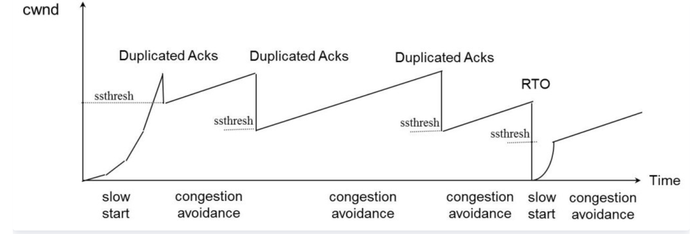


**二分搜索最佳cwnd：BIC-TCP** BIC-TCP是Linux 2.6.18默认拥塞控制算法，依赖丢包条件触发。BIC-TCP认为TCP拥塞窗口调整的本质就是找到最适合当前网络的一个发送窗口，为了找到这个窗口值，TCP采取的方式是(拥塞避免阶段)每RTT加1，缓慢上升，丢包时下降一半，接着再来慢慢上升。BIC-TCP的提出者们看穿了事情的本质，其实这就是一个搜索的过程，而TCP的搜索方式类似于逐个遍历搜索方法，可以认为这个值是在1和一个比较大的数(large_window)之间，既然在这个区间内需要搜索一个最佳值，那么显然最好的方式就是二分搜索思想。

BIC-TCP就是基于这样一个二分思想的：当出现丢包的时候，说明最佳窗口值应该比这个值小，那么BIC就把此时的cwnd设置为max_win，把乘法减小后的值设置为min_win，然后BIC就开始在这两者之间执行二分思想--每次跳到max_win和min_win的中点。


图2 BIC-TCP 算法仿真曲线（来源BIC-TCP RFC）

BIC也具备RTT的不公平性。RTT小的连接，窗口调整发生的速度越快，因此可能更快的抢占带宽。


## CUBIC

CUBIC是BIC-TCP的下一代版本。 它通过用三次函数（包含凹和凸部分）代替BIC-TCP的凹凸窗口生长部分，大大简化了BIC-TCP的窗口调整算法。实际上，任何奇数阶多项式函数都具有这种形状。三次函数的选择是偶然的，并且不方便。CUBIC的关键特征是其窗口增长仅取决于两个连续拥塞事件之间的时间。一个拥塞事件是指出现TCP快速恢复的时间。因此，窗口增长与RTT无关。 这个特性允许CUBIC流在同一个瓶颈中竞争，有相同的窗口大小，而不依赖于它们的RTT，从而获得良好的RTT公平性。而且，当RTT较短时，由于窗口增长率是固定的，其增长速度可能比TCP标准慢。 由于TCP标准（例如，TCP-SACK）在短RTT下工作良好，因此该特征增强了协议的TCP友好性。


## **基于精准带宽计算：BBR**


https://blog.csdn.net/yue2388253/article/details/88925203

 BBR通过实时计算带宽和最小RTT来决定发送速率pacing rate和窗口大小cwnd。完全摒弃丢包作为拥塞控制的直接反馈因素。

### 原理

传统的拥塞控制算法是计算cwnd值来规定当前可以发送多少数据，但是并不关注以什么样的速度发送数据。如果简单而粗暴地将窗口大小（send.cwnd、recv.cwnd的最小值）数据全部突发出去，这往往会造成路由器的排队，在深队列的情况下，会测量出rtt剧烈地抖动。bbr在计算cwnd的同时，还计算了一个与之适配的pacing rate，该pacing rate规定cwnd指示的一窗数据的数据包之间，以多大的时间间隔发送出去。

- BtlBW：最大带宽
- RtProp：物理链路延迟
- BDP：管道容量，BDP=BtlBW * RtProp

我们知道，网络工作的最优点是在物理链路延迟状态下，以最大速率传输数据。传统的拥塞控制算法思想是根据数据传输及ACK来确定RTT，但是这个RTT并不是物理链路延时，可能包含了路由器缓存耗时，也可能是拥塞状态下的耗时。传统的带宽计算也是在不断的试探逼近最优发送窗口，并在RTT或者统计周期内计算带宽。这种情况下，RTT并不是真正的物理链路延迟，带宽也有可能是在有路由缓存或丢包状况下计算得到，那么必然得到的不是精准的值。

BBR摒弃了丢包和实时RTT作为拥塞控制因素。引入BDP管道容量来衡量链路传输水平。BBR追求的是在链路最小RTT（物理链路延迟）的状态下，找到最大带宽。

而BBR对于这个问题的解决方式就是取一定时间范围内的RTprop极小值与BtlBw极大值作为估计值。

在连接建立的时候，BBR也采用类似慢启动的方式逐步增加发送速率，然后根据收到的ack计算BDP，当发现BDP不再增长时，就进入拥塞避免阶段（这个过程完全不管有没有丢包）。在慢启动的过程中，由于几乎不会填充中间设备的缓冲区，这过程中的延迟的最小值就是最初估计的最小延迟；而慢启动结束时的最大带宽就是最初的估计的最大延迟。

慢启动结束之后，为了把慢启动过程中可能填充到缓冲区中的数据排空，BBR会进入排空阶段，这期间会降低发送速率，如果缓冲区中有数据，降低发送速率就会使延时下降（缓冲区逐渐被清空），直到延时不再下降。

排空阶段结束后，进入稳定状态，这个阶段会交替探测带宽和延迟。带宽探测阶段是一个正反馈系统：定期尝试增加发包速率，如果收到确认的速率也增加了，就进一步增加发包速率。具体来说，以每8个RTT为周期，在第一个RTT中，尝试以估计带宽的5/4的速度发送数据，第二个RTT中，为了把前一个RTT多发出来的包排空，以估计带宽的3/4的速度发送数据。剩下6个RTT里，使用估计的带宽发包（估计带宽可能在前面的过程中更新）。 这个机制使得BBR在带宽增加时能够迅速提高发送速率，而在带宽下降时则需要一定的时间才能降低到稳定的水平。

除了带宽检测，BBR还会进行最小延时的检测。每过10s，如果最小RTT没有改变（也就是没有发现一个更低的延迟），就进入延迟探测阶段。延迟探测阶段持续的时间仅为 200 毫秒（或一个往返延迟，如果后者更大），这段时间里发送窗口固定为4个包，也就是几乎不发包。这段时间内测得的最小延迟作为新的延迟估计。也就是说，大约有2%的时间BBR会用极低的发包速率来测量延迟。


链接：https://juejin.im/post/5e0894a3f265da33d83e85fe

## DHCP

DHCP (Dynamic Host Configuration Protocol) 提供了即插即用的连网方式，用户不再需要手动配置 IP 地址等信息。DHCP 配置的内容不仅是 IP 地址，还包括子网掩码、网关 IP 地址。

DHCP 工作过程如下：

1. 客户端发送 Discover 报文，该报文的目的地址为 255.255.255.255:67，源地址为 0.0.0.0:68，被放入 UDP 中，该报文被广播到同一个子网的所有主机上。如果客户端和 DHCP 服务器不在同一个子网，就需要使用中继代理。
2. DHCP 服务器收到 Discover 报文之后，发送 Offer 报文给客户端，该报文包含了客户端所需要的信息。因为客户端可能收到多个 DHCP 服务器提供的信息，因此客户端需要进行选择。
3. 如果客户端选择了某个 DHCP 服务器提供的信息，那么就发送 Request 报文给该 DHCP 服务器。
4. DHCP 服务器发送 Ack 报文，表示客户端此时可以使用提供给它的信息。


## 为什么出现了NAT?

IP地址只有32位，最多只有42.9亿个地址，还要去掉保留地址、组播地址，能用的地址只有36亿左右，但是当下有数以万亿的主机，没有这么多IP地址怎么办，后面有了IPv6，但是当下IPv4还是主流，利用IPv4怎么满足这么多主机的IP地址呢？答案就是NAT，NAT技术使公司、机构以及个人产生以及局域网，然后在各个局域网的边界WAN端口使用一个或多个公网的IPv4进行一对多转换

NAT(Network Address Translation，网络地址转换), 用来将内网地址和端口号转换成合法的公网地址和端口号，建立一个会话，与公网主机进行通信。NAT的使用是为了解决公网IP有限及局域网安全性的问题。

实际上NAT分为**基础型NAT**（静态NAT即Static NAT，动态NAT即Dynamic NAT/Pooled NAT）和**NAPT**(Network Address Port Translation)两种，但由于基础型NAT已不常用，我们通常提到的NAT就代指NAPT。**NAPT**是指网络地址转换过程中使用了端口复用技术，即PAT(Port address Translation)。

### NAT工作原理：

- 网络被分为私网和公网两个部分，NAT网关设置在私网到公网的路由出口位置，双向流量必须都要经过NAT网关；
- 网络访问只能先由私网侧发起，公网无法主动访问私网主机；
- NAT网关在两个访问方向上完成两次地址的转换或翻译，出方向做源信息替换，入方向做目的信息替换；
- NAT网关的存在对通信双方是保持透明的；
- NAT网关为了实现双向翻译的功能，需要维护一张关联表，把会话的信息保存下来。


​    

    **NAT使用基于session的转换规则**
    
    TCP/UDP ：私有Host的Ipv4 + port <======> NAT公网的Ipv4 + port
    ICMP ：私有Host的Ipv4 + sessionID <======> NAT公网的Ipv4 + sessionID
    
    链接：https://www.jianshu.com/p/62028875d53e


​    

    动态NAT ：动态NAT是在路由器上配置一个外网IP地址池，当内部有计算机需要和外部通信时，就从地址池里动态的取出一个外网IP，并将他们的对应关系绑定到NAT表中，通信结束后，这个外网IP才被释放，可供其他内部IP地址转换使用，这个DHCP租约IP有相似之处。


​    

    PAT(port address Translation，端口地址转换，也叫端口地址复用)
    这是最常用的NAT技术，也是IPv4能够维持到今天的最重要的原因之一，它提供了一种多对一的方式，对多个内网IP地址，边界路由可以给他们分配一个外网IP，利用这个外网IP的不同端口和外部进行通信。

  


## 防止syn攻击

* syn cookie：syn  cookie技术是服务器在收到syn包时并不马上分配储存连接的数据区，而是根据这个syn包计算出一个cookie，把这个cookie填入tcp的Sequence Number字段发送syn+ack包，等对方回应ack包时检查回复的Acknowledgment  Number字段的合法性，如果合法再分配专门的数据区。

* 缩短SYN Timeout时间，由于SYN  Flood攻击的效果取决于服务器上保持的SYN半连接数，这个值=SYN攻击的频度 x SYN  Timeout，所以通过缩短从接收到SYN报文到确定这个报文无效并丢弃改连接的时间，例如设置为20秒以下，可以成倍的降低服务器的负荷。但过低的SYN Timeout设置可能会影响客户的正常访问。

* 网关超时设置

  ​      防火墙计数器到时，还没收到第3次握手包，则往服务器发送RST包，以使服务器从对列中删除该半连接。

  ​      网关超时设置，不宜过小也不宜过大。过小影响正常通讯，过大，影响防范SYN攻击的效果。

## **HTTPS 协议降级**

https://zhuanlan.zhihu.com/p/22917510

## http 请求头

```html
GET /home.html HTTP/1.1
Host: developer.mozilla.org
User-Agent: Mozilla/5.0 (Macintosh; Intel Mac OS X 10.9; rv:50.0) Gecko/20100101 Firefox/50.0
Accept: text/html,application/xhtml+xml,application/xml;q=0.9,*/*;q=0.8
Accept-Language: en-US,en;q=0.5
Accept-Encoding: gzip, deflate, br
Referer: https://developer.mozilla.org/testpage.html
Connection: keep-alive
Upgrade-Insecure-Requests: 1
If-Modified-Since: Mon, 18 Jul 2016 02:36:04 GMT
If-None-Match: "c561c68d0ba92bbeb8b0fff2a9199f722e3a621a"
Cache-Control: max-age=0
```

## http 状态码

服务器返回的 **响应报文** 中第一行为状态行，包含了状态码以及原因短语，用来告知客户端请求的结果。

| 状态码 | 类别                             | 含义                       |
| ------ | -------------------------------- | -------------------------- |
| 1XX    | Informational（信息性状态码）    | 接收的请求正在处理         |
| 2XX    | Success（成功状态码）            | 请求正常处理完毕           |
| 3XX    | Redirection（重定向状态码）      | 需要进行附加操作以完成请求 |
| 4XX    | Client Error（客户端错误状态码） | 服务器无法处理请求         |
| 5XX    | Server Error（服务器错误状态码） | 服务器处理请求出错         |

###### [1XX 信息]

- **100 Continue** ：表明到目前为止都很正常，客户端可以继续发送请求或者忽略这个响应。

###### [2XX 成功】

- **200 OK**
- **204 No Content** ：请求已经成功处理，但是返回的响应报文不包含实体的主体部分。一般在只需要从客户端往服务器发送信息，而不需要返回数据时使用。
- **206 Partial Content** ：表示客户端进行了范围请求，响应报文包含由 Content-Range 指定范围的实体内容。

###### [3XX 重定向]

- **301 Moved Permanently** ：永久性重定向
- **302 Found** ：临时性重定向
- **303 See Other** ：和 302 有着相同的功能，但是 303 明确要求客户端应该采用 GET 方法获取资源。
- 注：虽然 HTTP 协议规定 301、302 状态下重定向时不允许把 POST 方法改成 GET 方法，但是大多数浏览器都会在 301、302 和 303 状态下的重定向把 POST 方法改成 GET 方法。
- **304 Not Modified** ：如果请求报文首部包含一些条件，例如：If-Match，If-Modified-Since，If-None-Match，If-Range，If-Unmodified-Since，如果不满足条件，则服务器会返回 304 状态码。
- **307 Temporary Redirect** ：临时重定向，与 302 的含义类似，但是 307 要求浏览器不会把重定向请求的 POST 方法改成 GET 方法。

###### [4XX 客户端错误]

- **400 Bad Request** ：请求报文中存在语法错误。
- **401 Unauthorized** ：该状态码表示发送的请求需要有认证信息（BASIC 认证、DIGEST 认证）。如果之前已进行过一次请求，则表示用户认证失败。
- **403 Forbidden** ：请求被拒绝。
- **404 Not Found**

###### [5XX 服务器错误]

- **500 Internal Server Error** ：服务器正在执行请求时发生错误。

- **503 Service Unavailable** ：服务器暂时处于超负载或正在进行停机维护，现在无法处理请求。

  

### HTTP/1.x 的缺陷

- **连接无法复用**：连接无法复用会导致每次请求都经历三次握手和慢启动。三次握手在高延迟的场景下影响较明显，慢启动则对大量小文件请求影响较大（没有达到最大窗口请求就被终止）。
  - HTTP/1.0 传输数据时，每次都需要重新建立连接，增加延迟。
  - HTTP/1.1 虽然加入 keep-alive 可以复用一部分连接，但域名分片等情况下仍然需要建立多个 connection，耗费资源，给服务器带来性能压力。
- **Head-Of-Line Blocking（HOLB）**：导致带宽无法被充分利用，以及后续健康请求被阻塞。[HOLB](http://stackoverflow.com/questions/25221954/spdy-head-of-line-blocking)是指一系列包（package）因为第一个包被阻塞；当页面中需要请求很多资源的时候，HOLB（队头阻塞）会导致在达到最大请求数量时，剩余的资源需要等待其他资源请求完成后才能发起请求。
  - HTTP 1.0：下个请求必须在前一个请求返回后才能发出，`request-response`对按序发生。显然，如果某个请求长时间没有返回，那么接下来的请求就全部阻塞了。
  - HTTP 1.1：尝试使用 pipeling 来解决，即浏览器可以一次性发出多个请求（同个域名，同一条 TCP 链接）。但 pipeling 要求返回是按序的，那么前一个请求如果很耗时（比如处理大图片），那么后面的请求即使服务器已经处理完，仍会等待前面的请求处理完才开始按序返回。所以，pipeling 只部分解决了 HOLB。
- **协议开销大**： HTTP/1.x 在使用时，header 里携带的内容过大，在一定程度上增加了传输的成本，并且每次请求 header 基本不怎么变化，尤其在移动端增加用户流量。
- **安全因素**：HTTP/1.x 在传输数据时，所有传输的内容都是明文，客户端和服务器端都无法验证对方的身份，这在一定程度上无法保证数据的安全性

## http1.0 和http1.1 区别


1. **缓存处理**，在HTTP1.0中主要使用header里的If-Modified-Since,Expires来做为缓存判断的标准，HTTP1.1则引入了更多的缓存控制策略例如Entity tag，If-Unmodified-Since, If-Match, If-None-Match等更多可供选择的缓存头来控制缓存策略。

2. **带宽优化及网络连接的使用**，HTTP1.0中，存在一些浪费带宽的现象，例如客户端只是需要某个对象的一部分，而服务器却将整个对象送过来了，并且不支持断点续传功能，HTTP1.1则在请求头引入了range头域，它允许只请求资源的某个部分，即返回码是206（Partial Content），这样就方便了开发者自由的选择以便于充分利用带宽和连接。

3. **错误通知的管理**，在HTTP1.1中新增了24个错误状态响应码，如409（Conflict）表示请求的资源与资源的当前状态发生冲突；410（Gone）表示服务器上的某个资源被永久性的删除。

4. **Host头处理**，在HTTP1.0中认为每台服务器都绑定一个唯一的IP地址，因此，请求消息中的URL并没有传递主机名（hostname）。但随着虚拟主机技术的发展，在一台物理服务器上可以存在多个虚拟主机（Multi-homed Web Servers），并且它们共享一个IP地址。HTTP1.1的请求消息和响应消息都应支持Host头域，且请求消息中如果没有Host头域会报告一个错误（400 Bad Request）。

5. **长连接**，HTTP 1.1支持长连接（PersistentConnection）和请求的流水线（Pipelining）处理，在一个TCP连接上可以传送多个HTTP请求和响应，减少了建立和关闭连接的消耗和延迟，在HTTP1.1中默认开启Connection： keep-alive，一定程度上弥补了HTTP1.0每次请求都要创建连接的缺点。默认情况下，HTTP 请求是按顺序发出的，下一个请求只有在当前请求收到响应之后才会被发出。由于受到网络延迟和带宽的限制，在下一个请求被发送到服务器之前，可能需要等待很长时间。

   流水线是在同一条长连接上连续发出请求，而不用等待响应返回，这样可以减少延迟。

### HTTP/2 新特性

#### 1. 二进制传输

HTTP/2 采用二进制格式传输数据，而非 HTTP 1.x 的文本格式，二进制协议解析起来更高效。 HTTP / 1 的请求和响应报文，都是由起始行，首部和实体正文（可选）组成，各部分之间以文本换行符分隔。**HTTP/2 将请求和响应数据分割为更小的帧，并且它们采用二进制编码**。

#### 2. 多路复用

在 HTTP/2 中引入了多路复用的技术。多路复用很好的解决了浏览器限制同一个域名下的请求数量的问题，同时也接更容易实现全速传输，毕竟新开一个 TCP 连接都需要慢慢提升传输速度。

#### 3. Header 压缩

在 HTTP/1 中，我们使用文本的形式传输 header，在 header 携带 cookie 的情况下，可能每次都需要重复传输几百到几千的字节。

为了减少这块的资源消耗并提升性能， HTTP/2 对这些首部采取了压缩策略：

- HTTP/2 在客户端和服务器端使用“首部表”来跟踪和存储之前发送的键－值对，对于相同的数据，不再通过每次请求和响应发送；
- 首部表在 HTTP/2 的连接存续期内始终存在，由客户端和服务器共同渐进地更新;
- 每个新的首部键－值对要么被追加到当前表的末尾，要么替换表中之前的值

### 4. Server Push

Server Push 即服务端能通过 push 的方式将客户端需要的内容预先推送过去，也叫“cache push”。

可以想象以下情况，某些资源客户端是一定会请求的，这时就可以采取服务端 push 的技术，提前给客户端推送必要的资源，这样就可以相对减少一点延迟时间。当然在浏览器兼容的情况下你也可以使用 prefetch。
例如服务端可以主动把 JS 和 CSS 文件推送给客户端，而不需要客户端解析 HTML 时再发送这些请求。

## QUIC 

http://www.52im.net/thread-1309-1-1.html

## GET 和 POST 比较

最直观的区别就是GET把参数包含在URL中，POST通过request body传递参数。

- GET 请求可被缓存
- GET 请求保留在浏览器历史记录中
- GET 请求可被收藏为书签
- GET 请求不应在处理敏感数据时使用
- GET 请求有长度限制
- GET 请求只应当用于取回数据
- POST 请求不会被缓存
- POST 请求不会保留在浏览器历史记录中
- POST 不能被收藏为书签
- POST 请求对数据长度没有要求

1. GET参数通过URL传递，POST放在Request body中。
2. GET在浏览器回退时是无害的，而POST会再次提交请求。（按“后退”或“刷新”按钮时，post会重新提交数据，get不会）
3. GET产生的URL地址可以被Bookmark（书签），而POST不可以。（get请求可被收藏为书签，post不行）
4. GET请求会被浏览器主动cache（缓存），而POST不会，除非手动设置。（get请求会被缓存，post不会）
5. GET请求只能进行url编码，而POST支持以下4种编码方式（）。
         1.application/x-www-form-urlencoded     2.multipart/formdata  3.application/json  4.text/xml
6. GET请求参数会被完整保留在浏览器历史记录里，而POST中的参数不会被保留。
7. GET请求在URL中传送的参数是有长度限制的，而POST没有。
8. 对参数的数据类型，GET只接受ASCII字符，而POST没有限制。

## 

## JWT,OAuth2,Session对比

### 传统的session认证

http协议本身是一种无状态的协议，而这就意味着如果用户向我们的应用提供了用户名和密码来进行用户认证，那么下一次请求时，用户还要再一次进行用户认证才行，因为根据http协议，我们并不能知道是哪个用户发出的请求，所以为了让我们的应用能识别是哪个用户发出的请求，我们只能在服务器存储一份用户登录的信息，这份登录信息会在响应时传递给浏览器，告诉其保存为cookie,以便下次请求时发送给我们的应用，这样我们的应用就能识别请求来自哪个用户了,这就是传统的基于session认证。但是这种基于session的认证使应用本身很难得到扩展，随着不同客户端用户的增加，独立的服务器已无法承载更多的用户，而这时候基于session认证应用的问题就会暴露出来：

- Session: 每个用户经过我们的应用认证之后，我们的应用都要在服务端做一次记录，以方便用户下次请求的鉴别，通常而言session都是保存在内存中，而随着认证用户的增多，服务端的开销会明显增大
- 扩展性: 用户认证之后，服务端做认证记录，如果认证的记录被保存在内存中的话，这意味着用户下次请求还必须要请求在这台服务器上,这样才能拿到授权的资源，这样在分布式的应用上，相应的限制了负载均衡器的能力。这也意味着限制了应用的扩展能力
- CSRF: 因为是基于cookie来进行用户识别的, cookie如果被截获，用户就会很容易受到跨站请求伪造的攻击

###  基于**token**的鉴权机制

**JWT和OAuth2都是基于token的鉴权机制**。基于token的鉴权机制类似于http协议也是无状态的，它不需要在服务端去保留用户的认证信息或者会话信息。这就意味着基于token认证机制的应用不需要去考虑用户在哪一台服务器登录了，这就为应用的扩展提供了便利。

其基本的流程如下：

1. 用户使用用户名密码来请求服务器
2. 服务器进行验证用户的信息
3. 服务器通过验证发送给用户一个token
4. 客户端存储token，并在每次请求时附送上这个token值
5. 服务端验证token值，并返回数据

这个token必须要在每次请求时传递给服务端，它应该保存在请求头里， 另外，服务端要支持CORS(跨来源资源共享)策略，一般我们在服务端这么做就可以了`Access-Control-Allow-Origin: *`。

### JWT 认证协议与 OAuth2.0 授权框架不恰当比较

之所以说是不恰当，是因为JWT和OAuth2是完全不通过的概念。既然 JWT 和 OAuth2 没有可比性，为什么还要把这两个放在一起说呢？很多情况下，在讨论OAuth2的实现时，会把JSON Web Token作为一种认证机制使用。这也是为什么他们会经常一起出现。

1. JWT 是一种认证协议
    JWT提供了一种用于发布接入令牌（Access Token),并对发布的签名接入令牌进行验证的方法。 令牌（Token）本身包含了一系列声明，应用程序可以根据这些声明限制用户对资源的访问。
2. OAuth2 是一种授权框架
    OAuth2是一种授权框架，提供了一套详细的授权机制。用户或应用可以通过公开的或私有的设置，授权第三方应用访问特定资源。
3. JWT 使用场景
    JWT 的主要优势在于使用无状态、可扩展的方式处理应用中的用户会话。服务端可以通过内嵌的声明信息，很容易地获取用户的会话信息，而不需要去访问用户或会话的数据库。在一个分布式的面向服务的框架中，这一点非常有用。但是，如果系统中需要使用黑名单实现长期有效的 Token 刷新机制，这种无状态的优势就不明显了。

- 优势
  - 快速开发
  - 不需要 Cookie
  - JSON 在移动端的广泛应用
  - 不依赖于社交登录
  - 相对简单的概念理解
- 限制
  - Token有长度限制
  - Token不能撤销
  - 需要 Token 有失效时间限制（exp）

1. OAuth2 使用场景
    如果不介意API的使用依赖于外部的第三方认证提供者，你可以简单地把认证工作留给认证服务商去做。也就是常见的，去认证服务商（比如 Facebook）那里注册你的应用，然后设置需要访问的用户信息，比如电子邮箱、姓名等。当用户访问站点的注册页面时，会看到连接到第三方提供商的入口。用户点击以后被重定向到对应的认证服务商网站，获得用户的授权后就可以访问到需要的信息，然后重定向回来。

- 优势
  - 快速开发
  - 实施代码量小
  - 维护工作减少
  - 可以和 JWT 同时使用
  - 可针对不同应用扩展
- 限制
  - 框架沉重


## 同源 -》 协议，域名，端口 

## 跨域解决方案

#### jsonp 

利用script 无跨域，把本地函数作为回调函数传给服务器

###### JSONP的实现流程

- 声明一个回调函数，其函数名(如show)当做参数值，要传递给跨域请求数据的服务器，函数形参为要获取目标数据(服务器返回的data)。
- 创建一个\<script\>标签，把那个跨域的API数据接口地址，赋值给script的src,还要在这个地址中向服务器传递该函数名（可以通过问号传参:?callback=show）。
- 服务器接收到请求后，需要进行特殊的处理：把传递进来的函数名和它需要给你的数据拼接成一个字符串,例如：传递进去的函数名是show，它准备好的数据是`show('我不爱你')`。
- 最后服务器把准备的数据通过HTTP协议返回给客户端，客户端再调用执行之前声明的回调函数（show），对返回的数据进行操作。
- 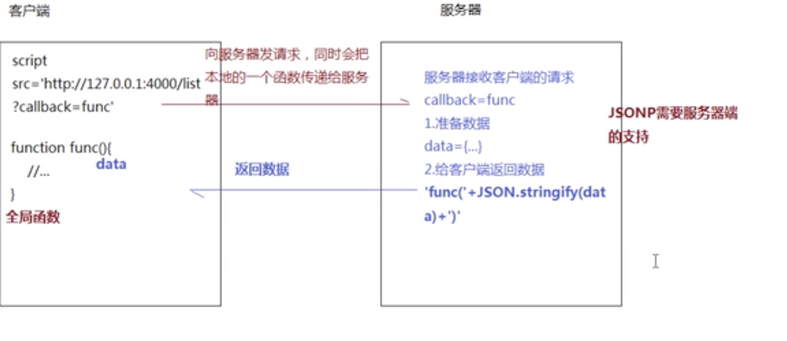

JSONP优点是简单兼容性好，可用于解决主流浏览器的跨域数据访问的问题。**缺点是仅支持get方法具有局限性**

**不安全可能会遭受XSS攻击。** url劫持。

#### **CORS 需要浏览器和后端同时支持。IE 8 和 9 需要通过 XDomainRequest 来实现**。

浏览器会自动进行 CORS 通信，实现 CORS 通信的关键是后端。只要后端实现了 CORS，就实现了跨域。

```java
// 允许哪个方法访问我
res.setHeader('Access-Control-Allow-Methods', 'PUT')
// 预检的存活时间
res.setHeader('Access-Control-Max-Age', 6)
// OPTIONS请求不做任何处理
if (req.method === 'OPTIONS') {
  res.end() 
}
// 定义后台返回的内容
app.put('/getData', function(req, res) {
  console.log(req.headers)
  res.end('sss')
})

```

```js
  if (whitList.includes(origin)) {
    // 设置哪个源可以访问我
    res.setHeader('Access-Control-Allow-Origin', origin)
    // 允许携带哪个头访问我
    res.setHeader('Access-Control-Allow-Headers', 'name')
    // 允许哪个方法访问我
    res.setHeader('Access-Control-Allow-Methods', 'PUT')
    // 允许携带cookie
    res.setHeader('Access-Control-Allow-Credentials', true)
    // 预检的存活时间
    res.setHeader('Access-Control-Max-Age', 6)
    // 允许返回的头
    res.setHeader('Access-Control-Expose-Headers', 'name')
    if (req.method === 'OPTIONS') {
      res.end() // OPTIONS请求不做任何处理
    }
  }
 
```


## HTTP 方法

get, post, option, head,put,delete,connect, trace

## HTTP 首部

## 

## **HTTPS与HTTP的区别**

- HTTPS协议需要到CA申请证书，一般免费证书很少，需要交费。

- HTTP协议运行在TCP之上，所有传输的内容都是明文，HTTPS运行在SSL/TLS之上，SSL/TLS运行在TCP之上，所有传输的内容都经过加密的。

- HTTP和HTTPS使用的是完全不同的连接方式，用的端口也不一样，前者是80，后者是443。

- HTTPS可以有效的防止运营商劫持，解决了防劫持的一个大问题。

  

## 五层协议

- **应用层** ：为特定应用程序提供数据传输服务，例如 HTTP、DNS 等协议。数据单位为报文。
- **传输层** ：为进程提供通用数据传输服务。由于应用层协议很多，定义通用的传输层协议就可以支持不断增多的应用层协议。运输层包括两种协议：传输控制协议 TCP，提供面向连接、可靠的数据传输服务，数据单位为报文段；用户数据报协议 UDP，提供无连接、尽最大努力的数据传输服务，数据单位为用户数据报。TCP 主要提供完整性服务，UDP 主要提供及时性服务。
- **网络层** ：为主机提供数据传输服务。而传输层协议是为主机中的进程提供数据传输服务。网络层把传输层传递下来的报文段或者用户数据报封装成分组。
- **数据链路层** ：网络层针对的还是主机之间的数据传输服务，而主机之间可以有很多链路，链路层协议就是为同一链路的主机提供数据传输服务。数据链路层把网络层传下来的分组封装成帧。
- **物理层** ：考虑的是怎样在传输媒体上传输数据比特流，而不是指具体的传输媒体。物理层的作用是尽可能屏蔽传输媒体和通信手段的差异，使数据链路层感觉不到这些差异。

## SSL/TLS 握手过程 

https://www.jianshu.com/p/7158568e4867

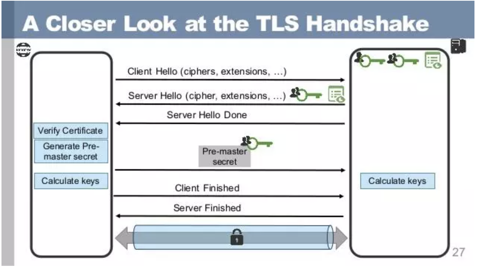

###### Client Hello

握手第一步是客户端向服务端发送 Client Hello 消息，这个消息里包含了一个客户端生成的随机数 **Random1**、客户端支持的加密套件（Support Ciphers）和 SSL Version 等信息

###### Server Hello

第二步是服务端向客户端发送 Server Hello 消息，这个消息会从 Client Hello 传过来的 Support Ciphers 里确定一份加密套件，这个套件决定了后续加密和生成摘要时具体使用哪些算法，另外还会生成一份随机数 **Random2**。注意，至此客户端和服务端都拥有了两个随机数（Random1+ Random2），这两个随机数会在后续生成对称秘钥时用到。

###### Certificate

这一步是服务端将自己的证书下发给客户端，让客户端验证自己的身份，客户端验证通过后取出证书中的公钥。


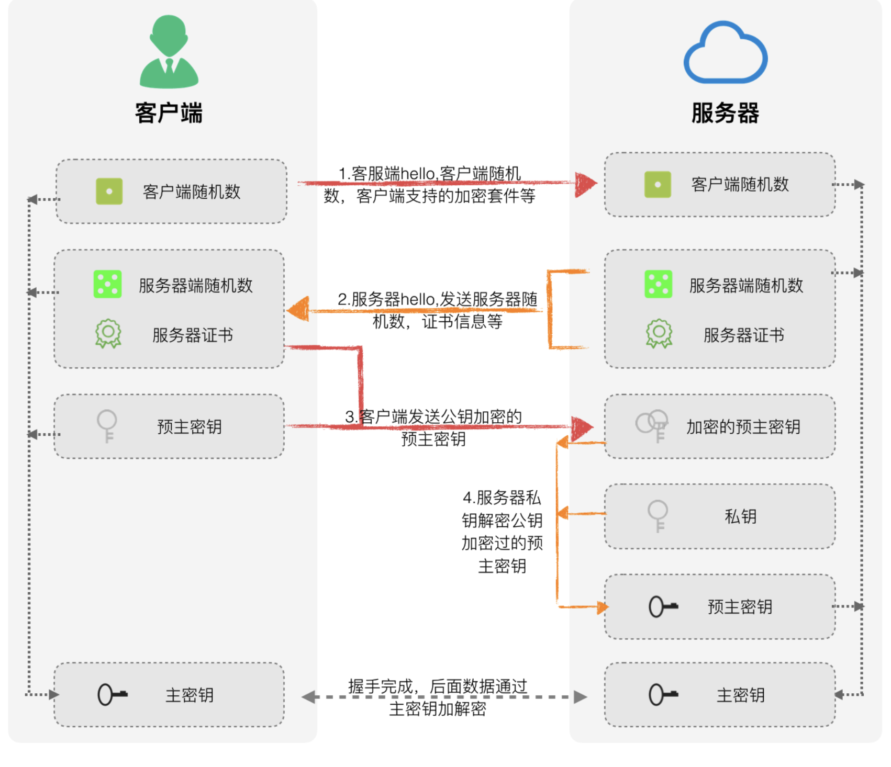


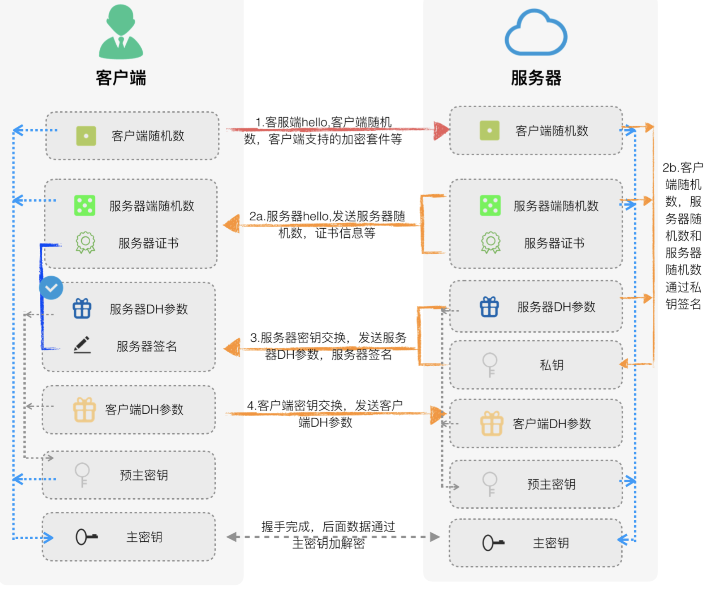


## dns

1、在浏览器中输入www  . qq  .com 域名，操作系统会先检查自己本地的hosts文件是否有这个网址映射关系，如果有，就先调用这个IP地址映射，完成域名解析。 

2、如果hosts里没有这个域名的映射，则查找本地DNS解析器缓存，是否有这个网址映射关系，如果有，直接返回，完成域名解析。 

3、如果hosts与本地DNS解析器缓存都没有相应的网址映射关系，首先会找TCP/ip参数中设置的首选DNS服务器，在此我们叫它本地DNS服务器，此服务器收到查询时，如果要查询的域名，包含在本地配置区域资源中，则返回解析结果给客户机，完成域名解析，此解析具有权威性。 

4、如果要查询的域名，不由本地DNS服务器区域解析，但该服务器已缓存了此网址映射关系，则调用这个IP地址映射，完成域名解析，此解析不具有权威性。 

5、如果本地DNS服务器本地区域文件与缓存解析都失效，则根据本地DNS服务器的设置（是否设置转发器）进行查询，如果未用转发模式，本地DNS就把请求发至13台根DNS，根DNS服务器收到请求后会判断这个域名(.com)是谁来授权管理，并会返回一个负责该顶级域名服务器的一个IP。本地DNS服务器收到IP信息后，将会联系负责.com域的这台服务器。这台负责.com域的服务器收到请求后，如果自己无法解析，它就会找一个管理.com域的下一级DNS服务器地址([http://qq.com](https://link.zhihu.com/?target=http%3A//qq.com))给本地DNS服务器。当本地DNS服务器收到这个地址后，就会找[http://qq.com](https://link.zhihu.com/?target=http%3A//qq.com)域服务器，重复上面的动作，进行查询，直至找到www  . qq  .com主机。 

6、如果用的是转发模式，此DNS服务器就会把请求转发至上一级DNS服务器，由上一级服务器进行解析，上一级服务器如果不能解析，或找根DNS或把转请求转至上上级，以此循环。不管是本地DNS服务器用是是转发，还是根提示，最后都是把结果返回给本地DNS服务器，由此DNS服务器再返回给客户机。

## 一个完整的HTTP请求过程

输入URL到页面展现的过程:

1. 输入URL后，会先进行域名解析。优先查找本地host文件有无对应的IP地址，没有的话去本地DNS服务器查找，还不行的话，本地DNS服务器会去找根DNS服务器要一个域服务器的地址进行查询，域服务器将要查询的域名的解析服务器地址返回给本地DNS，本地DNS去这里查询就OK了。
2. 浏览器拿到服务器的IP地址后，会向它发送HTTP请求。HTTP请求经由一层层的处理、封装、发出之后，最终经由网络到达服务器，建立TCP/IP连接，服务器接收到请求并开始处理。
3. 服务器构建响应，再经由一层层的处理、封装、发出后，到达客户端，浏览器处理请求。
4. 浏览器开始渲染页面，解析HTML，构建render树，根据render树的节点和CSS的对应关系，进行布局，绘制页面。

# WEB 攻防

## csrf

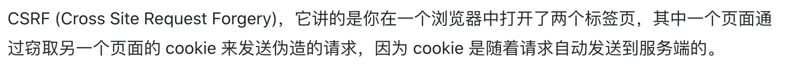


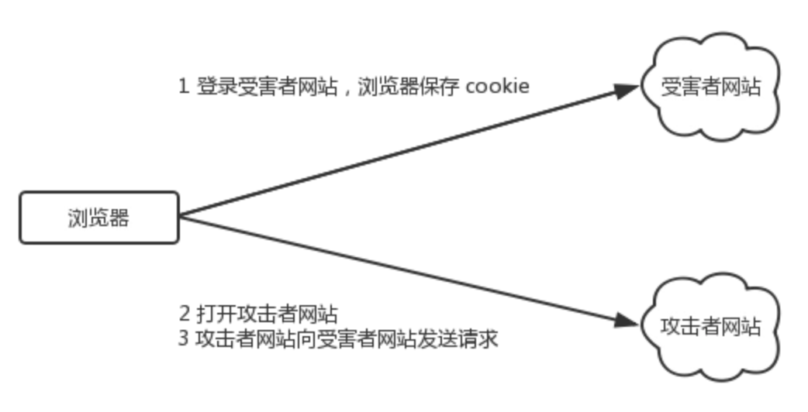


防止： 

* 加入referer /origin判断

* 加入csrf token

* 新增http请求头

### referer /origin判断

CSRF大多数情况下来自第三方域名，但并不能排除本域发起。如果攻击者有权限在本域发布评论（含链接、图片等，统称UGC），那么它可以直接在本域发起攻击，这种情况下**同源策略无法达到防护的作用。**综上所述：同源验证是一个相对简单的防范方法，能够防范绝大多数的 CSRF 攻击。但这并不是万无一失的，对于安全性要求较高，或者有较多用户输入内容的网站，我们就要对关键的接口做额外的防护措施。

### CSRF Token

我们可以要求所有的用户请求都携带一个 CSRF 攻击者无法获取到的Token。服务器通过校验请求是否携带正确的 Token，来把正常的请求和攻击的请求区分开，也可以防范 CSRF 的攻击。

1. 将CSRF Token输出到页面中
   首先，用户打开页面的时候，服务器需要给这个用户生成一个 Token，该 Token 通过加密算法对数据进行加密，一般 Token 都包括随机字符串和时间戳的组合，显然在提交时 Token 不能再放在 Cookie 中了，否则又会被攻击者冒用。因此，为了安全起见 Token 最好还是存在服务器的 Session 中，之后在每次页面加载时，使用 JS 遍历整个 DOM 树，对于 DOM 中所有的 a 和 form 标签后加入 Token。这样可以解决大部分的请求，但是对于在页面加载之后动态生成的 HTML 代码，这种方法就没有作用，还需要程序员在编码时手动添加 Token。
2. 页面提交的请求携带这个 Token
   对于 GET 请求，Token 将附在请求地址之后，这样 URL 就变成 `http://url?csrftoken=tokenvalue`。而对于 POST 请求来说，要在 form 的最后加上 ``
3. 服务器验证 Token 是否正确
   当用户从客户端得到了 Token，再次提交给服务器的时候，服务器需要判断 Token 的有效性，验证过程是先解密 Token，对比加密字符串以及时间戳，如果加密字符串一致且时间未过期，那么这个 Token 就是有效的。

这种方法要比之前检查 Referer 或者 Origin 要安全一些，Token 可以在产生并放于 Session 之中，然后在每次请求时把 Token 从 Session 中拿出，与请求中的 Token 进行比对，但这种方法的比较麻烦的在于如何把 Token 以参数的形式加入请求。如果在请求中找不到 Token，或者提供的值与会话中的值不匹配，则应中止请求，应重置 Token 并将事件记录为正在进行的潜在 CSRF 攻击。

Token 是一个比较有效的 CSRF 防护方法，只要页面没有 XSS 漏洞泄露 Token，那么接口的 CSRF 攻击就无法成功。
但是此方法的实现比较复杂，需要给每一个页面都写入 Token（前端无法使用纯静态页面），每一个 Form 及 Ajax 请求都携带这个 Token，后端对每一个接口都进行校验，并保证页面 Token 及请求 Token 一致。这就使得这个防护策略不能在通用的拦截上统一拦截处理，而需要每一个页面和接口都添加对应的输出和校验。这种方法工作量巨大，且有可能遗漏。（验证码和密码其实也可以起到 CSRF Token 的作用，而且更安全）

### 双重 Cookie 验证

在会话中存储 CSRF Token 比较繁琐，而且不能在通用的拦截上统一处理所有的接口。
那么另一种防御措施是使用双重提交 Cookie。利用 CSRF 攻击不能获取到用户 Cookie 的特点，我们可以要求 Ajax 和表单请求携带一个 Cookie 中的值。

双重Cookie采用以下流程：

1. 在用户访问网站页面时，向请求域名注入一个 Cookie，内容为随机字符串（例如 `csrfcookie=v8g9e4ksfhw`）。
2. 在前端向后端发起请求时，取出 Cookie，并添加到 URL 的参数中（接上例 `POST https://www.a.com/comment?csrfcookie=v8g9e4ksfhw`）。
3. 后端接口验证 Cookie 中的字段与 URL 参数中的字段是否一致，不一致则拒绝。

用双重 Cookie 防御 CSRF 的优点：

- 无需使用 Session，适用面更广，易于实施。
- Token 储存于客户端中，不会给服务器带来压力。
- 相对于 Token，实施成本更低，可以在前后端统一拦截校验，而不需要一个个接口和页面添加。

缺点：

- Cookie 中增加了额外的字段。
- 如果有其他漏洞（例如 XSS），攻击者可以注入 Cookie，那么该防御方式失效。
- 难以做到子域名的隔离。
- 为了确保 Cookie 传输安全，采用这种防御方式的最好确保用整站 HTTPS 的方式，如果还没切 HTTPS 的使用这种方式也会有风险。

### 

## SYN Flood攻击原理与防范

SYN Flood攻击正是利用了TCP连接的三次握手，假设一个用户向服务器发送了SYN报文(第一次握手)后突然死机或掉线，那么服务器在发出SYN+ACK应答报文(第二次握手)后是无法收到客户端的ACK报文的(第三次握手无法完成)，这种情况下服务器端一般会重试(再次发送SYN+ACK给客户端)并等待一段时间后丢弃这个未完成的连接，这段时间的长度我们称为SYN Timeout，一般来说这个时间是分钟的数量级(大约为30秒-2分钟)；一个用户出现异常导致服务器的一个线程等待1分钟并不会对服务器端造成什么大的影响，但如果有大量的等待丢失的情况发生，服务器端将为了维护一个非常大的半连接请求而消耗非常多的资源。我们可以想象大量的保存并遍历也会消耗非常多的CPU时间和内存，再加上服务器端不断对列表中的IP进行SYN+ACK的重试，服务器的负载将会变得非常巨大。如果服务器的TCP/IP栈不够强大，最后的结果往往是堆栈溢出崩溃。相对于攻击数据流，正常的用户请求就显得十分渺小，服务器疲于处理攻击者伪造的TCP连接请求而无暇理睬客户的正常请求，此时从正常客户会表现为打开页面缓慢或服务器无响应，这种情况就是我们常说的服务器端SYN Flood攻击(SYN洪水攻击)。


 第一种是缩短SYN Timeout时间，由于SYN Flood攻击的效果取决于服务器上保持的SYN半连接数，这个值=SYN攻击的频度 x SYN Timeout，所以通过缩短从接收到SYN报文到确定这个报文无效并丢弃改连接的时间，例如设置为20秒以下，可以成倍的降低服务器的负荷。但过低的SYN Timeout设置可能会影响客户的正常访问。

　　第二种方法是设置SYN Cookie，就是给每一个请求连接的IP地址分配一个Cookie，如果短时间内连续受到某个IP的重复SYN报文，就认定是受到了攻击，并记录地址信息，以后从这个IP地址来的包会被一概丢弃。这样做的结果也可能会影响到正常用户的访问。


　通过设置注册表防御SYN Flood攻击，采用的是被动的策略，无论系统如何强大，始终不能靠被动的防护支撑下去，下面我们来看看另外一种比较有效的方法。

　　我称这种策略为“牺牲”策略，基于SYN Flood攻击代码的一个缺陷，我们重新来分析一下SYN Flood攻击者的流程：SYN Flood程序有两种攻击方式，基于IP的和基于域名的，前者是攻击者自己进行域名解析并将IP地址传递给攻击程序，后者是攻击程序自动进行域名解析，但是它们有一点是相同的，就是一旦攻击开始，将不会再进行域名解析，我们就是要利用这一点，假设一台服务器在受到SYN Flood攻击后迅速更换自己的IP地址，那么攻击者仍在不断攻击的只是一个空的IP地址，并没有任何主机，而管理员只需将DNS解析更改到新的IP地址就能在很短的时间内恢复用户通过域名进行的正常访问，这种做法取决于DNS的刷新时间。为了迷惑攻击者，我们甚至可以放置一台“牺牲”服务器，对攻击数据流进行牵引。

　　同样的原因，在众多的负载均衡架构中，基于DNS解析的负载均衡本身就拥有对SYN Flood的免疫力，基于DNS解析的负载均衡能将用户的请求分配到不同IP的服务器主机上，攻击者的一次攻击永远只能是其中一台服务器，虽然说攻击者也能不断去进行DNS请求来持续对用户的攻击，但是这样增加了攻击者的攻击强度，同时由于过多的DNS请求，可以帮助管理员查找到攻击者的地址，这主要是由于DNS请求需要返回数据，而这个数据是很难被伪装的


## DNS劫持” https://juejin.im/post/6844903863623876622

### DNS劫持 vs HTTP劫持

开始正式介绍DNS劫持之前，先与HTTP劫持做一个比较，可能有助于有些同学对下文更容易理解更深入一点。

DNS劫持现象：你输入一个google.com网址，出来的是百度的页面

HTTP劫持现象：访问着github的页面，右下角出现了一个格格不入的广告弹窗


## DNS

注：一般的网站会选择放在虚拟主机，且在主机上放置了很多个网站，而每个网站绑定1个或以上域名。虽然主机上有多个站点，但当用户访问某个站点时，服务器会根据http报文信息（域名），访问对应站点的部署目录，从而实现一台服务器上配置多个站点，即使有多个网站，也不会相互干扰。但使用IP访问，主机不知道用户访问的具体目录，请求便会出现异常情况。）


**1.本机DNS劫持**

攻击者通过某些手段使用户的计算机感染上木马病毒，或者恶意软件之后，恶意修改本地DNS配置，比如修改本地hosts文件，缓存等

**2. 路由DNS劫持**

很多用户默认路由器的默认密码，攻击者可以侵入到路由管理员账号中，修改路由器的默认配置

**3.攻击DNS服务器**

直接攻击DNS服务器，例如对DNS服务器进行DDOS攻击，可以是DNS服务器宕机，出现异常请求，还可以利用某些手段感染dns服务器的缓存，使给用户返回来的是恶意的ip地址

**1.加强本地计算机病毒检查，开启防火墙等，防止恶意软件，木马病毒感染计算机**

**2.改变路由器默认密码，防止攻击者修改路由器的DNS配置指向恶意的DNS服务器**

**3.企业的话可以准备两个以上的域名，一旦一个域名挂掉，还可以使用另一个**

**4.用HTTP DNS 代替 Local DNS**


# NGINX

https://blog.csdn.net/yusiguyuan/article/details/39249953


## MASTER& WORKER 

https://aimuke.github.io/nginx/2019/06/20/nginx-concurrent/

## master进程

主要用来管理worker进程，包含：

- 接收来自外界的信号
- 向各worker进程发送信号
- 监控worker进程的运行状态，当worker进程退出后(异常情况下)，会自动重新启动新的worker进程

master进程充当整个进程组与用户的交互接口，同时对进程进行监护。它不需要处理网络事件，不负责业务的执行，只会通过管理worker进程来实现重启服务、平滑升级、更换日志文件、配置文件实时生效等功能。

我们要控制nginx，只需要通过 `kill` 向master进程发送信号就行了。比如`kill -HUP pid` 是告诉nginx从容地重启nginx。我们一般用这个信号来重启nginx，或重新加载配置，因为是从容地重启，因此服务是不中断的。master进程在接收到`HUP`信号后是怎么做的呢？

- 首先master进程在接到信号后，会先重新加载配置文件
- 然后再启动新的worker进程
- 并向所有老的worker进程发送信号，告诉他们可以光荣退休了
- 新的worker在启动后，就开始接收新的请求，
- 老的worker在收到来自master的信号后，就不再接收新的请求，并且在当前进程中的所有未处理完的请求处理完成后，再退出。

当然，直接给master进程发送信号，这是比较老的操作方式，nginx在0.8版本之后，引入了一系列命令行参数，来方便我们管理。比如 `./nginx -s reload` 就是来重启nginx，`./nginx -s stop` 就是来停止nginx的运行。如何做到的呢？我们还是拿`reload` 来说，我们看到，执行命令时，我们是启动一个新的nginx进程，而新的nginx进程在解析到reload参数后，就知道我们的目的是控制nginx来重新加载配置文件了，它会向master进程发送信号，然后接下来的动作，就和我们直接向master进程发送信号一样了。

## worker进程

而基本的网络事件，则是放在worker进程中来处理了。多个worker进程之间是对等的，他们同等竞争来自客户端的请求，各进程互相之间是独立的。一个请求只可能在一个worker进程中处理，一个worker进程不可能处理其它进程的请求。worker进程的个数是可以设置的，一般我们会设置与机器cpu核数一致，这里面的原因与nginx的进程模型以及事件处理模型是分不开的。

worker进程之间是平等的，每个进程处理请求的机会也是一样的。当我们提供80端口的http服务时，一个连接请求过来，每个进程都有可能处理这个连接，怎么做到的呢？首先，每个worker进程都是从master进程fork过来，在master进程里面，先建立好需要listen的socket（listenfd）之后，然后再fork出多个worker进程。所有worker进程的listenfd会在新连接到来时变得可读，为保证只有一个进程处理该连接，所有worker进程在注册listenfd读事件前抢`accept_mutex`，抢到互斥锁的那个进程注册`listenfd`读事件，在读事件里调用`accept`接受该连接。当一个worker进程在`accept`这个连接之后，就开始读取请求，解析请求，处理请求，产生数据后，再返回给客户端，最后才断开连接，这样一个完整的请求就是这样的了。我们可以看到，一个请求，完全由worker进程来处理，而且只在一个worker进程中处理。


# worker进程工作流程


当一个 worker 进程在` accept()` 这个连接之后，就开始读取请求，解析请求，处理请求，产生数据后，再返回给客户端，最后才断开连接，一个完整的请求。一个请求完全由 worker 进程来处理，而且只能在一个 worker 进程中处理。

这样做带来的好处：

- 节省锁带来的开销。每个 worker 进程都是独立的进程，不共享资源，不需要加锁。同时在编程以及问题查上时，也会方便很多。
- 独立进程，减少风险。采用独立的进程，可以让互相之间不会影响，一个进程退出后，其它进程还在工作，服务不会中断，master 进程则很快重新启动新的 worker 进程。当然，worker 进程的也能发生意外退出。

多进程模型每个进程/线程只能处理一路IO，那么 Nginx是如何处理多路IO呢？

如果不使用 IO 多路复用，那么在一个进程中，同时只能处理一个请求，比如执行 `accept()`，如果没有连接过来，那么程序会阻塞在这里，直到有一个连接过来，才能继续向下执行。

而多路复用，允许我们只在事件发生时才将控制返回给程序，而其他时候内核都挂起进程，随时待命。


### 核心：Nginx采用的 IO多路复用模型epoll

`epoll`通过在Linux内核中申请一个简易的文件系统（文件系统一般用什么数据结构实现？B+树），其工作流程分为三部分：

1. 调用 `int epoll_create(int size)` 建立一个`epoll`对象，内核会创建一个`eventpoll`结构体，用于存放通过`epoll_ctl()`向 `epoll` 对象中添加进来的事件，这些事件都会挂载在红黑树中。
2. 调用 `int epoll_ctl(int epfd, int op, int fd, struct epoll_event *event)` 在 epoll 对象中为 `fd` 注册事件，所有添加到epoll中的事件都会与设备驱动程序建立回调关系，也就是说，当相应的事件发生时会调用这个sockfd的回调方法，将`sockfd`添加到 `eventpoll` 中的双链表
3. 调用 `int epoll_wait(int epfd, struct epoll_event * events, int maxevents, int timeout)` 来等待事件的发生，`timeout` 为 `-1` 时，该调用会阻塞直到有事件发生

这样，注册好事件之后，只要有 `fd` 上事件发生，`epoll_wait()` 就能检测到并返回给用户，用户就能”非阻塞“地进行 I/O 了。

`epoll()` 中内核则维护一个链表， `epoll_wait` 直接检查链表是不是空就知道是否有文件描述符准备好了。（`epoll` 与 `select` 相比最大的优点是不会随着 `sockfd` 数目增长而降低效率，使用 `select()` 时，内核采用轮训的方法来查看是否有 `fd` 准备好，其中的保存 `sockfd` 的是类似数组的数据结构 `fd_set`，key 为 `fd` ，value 为 `0` 或者 `1`。）

能达到这种效果，是因为在内核实现中 `epoll` 是根据每个 `sockfd` 上面的与设备驱动程序建立起来的回调函数实现的。那么，某个 `sockfd` 上的事件发生时，与它对应的回调函数就会被调用，来把这个 `sockfd` 加入链表，其他处于“空闲的”状态的则不会。在这点上， `epoll` 实现了一个”伪”AIO。但是如果绝大部分的 I/O 都是“活跃的”，每个 socket 使用率很高的话，epoll效率不一定比 select 高（可能是要维护队列复杂）。

可以看出，因为一个进程里只有一个线程，所以一个进程同时只能做一件事，但是可以通过不断地切换来“同时”处理多个请求。

**例子：** Nginx 会注册一个事件：“如果来自一个新客户端的连接请求到来了，再通知我”，此后只有连接请求到来，服务器才会执行 `accept()` 来接收请求。又比如向上游服务器（比如 PHP-FPM）转发请求，并等待请求返回时，这个处理的 worker 不会在这阻塞，它会在发送完请求后，注册一个事件：“如果缓冲区接收到数据了，告诉我一声，我再将它读进来”，于是进程就空闲下来等待事件发生。

这样，基于 多进程 + `epoll` ， Nginx 便能实现高并发。

使用 epoll 处理事件的一个框架，代码转自：http://www.cnblogs.com/fnlingnzb-learner/p/5835573.html

```c
for( ; ; )  //  无限循环
{
	nfds = epoll_wait(epfd,events,20,500);  //  最长阻塞 500s
	for(i=0;i<nfds;++i)
	{
		if(events[i].data.fd==listenfd) //有新的连接
		{
			connfd = accept(listenfd,(sockaddr *)&clientaddr, &clilen); //accept这个连接
			ev.data.fd=connfd;
			ev.events=EPOLLIN|EPOLLET;
			epoll_ctl(epfd,EPOLL_CTL_ADD,connfd,&ev); //将新的fd添加到epoll的监听队列中
		}
		else if( events[i].events&EPOLLIN ) //接收到数据，读socket
		{
			n = read(sockfd, line, MAXLINE)) < 0    //读
			ev.data.ptr = md;     //md为自定义类型，添加数据
			ev.events=EPOLLOUT|EPOLLET;
			epoll_ctl(epfd,EPOLL_CTL_MOD,sockfd,&ev);//修改标识符，等待下一个循环时发送数据，异步处理的精髓
		}
		else if(events[i].events&EPOLLOUT) //有数据待发送，写socket
		{
			struct myepoll_data* md = (myepoll_data*)events[i].data.ptr;    //取数据
			sockfd = md->fd;
			send( sockfd, md->ptr, strlen((char*)md->ptr), 0 );        //发送数据
			ev.data.fd=sockfd;
			ev.events=EPOLLIN|EPOLLET;
			epoll_ctl(epfd,EPOLL_CTL_MOD,sockfd,&ev); //修改标识符，等待下一个循环时接收数据
		}
		else
		{
			//其他的处理
		}
	}
}
```

### 正向代理和反向代理的区别

正向代理是一个位于客户端和目标服务器之间的代理服务器(中间服务器)。为了从原始服务器取得内容，客户端向代理服务器发送一个请求，并且指定目标服务器，之后代理向目标服务器转交并且将获得的内容返回给客户端。正向代理的情况下客户端必须要进行一些特别的设置才能使用。

- 正向代理：正向代理用途是为了在防火墙内的局域网提供访问internet的途径。另外还可以使用缓冲特性减少网络使用率
- 正向代理：正向代理允许客户端通过它访问任意网站并且隐蔽客户端自身，因此你必须采取安全措施来确保仅为经过授权的客户端提供服务

反向代理正好相反。对于客户端来说，反向代理就好像目标服务器。并且客户端不需要进行任何设置。客户端向反向代理发送请求，接着反向代理判断请求走向何处，并将请求转交给客户端，使得这些内容就好似他自己一样，一次客户端并不会感知到反向代理后面的服务，也因此不需要客户端做任何设置，只需要把反向代理服务器当成真正的服务器就好了。

- 反向代理：反向代理的用途是将防火墙后面的服务器提供给internet用户访问。同时还可以完成诸如负载均衡等功能
- 反向代理：对外是透明的，访问者并不知道自己访问的是代理。对访问者而言，他以为访问的就是原始服务器


### Nginx 处理一个 HTTP 请求的全过程

1. Read Request Headers：解析请求头。
2. Identify Configuration Block：识别由哪一个 location 进行处理，匹配 URL。
3. Apply Rate Limits：判断是否限速。例如可能这个请求并发的连接数太多超过了限制，或者 QPS 太高。
4. Perform Authentication：连接控制，验证请求。例如可能根据 Referrer 头部做一些防盗链的设置，或者验证用户的权限。
5. Generate Content：生成返回给用户的响应。为了生成这个响应，做反向代理的时候可能会和上游服务（Upstream Services）进行通信，然后这个过程中还可能会有些子请求或者重定向，那么还会走一下这个过程（Internal redirects and subrequests）。
6. Response Filters：过滤返回给用户的响应。比如压缩响应，或者对图片进行处理。
7. Log：记录日志。


## Nginx的事件处理机制：

对于一个基本的web服务器来说，事件通常有三种类型，网络事件、信号、定时器。
首先看一个请求的基本过程：建立连接---接收数据---发送数据 。
再次看系统底层的操作 ：上述过程（建立连接---接收数据---发送数据）在系统底层就是读写事件。

分析：

​	1）如果采用阻塞调用的方式，当读写事件没有准备好时，必然不能够进行读写事件，那么久只好等待，等事件准备好了，才能进行读写事件。那么请求就会被耽搁 。阻塞调用会进入内核等待，cpu就会让出去给别人用了，对单线程的worker来说，显然不合适，当网络事 件越多时，大家都在等待呢，cpu空闲下来没人用，cpu利用率自然上不去了，更别谈高并发了 。      

​	2）既然没有准备好阻塞调用不行，那么采用非阻塞方式。非阻塞就是，事件，马上返回EAGAIN，告诉你，事件还没准备好呢，你慌什么，过会再来吧。好吧，你过一会，再来检查一下事件，直到事件准备好了为止，在这期间，你就可以先去做其它事情，然后再来看看事件好了没。虽然不阻塞了，但你得不时地过来检查一下事件的状态，你可以做更多的事情了，但带来的开销也是不小的 

小结：非阻塞通过不断检查事件的状态来判断是否进行读写操作，这样带来的开销很大。 

！！！因此才有了**异步非阻塞**的事件处理机制。具体到系统调用就是像select/poll/epoll/kqueue这样的系统调用。他们提供了一种机制，让你可以同时监控多个事件，调用他们是阻塞的，但可以设置超时时间，在超时时间之内，如果有事件准备好了，就返回。这种机制解决了我们上面两个问题。 


以epoll为例：当事件没有准备好时，就放入epoll(队列)里面。如果有事件准备好了，那么就去处理；如果事件返回的是EAGAIN，那么继续将其放入epoll里面。从而，只要有事件准备好了，我们就去处理她，只有当所有时间都没有准备好时，才在epoll里面等着。这样 ，我们就可以并发处理大量的并发了，当然，这里的并发请求，是指未处理完的请求，线程只有一个，所以同时能处理的请求当然只有一个了，只是在请求间进行不断地切换而已，切换也是因为异步事件未准备好，而主动让出的。这里的切换是没有任何代价，你可以理 解为循环处理多个准备好的事件，事实上就是这样的。 

4）与多线程的比较：
与多线程相比，这种事件处理方式是有很大的优势的，不需要创建线程，每个请求占用的内存也很少，没有上下文切换，事件处理非常的轻量级。并发数再多也不会导致无谓的资源浪费（上下文切换）。

小结：通过异步非阻塞的事件处理机制，Nginx实现由进程循环处理多个准备好的事件，从而实现高并发和轻量级。


## nginx做负载均衡时其中一台服务器挂掉宕机时响应速度慢的问题解决

nginx会根据预先设置的权重转发请求，若给某一台服务器转发请求时，达到默认超时时间未响应，则再向另一台服务器转发请求。默认超时时间1分钟。


# I/O 模型

Unix 有五种 I/O 模型：

- 阻塞式 I/O
- 非阻塞式 I/O
- I/O 复用（select 和 poll）
- 信号驱动式 I/O（SIGIO）
- 异步 I/O（AIO）

## [阻塞式 I/O](https://cyc2018.github.io/CS-Notes/#/notes/Socket?id=阻塞式-io)

应用进程被阻塞，直到数据从内核缓冲区复制到应用进程缓冲区中才返回。

应该注意到，在阻塞的过程中，其它应用进程还可以执行，因此阻塞不意味着整个操作系统都被阻塞。因为其它应用进程还可以执行，所以不消耗 CPU 时间，这种模型的 CPU 利用率会比较高。

下图中，recvfrom() 用于接收 Socket 传来的数据，并复制到应用进程的缓冲区 buf 中。这里把 recvfrom() 当成系统调用。

```c
ssize_t recvfrom(int sockfd, void *buf, size_t len, int flags, struct sockaddr *src_addr, socklen_t *addrlen);Copy to clipboardErrorCopied
```


## [非阻塞式 I/O](https://cyc2018.github.io/CS-Notes/#/notes/Socket?id=非阻塞式-io)

应用进程执行系统调用之后，内核返回一个错误码。应用进程可以继续执行，但是需要不断的执行系统调用来获知 I/O 是否完成，这种方式称为轮询（polling）。

由于 CPU 要处理更多的系统调用，因此这种模型的 CPU 利用率比较低。


## [I/O 复用](https://cyc2018.github.io/CS-Notes/#/notes/Socket?id=io-复用)

使用 select 或者 poll 等待数据，并且可以等待多个套接字中的任何一个变为可读。这一过程会被阻塞，当某一个套接字可读时返回，之后再使用 recvfrom 把数据从内核复制到进程中。

它可以让单个进程具有处理多个 I/O 事件的能力。又被称为 Event Driven I/O，即事件驱动 I/O。

如果一个 Web 服务器没有 I/O 复用，那么每一个 Socket 连接都需要创建一个线程去处理。如果同时有几万个连接，那么就需要创建相同数量的线程。相比于多进程和多线程技术，I/O 复用不需要进程线程创建和切换的开销，系统开销更小。


## [信号驱动 I/O](https://cyc2018.github.io/CS-Notes/#/notes/Socket?id=信号驱动-io)

应用进程使用 sigaction 系统调用，内核立即返回，应用进程可以继续执行，也就是说等待数据阶段应用进程是非阻塞的。内核在数据到达时向应用进程发送 SIGIO 信号，应用进程收到之后在信号处理程序中调用 recvfrom 将数据从内核复制到应用进程中。

相比于非阻塞式 I/O 的轮询方式，信号驱动 I/O 的 CPU 利用率更高。


## [异步 I/O](https://cyc2018.github.io/CS-Notes/#/notes/Socket?id=异步-io)

应用进程执行 aio_read 系统调用会立即返回，应用进程可以继续执行，不会被阻塞，内核会在所有操作完成之后向应用进程发送信号。

异步 I/O 与信号驱动 I/O 的区别在于，异步 I/O 的信号是通知应用进程 I/O 完成，而信号驱动 I/O 的信号是通知应用进程可以开始 I/O。


## IO复用 https://www.cnblogs.com/Anker/p/3265058.html

select 和 poll 的功能基本相同，不过在一些实现细节上有所不同。

- select 会修改描述符，而 poll 不会；
- select 的描述符类型使用数组实现，FD_SETSIZE 大小默认为 1024，因此默认只能监听少于 1024 个描述符。如果要监听更多描述符的话，需要修改 FD_SETSIZE 之后重新编译；而 poll 没有描述符数量的限制；
- poll 提供了更多的事件类型，并且对描述符的重复利用上比 select 高。
- 如果一个线程对某个描述符调用了 select 或者 poll，另一个线程关闭了该描述符，会导致调用结果不确定。

select 和 poll 速度都比较慢，每次调用都需要将全部描述符从应用进程缓冲区复制到内核缓冲区。

## epoll

```c
int epoll_create(int size);
int epoll_ctl(int epfd, int op, int fd, struct epoll_event *event)；
int epoll_wait(int epfd, struct epoll_event * events, int maxevents, int timeout);Copy to clipboardErrorCopied
```

epoll_ctl() 用于向内核注册新的描述符或者是改变某个文件描述符的状态。已注册的描述符在内核中会被维护在一棵红黑树上，通过回调函数内核会将 I/O 准备好的描述符加入到一个链表中管理，进程调用 epoll_wait() 便可以得到事件完成的描述符。

从上面的描述可以看出，epoll 只需要将描述符从进程缓冲区向内核缓冲区拷贝一次，并且进程不需要通过轮询来获得事件完成的描述符。

epoll 仅适用于 Linux OS。

epoll 比 select 和 poll 更加灵活而且没有描述符数量限制。

epoll 对多线程编程更有友好，一个线程调用了 epoll_wait() 另一个线程关闭了同一个描述符也不会产生像 select 和 poll 的不确定情况。

```c
// Create the epoll descriptor. Only one is needed per app, and is used to monitor all sockets.
// The function argument is ignored (it was not before, but now it is), so put your favorite number here
int pollingfd = epoll_create( 0xCAFE );

if ( pollingfd < 0 )
 // report error

// Initialize the epoll structure in case more members are added in future
struct epoll_event ev = { 0 };

// Associate the connection class instance with the event. You can associate anything
// you want, epoll does not use this information. We store a connection class pointer, pConnection1
ev.data.ptr = pConnection1;

// Monitor for input, and do not automatically rearm the descriptor after the event
ev.events = EPOLLIN | EPOLLONESHOT;
// Add the descriptor into the monitoring list. We can do it even if another thread is
// waiting in epoll_wait - the descriptor will be properly added
if ( epoll_ctl( epollfd, EPOLL_CTL_ADD, pConnection1->getSocket(), &ev ) != 0 )
    // report error

// Wait for up to 20 events (assuming we have added maybe 200 sockets before that it may happen)
struct epoll_event pevents[ 20 ];

// Wait for 10 seconds, and retrieve less than 20 epoll_event and store them into epoll_event array
int ready = epoll_wait( pollingfd, pevents, 20, 10000 );
// Check if epoll actually succeed
if ( ret == -1 )
    // report error and abort
else if ( ret == 0 )
    // timeout; no event detected
else
{
    // Check if any events detected
    for ( int i = 0; i < ret; i++ )
    {
        if ( pevents[i].events & EPOLLIN )
        {
            // Get back our connection pointer
            Connection * c = (Connection*) pevents[i].data.ptr;
            c->handleReadEvent();
         }
    }
}Copy to clipboardErrorCopied
```

## [工作模式](https://cyc2018.github.io/CS-Notes/#/notes/Socket?id=工作模式)

epoll 的描述符事件有两种触发模式：LT（level trigger）和 ET（edge trigger）。

### [1. LT 模式](https://cyc2018.github.io/CS-Notes/#/notes/Socket?id=_1-lt-模式)

当 epoll_wait() 检测到描述符事件到达时，将此事件通知进程，进程可以不立即处理该事件，下次调用 epoll_wait() 会再次通知进程。是默认的一种模式，并且同时支持 Blocking 和 No-Blocking。

### [2. ET 模式](https://cyc2018.github.io/CS-Notes/#/notes/Socket?id=_2-et-模式)

和 LT 模式不同的是，通知之后进程必须立即处理事件，下次再调用 epoll_wait() 时不会再得到事件到达的通知。

很大程度上减少了 epoll 事件被重复触发的次数，因此效率要比 LT 模式高。只支持 No-Blocking，以避免由于一个文件句柄的阻塞读/阻塞写操作把处理多个文件描述符的任务饿死。

## [应用场景](https://cyc2018.github.io/CS-Notes/#/notes/Socket?id=应用场景)

很容易产生一种错觉认为只要用 epoll 就可以了，select 和 poll 都已经过时了，其实它们都有各自的使用场景。

### [1. select 应用场景](https://cyc2018.github.io/CS-Notes/#/notes/Socket?id=_1-select-应用场景)

select 的 timeout 参数精度为微秒，而 poll 和 epoll 为毫秒，因此 select 更加适用于实时性要求比较高的场景，比如核反应堆的控制。

select 可移植性更好，几乎被所有主流平台所支持。

### [2. poll 应用场景](https://cyc2018.github.io/CS-Notes/#/notes/Socket?id=_2-poll-应用场景)

poll 没有最大描述符数量的限制，如果平台支持并且对实时性要求不高，应该使用 poll 而不是 select。

### [3. epoll 应用场景](https://cyc2018.github.io/CS-Notes/#/notes/Socket?id=_3-epoll-应用场景)

只需要运行在 Linux 平台上，有大量的描述符需要同时轮询，并且这些连接最好是长连接。

需要同时监控小于 1000 个描述符，就没有必要使用 epoll，因为这个应用场景下并不能体现 epoll 的优势。

需要监控的描述符状态变化多，而且都是非常短暂的，也没有必要使用 epoll。因为 epoll 中的所有描述符都存储在内核中，造成每次需要对描述符的状态改变都需要通过 epoll_ctl() 进行系统调用，频繁系统调用降低效率。并且 epoll 的描述符存储在内核，不容易调试。

### 

# 框架

##  Spring 

### 什么是 Spring Framework？

Spring 是一个开源应用框架，旨在降低应用程序开发的复杂度。它是轻量级、松散耦合的。它具有分层体系结构，允许用户选择组件，同时还为 J2EE 应用程序开发提供了一个有凝聚力的框架。它可以集成其他框架，如 Structs、Hibernate、EJB 等，所以又称为框架的框架。

### **什么是依赖注入？** （DI）

**依赖注入**就是将实例变量传入到一个对象中去(Dependency injection means giving an object its instance variables)。是一种设计模式


###  **什么是 Spring IOC 容器？**

Spring 框架的核心是 Spring 容器。容器创建对象，将它们装配在一起，配置它们并管理它们的完整生命周期。Spring 容器使用依赖注入来管理组成应用程序的组件。容器通过读取提供的配置元数据来接收对象进行实例化，配置和组装的指令。该元数据可以通过 XML，Java 注解或 Java 代码提供。

IoC 的好处是：

- 它将最小化应用程序中的代码量。

- 易于测试，因为它不需要单元测试用例中的任何单例或 JNDI 查找机制。

- 它以最小的影响和最少的侵入机制促进松耦合。

- 它支持即时的实例化和延迟加载服务

  

### **spring 支持集中 bean scope？**

Spring bean 支持 5 种 scope：

- Singleton - 每个 Spring IoC 容器仅有一个单实例。
- Prototype - 每次请求都会产生一个新的实例。
- Request - 每一次 HTTP 请求都会产生一个新的实例，并且该 bean 仅在当前 HTTP 请求内有效。
- Session - 每一次 HTTP 请求都会产生一个新的 bean，同时该 bean 仅在当前 HTTP session 内有效。
- Global-session - 类似于标准的 HTTP Session 作用域，不过它仅仅在基于 portlet 的 web 应用中才有意义。Portlet 规范定义了全局 Session 的概念，它被所有构成某个 portlet web 应用的各种不同的 portlet 所共享。在 global session 作用域中定义的 bean 被限定于全局 portlet Session 的生命周期范围内。如果你在 web 中使用 global session 作用域来标识 bean，那么 web 会自动当成 session 类型来使用。

### **spring bean 容器的生命周期是什么样的**

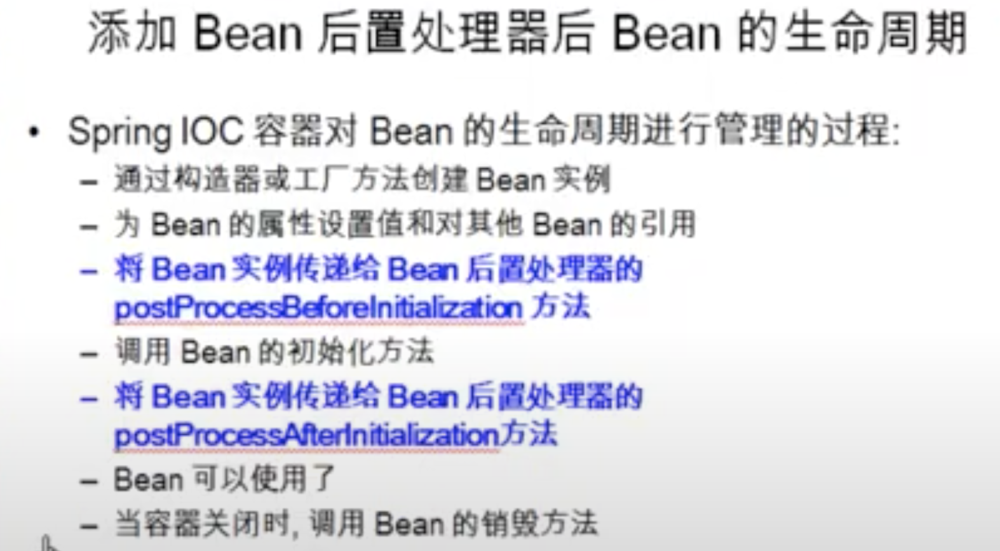

spring bean 容器的生命周期流程如下：

1. Spring 容器根据配置中的 bean 定义中实例化 bean

2. Spring 使用依赖注入填充所有属性，如 bean 中所定义的配置。

3. 如果 bean 实现 BeanNameAware 接口，则工厂通过传递 bean 的 ID 来调用 setBeanName()。

4. 如果 bean 实现 BeanFactoryAware 接口，工厂通过传递自身的实例来调用 setBeanFactory()。

5. 如果存在与 bean 关联的任何 BeanPostProcessors，则调用 preProcessBeforeInitialization() 方法。

6. 如果为 bean 指定了 init 方法（ <bean>的 init-method 属性），那么将调用它。

7. 最后，如果存在与 bean 关联的任何 BeanPostProcessors，则将调用 postProcessAfterInitialization() 方法。

8. 如果 bean 实现 DisposableBean 接口，当 spring 容器关闭时，会调用 destory()。

9. 如果为 bean 指定了 destroy 方法（ <bean>的 destroy-method 属性），那么将调用它。

   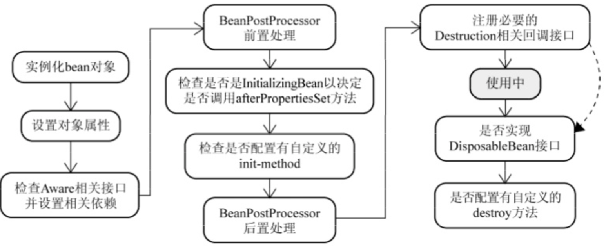

###  **什么是 AOP？**

AOP(Aspect-Oriented Programming), 即 面向切面编程, 它与 OOP( Object-Oriented Programming, 面向对象编程) 相辅相成, 提供了与 OOP 不同的抽象软件结构的视角.在 OOP 中, 我们以类(class)作为我们的基本单元, 而 AOP 中的基本单元是 Aspect(切面)


### **AOP 中的 Aspect、Advice、Pointcut、JointPoint 和 Advice 参数分别是什么？**

1. Aspect - Aspect 是一个实现交叉问题的类，例如事务管理。方面可以是配置的普通类，然后在 Spring Bean 配置文件中配置，或者我们可以使用 Spring AspectJ 支持使用 @Aspect 注解将类声明为 Aspect。

2. Advice - Advice 是针对特定 JoinPoint 采取的操作。在编程方面，它们是在应用程序中达到具有匹配切入点的特定 JoinPoint 时执行的方法。您可以将 Advice 视为 Spring 拦截器（Interceptor）或 Servlet 过滤器（filter）。

3. Advice Arguments - 我们可以在 advice 方法中传递参数。我们可以在切入点中使用 args() 表达式来应用于与参数模式匹配的任何方法。如果我们使用它，那么我们需要在确定参数类型的 advice 方法中使用相同的名称。

4. Pointcut - Pointcut 是与 JoinPoint 匹配的正则表达式，用于确定是否需要执行 Advice。Pointcut 使用与 JoinPoint 匹配的不同类型的表达式。Spring 框架使用 AspectJ Pointcut 表达式语言来确定将应用通知方法的 JoinPoint。

5. JoinPoint - JoinPoint 是应用程序中的特定点，例如方法执行，异常处理，更改对象变量值等。在 Spring AOP 中，JoinPoint 始终是方法的执行器。

   
  
   ### **有哪些类型的通知（Advice）？**

- Before - 这些类型的 Advice 在 joinpoint 方法之前执行，并使用 @Before 注解标记进行配置。
- After Returning - 这些类型的 Advice 在连接点方法正常执行后执行，并使用@AfterReturning 注解标记进行配置。
- After Throwing - 这些类型的 Advice 仅在 joinpoint 方法通过抛出异常退出并使用 @AfterThrowing 注解标记配置时执行。
- After (finally) - 这些类型的 Advice 在连接点方法之后执行，无论方法退出是正常还是异常返回，并使用 @After 注解标记进行配置。
- Around - 这些类型的 Advice 在连接点之前和之后执行，并使用 @Around 注解标记进行配置。

### **AOP 有哪些实现方式？**

实现 AOP 的技术，主要分为两大类：

- 静态代理 - 指使用 AOP 框架提供的命令进行编译，从而在编译阶段就可生成 AOP 代理类，因此也称为编译时增强；
- 编译时编织（特殊编译器实现）
- 类加载时编织（特殊的类加载器实现）。
- 动态代理 - 在运行时在内存中“临时”生成 AOP 动态代理类，因此也被称为运行时增强。
- JDK 动态代理
- CGLIB

### **Spring AOP and AspectJ AOP 有什么区别？**

Spring AOP 基于动态代理方式实现；AspectJ 基于静态代理方式实现。

Spring AOP 仅支持方法级别的 PointCut；提供了完全的 AOP 支持，它还支持属性级别的 PointCut。

### Spring 如何解决循环依赖？

spring对循环依赖的处理有三种情况： ①构造器的循环依赖：这种依赖spring是处理不了的，直 接抛出BeanCurrentlylnCreationException异常。 ②单例模式下的setter循环依赖：通过“三级缓存”处理循环依赖。 ③非单例循环依赖：无法处理。


https://juejin.im/post/5c98a7b4f265da60ee12e9b2

Spring为了解决单例的循环依赖问题，使用了三级缓存。这三级缓存的作用分别是：

singletonFactories ： 进入实例化阶段的单例对象工厂的cache （三级缓存）

earlySingletonObjects ：完成实例化但是尚未初始化的，提前暴光的单例对象的Cache （二级缓存）

singletonObjects：完成初始化的单例对象的cache（一级缓存）

我们在创建bean的时候，会首先从cache中获取这个bean，这个缓存就是sigletonObjects。主要的调用方法是：


```java
/** Cache of singleton objects: bean name –> bean instance */
private final Map singletonObjects = new ConcurrentHashMap(256);
/** Cache of singleton factories: bean name –> ObjectFactory */
private final Map> singletonFactories = new HashMap>(16);
/** Cache of early singleton objects: bean name –> bean instance */
private final Map earlySingletonObjects = new HashMap(16);

protected Object getSingleton(String beanName, boolean allowEarlyReference) {
    Object singletonObject = this.singletonObjects.get(beanName);
    //isSingletonCurrentlyInCreation()判断当前单例bean是否正在创建中
    if (singletonObject == null && isSingletonCurrentlyInCreation(beanName)) {
        synchronized (this.singletonObjects) {
            singletonObject = this.earlySingletonObjects.get(beanName);
            //allowEarlyReference 是否允许从singletonFactories中通过getObject拿到对象
            if (singletonObject == null && allowEarlyReference) {
                ObjectFactory<?> singletonFactory = this.singletonFactories.get(beanName);
                if (singletonFactory != null) {
                    singletonObject = singletonFactory.getObject();
                    //从singletonFactories中移除，并放入earlySingletonObjects中。
                    //其实也就是从三级缓存移动到了二级缓存
                    this.earlySingletonObjects.put(beanName, singletonObject);
                    this.singletonFactories.remove(beanName);
                }
            }
        }
    }
    return (singletonObject != NULL_OBJECT ? singletonObject : null);
}


```

### 解决读问题: 设置事务隔离级别（5种）

DEFAULT 这是一个PlatfromTransactionManager默认的隔离级别，使用数据库默认的事务隔离级别.
未提交读（read uncommited） :脏读，不可重复读，虚读都有可能发生
已提交读 （read commited）:避免脏读。但是不可重复读和虚读有可能发生
可重复读 （repeatable read） :避免脏读和不可重复读.但是虚读有可能发生.
串行化的 （serializable） :避免以上所有读问题.
Mysql 默认:可重复读
Oracle 默认:读已提交

read uncommited：是最低的事务隔离级别，它允许另外一个事务可以看到这个事务未提交的数据。
read commited：保证一个事物提交后才能被另外一个事务读取。另外一个事务不能读取该事物未提交的数据。
repeatable read：这种事务隔离级别可以防止脏读，不可重复读。但是可能会出现幻象读。它除了保证一个事务不能被另外一个事务读取未提交的数据之外还避免了以下情况产生（不可重复读）。
serializable：这是花费最高代价但最可靠的事务隔离级别。事务被处理为顺序执行。除了防止脏读，不可重复读之外，还避免了幻象读（避免三种）。

### 事务的传播行为（7 种）

PROPAGION_XXX :事务的传播行为

* 保证同一个事务中
  PROPAGATION_REQUIRED 支持当前事务，如果不存在 就新建一个(默认)
  PROPAGATION_SUPPORTS 支持当前事务，如果不存在，就不使用事务
  PROPAGATION_MANDATORY 支持当前事务，如果不存在，抛出异常
* 保证没有在同一个事务中
  PROPAGATION_REQUIRES_NEW 如果有事务存在，挂起当前事务，创建一个新的事务
  PROPAGATION_NOT_SUPPORTED 以非事务方式运行，如果有事务存在，挂起当前事务
  PROPAGATION_NEVER 以非事务方式运行，如果有事务存在，抛出异常
  PROPAGATION_NESTED 如果当前事务存在，则嵌套事务执行

1. ### spring事务：

   什么是事务:
   事务逻辑上的一组操作,组成这组操作的各个逻辑单元,要么一起成功,要么一起失败.

   事务特性（4种）:
   原子性 （atomicity）:强调事务的不可分割.
   一致性 （consistency）:事务的执行的前后数据的完整性保持一致.
   隔离性 （isolation）:一个事务执行的过程中,不应该受到其他事务的干扰
   持久性（durability） :事务一旦结束,数据就持久到数据库

   如果不考虑隔离性引发安全性问题:
   脏读 :一个事务读到了另一个事务的未提交的数据
   不可重复读 :一个事务读到了另一个事务已经提交的 update 的数据导致多次查询结果不一致.
   虚幻读 :一个事务读到了另一个事务已经提交的 insert 的数据导致多次查询结果不一致.

   

   ### @Autowired 原理


1.变量名用userService1,userService2，而不是userService。通常情况下@Autowired是通过byType的方法注入的，可是在多个实现类的时候，byType的方式不再是唯一，而需要通过byName的方式来注入，而这个name默认就是根据变量名来的。

2.通过@Qualifier注解来指明使用哪一个实现类，实际上也是通过byName的方式实现。由此看来，@Autowired注解到底使用byType还是byName，其实是存在一定策略的，也就是有优先级。优先用byType，而后是byName。

## Spring MVC

###   Spring MVC 框架有什么用？

Spring Web MVC 框架提供 模型-视图-控制器 架构和随时可用的组件，用于开发灵活且松散耦合的 Web 应用程序。MVC 模式有助于分离应用程序的不同方面，如输入逻辑，业务逻辑和 UI 逻辑，同时在所有这些元素之间提供松散耦合。

### DispatcherServlet 的工作流程

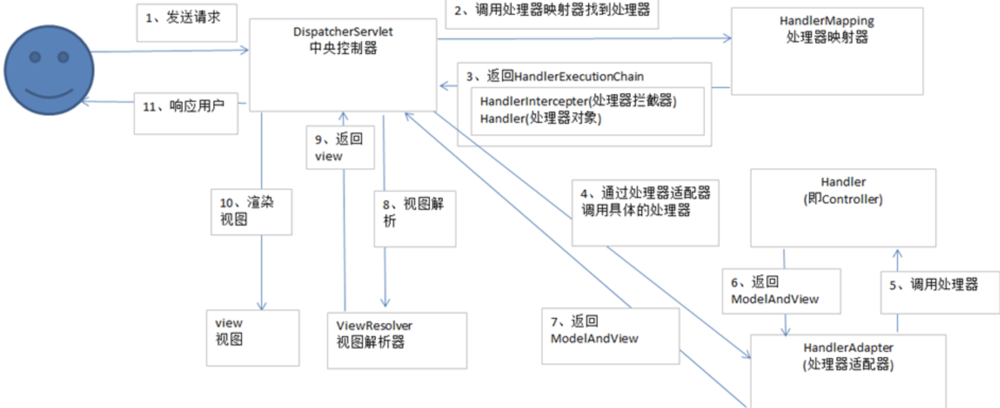

①客户端的所有请求都交给前端控制器DispatcherServlet来处理，它会负责调用系统的其他模块来真正处理用户的请求。

② DispatcherServlet收到请求后，将根据请求的信息（包括URL、HTTP协议方法、请求头、请求参数、Cookie等）以及HandlerMapping的配置找到处理该请求的Handler（任何一个对象都可以作为请求的Handler）。

③在这个地方Spring会通过HandlerAdapter对该处理器进行封装。

④ HandlerAdapter是一个适配器，它用统一的接口对各种Handler中的方法进行调用。

⑤ Handler完成对用户请求的处理后，会返回一个ModelAndView对象给DispatcherServlet，ModelAndView顾名思义，包含了数据模型以及相应的视图的信息。

⑥ ModelAndView的视图是逻辑视图，DispatcherServlet还要借助ViewResolver完成从逻辑视图到真实视图对象的解析工作。 ⑦ 当得到真正的视图对象后，DispatcherServlet会利用视图对象对模型数据进行渲染。

⑧ 客户端得到响应，可能是一个普通的HTML页面，也可以是XML或JSON字符串，还可以是一张图片或者一个PDF文件。


   链接：https://juejin.im/post/5d05cfa56fb9a07ee9586eb4


### SpringMVC的运行机制

1. 用户发送请求时会先从DispathcherServler的doService方法开始，在该方法中会将ApplicationContext、localeResolver、themeResolver等对象添加到request中，紧接着就是调用doDispatch方法。

2. 进入该方法后首先会检查该请求是否是文件上传的请求(校验的规则是是否是post并且contenttType是否为multipart/为前缀)即调用的是checkMultipart方法；如果是的将request包装成MultipartHttpServletRequest。

3. 然后调用getHandler方法来匹配每个HandlerMapping对象，如果匹配成功会返回这个Handle的处理链HandlerExecutionChain对象，在获取该对象的内部其实也获取我们自定定义的拦截器，并执行了其中的方法。

4. 执行拦截器的preHandle方法，如果返回false执行afterCompletion方法并理解返回

5. 通过上述获取到了HandlerExecutionChain对象，通过该对象的getHandler()方法获得一个object通过HandlerAdapter进行封装得到HandlerAdapter对象。

6. 该对象调用handle方法来执行Controller中的方法，该对象如果返回一个ModelAndView给DispatcherServlet。

7. DispatcherServlet借助ViewResolver完成逻辑试图名到真实视图对象的解析，得到View后DispatcherServlet使用这个View对ModelAndView中的模型数据进行视图渲染。

 

## SpringBoot 应用程序启动过程

https://www.jianshu.com/p/dc12081b3598

https://zhuanlan.zhihu.com/p/53022678

* SpringApplication的实例化 

  * 推断应用类型是否是Web环境
  * 设置初始化器（Initializer）：META-INF/spring.factories 读取相应配置文件，然后进行遍历，读取配置文件中Key为：org.springframework.context.ApplicationContextInitializer 的 value。
  * 设置监听器（Listener）
  * 推断应用入口类（Main）
  * 

* 

  ​	

  
  
  SpringBoot的启动主要是通过实例化SpringApplication来启动的，启动过程主要做了以下几件事情：配置属性、获取监听器，发布应用开始启动事件初、始化输入参数、配置环境，输出banner、**创建上下文**、预处理上下文、**刷新上下文(加载tomcat容器)**、再刷新上下文、发布应用已经启动事件、发布应用启动完成事件。

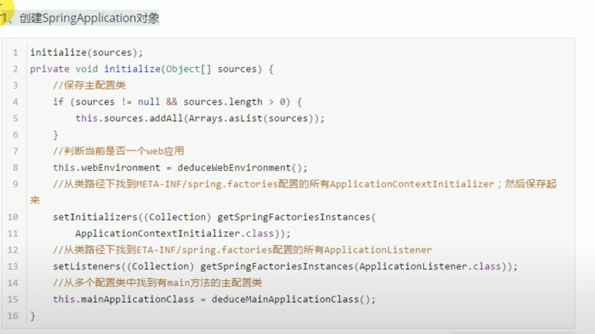


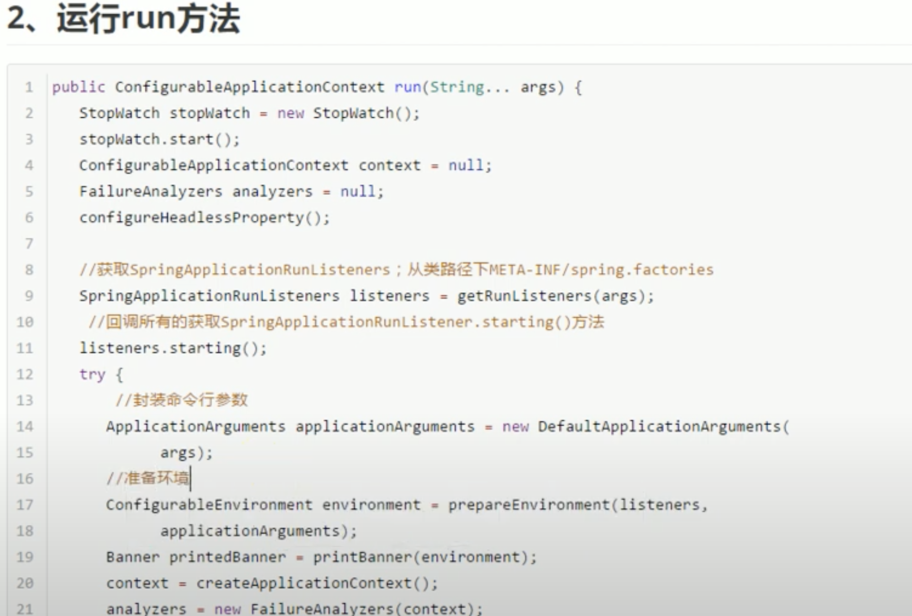

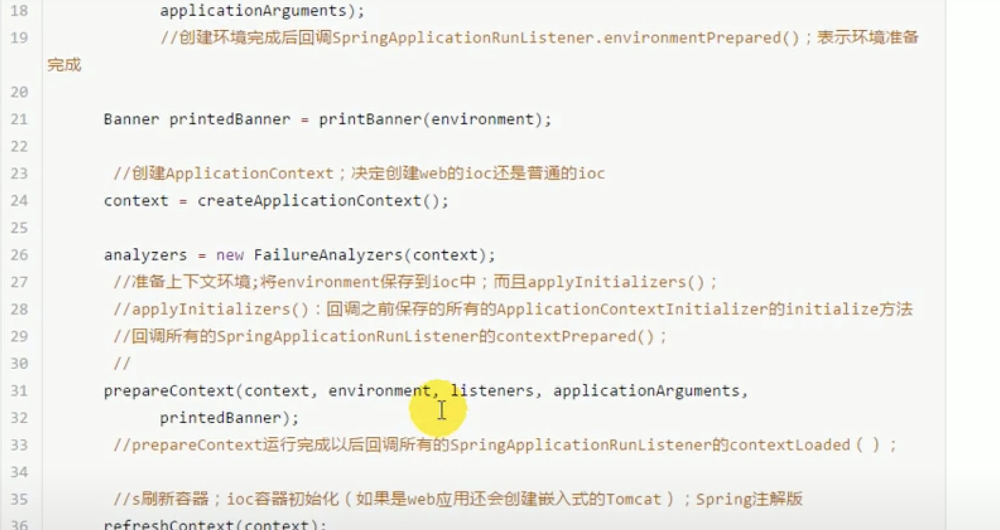


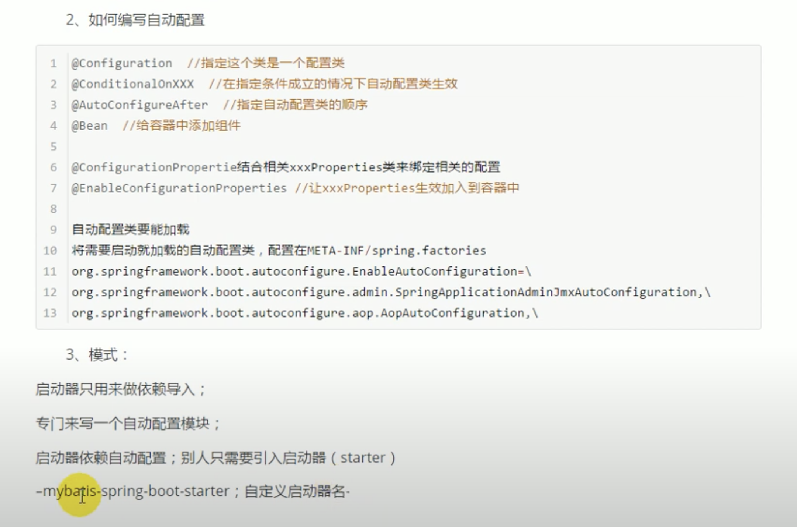


## @Transactional 注解管理事务的实现步骤

```xml
<tx:annotation-driven />
<bean id="transactionManager"
class="org.springframework.jdbc.datasource.DataSourceTransactionManager">
<property name="dataSource" ref="dataSource" />
</bean>
```

将@Transactional 注解添加到合适的**方法**上，并设置合适的属性信息。@Transactional 注解的属性信息如下表  展示。

#####  @Transactional 注解的属性信息

| 属性名           | 说明                                                         |
| :--------------- | :----------------------------------------------------------- |
| name             | 当在配置文件中有多个 TransactionManager , 可以用该属性指定选择哪个事务管理器。 |
| propagation      | 事务的传播行为，默认值为 REQUIRED。                          |
| isolation        | 事务的隔离度，默认值采用 DEFAULT。                           |
| timeout          | 事务的超时时间，默认值为-1。如果超过该时间限制但事务还没有完成，则自动回滚事务。 |
| read-only        | 指定事务是否为只读事务，默认值为 false；为了忽略那些不需要事务的方法，比如读取数据，可以设置 read-only 为 true。 |
| rollback-for     | 用于指定能够触发事务回滚的异常类型，如果有多个异常类型需要指定，各类型之间可以通过逗号分隔。 |
| no-rollback- for | 抛出 no-rollback-for 指定的异常类型，不回滚事务。            |

@Transactional 注解也可以添加到**类级别**上。当把@Transactional 注解放在类级别时，表示所有该类的**公共方法**都配置相同的事务属性信息。见下，EmployeeService 的所有方法都支持事务并且是只读。当类级别配置了@Transactional，方法级别也配置了@Transactional，应用程序会以方法级别的事务属性信息来管理事务，换言之，方法级别的事务属性信息会覆盖类级别的相关配置信息。

```java
@Transactional(propagation= Propagation.SUPPORTS,readOnly=true)
@Service(value ="employeeService")
public class EmployeeService


```


## Spring 的注解方式的事务实现机制

在应用系统调用声明@Transactional 的目标方法时，Spring Framework 默认使用 AOP 代理，在代码运行时生成一个代理对象，根据@Transactional 的属性配置信息，这个代理对象决定该声明@Transactional 的目标方法是否由拦截器 TransactionInterceptor 来使用拦截，在 TransactionInterceptor 拦截时，会在在目标方法开始执行之前创建并加入事务，并执行目标方法的逻辑, 最后根据执行情况是否出现异常，利用抽象事务管理器(图 2 有相关介绍)AbstractPlatformTransactionManager 操作数据源 DataSource 提交或回滚事务, 如图 。

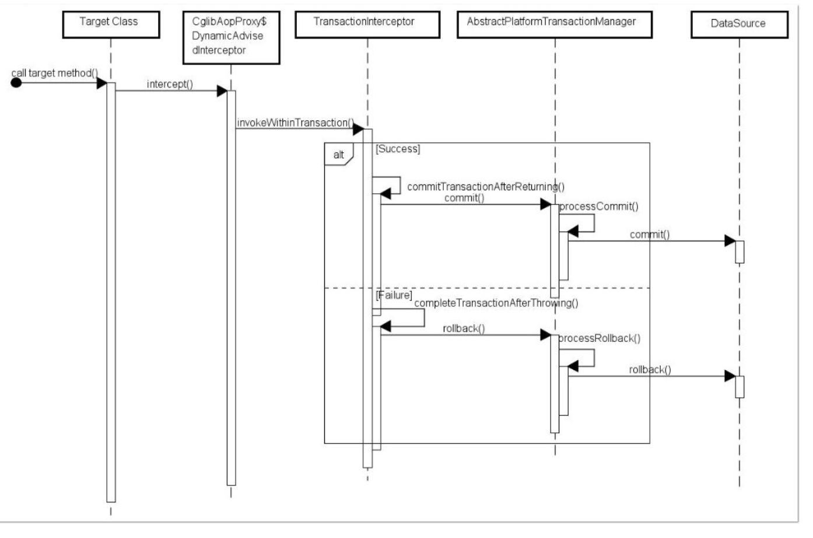


## 事务将不会发生回滚情况

需要注意下面三种 propagation 可以不启动事务。本来期望目标方法进行事务管理，但若是错误的配置这三种 propagation，事务将不会发生回滚。

1. TransactionDefinition.PROPAGATION_SUPPORTS：如果当前存在事务，则加入该事务；如果当前没有事务，则以非事务的方式继续运行。

2. TransactionDefinition.PROPAGATION_NOT_SUPPORTED：以非事务方式运行，如果当前存在事务，则把当前事务挂起。

3. TransactionDefinition.PROPAGATION_NEVER：以非事务方式运行，如果当前存在事务，则抛出异常。

   

   默认情况下，如果在事务中抛出了未检查异常（继承自 RuntimeException 的异常）或者 Error，则 Spring 将回滚事务；除此之外，Spring 不会回滚事务。如果在事务中抛出其他类型的异常，并期望 Spring 能够回滚事务，可以指定 rollbackFor。例：

   >@Transactional(propagation= Propagation.REQUIRED,rollbackFor= MyException.class)

   通过分析 Spring 源码可以知道，若在目标方法中抛出的异常是 rollbackFor 指定的异常的子类，事务同样会回滚。

> ```java
> private int getDepth(Class<?> exceptionClass, int depth) {
>         if (exceptionClass.getName().contains(this.exceptionName)) {
>             // Found it!
>             return depth;
> }
>         // If we've gone as far as we can go and haven't found it...
>         if (exceptionClass == Throwable.class) {
>             return -1;
> }
> return getDepth(exceptionClass.getSuperclass(), depth + 1);
> }
> ```


4. @Transactional 只能应用到 public 方法才有效

5. 在 Spring 的 AOP 代理下，只有目标方法由外部调用，目标方法才由 Spring 生成的代理对象来管理，这会造成自调用问题。若同一类中的其他没有@Transactional 注解的方法内部调用有@Transactional 注解的方法，有@Transactional 注解的方法的事务被忽略，不会发生回滚。

   `AOP`使用的是动态代理的机制，它会给类生成一个代理类，事务的相关操作都在代理类上完成。内部方式使用`this`调用方式时，使用的是实例调用，并没有通过代理类调用方法，所以会导致事务失效。

   为解决这两个问题，使用 AspectJ 取代 Spring AOP 代理。

   

在TransactionDefinition类中，spring提供了**6种传播属**性，接下来分别用简单示例来说明。

**PROPAGATION_REQUIRED**

说明： 如果当前已经存在事务，那么加入该事务，如果不存在事务，创建一个事务，这是默认的传播属性值。

**PROPAGATION_SUPPORTS**

说明：如果当前已经存在事务，那么加入该事务，否则创建一个所谓的空事务（可以认为无事务执行）。

**PROPAGATION_MANDATORY**

说明：当前必须存在一个事务，否则抛出异常。

**PROPAGATN_REQUIRES_NEW**

说明：如果当前存在事务，先把当前事务相关内容封装到一个实体，然后重新创建一个新事务，接受这个实体为参数，用于事务的恢复。更直白的说法就是暂停当前事务(当前无事务则不需要)，创建一个新事务。 针对这种情况，两个事务没有依赖关系，可以实现新事务回滚了，但外部事务继续执行。

**Propagation.NOT_SUPPORTED**

说明：如果当前存在事务，挂起当前事务，然后新的方法在没有事务的环境中执行，没有spring事务的环境下，sql的提交完全依赖于 defaultAutoCommit属性值 。


**6、 PROPAGATION_NEVER**

说明： 如果当前存在事务，则抛出异常，否则在无事务环境上执行代码。

**PROPAGATION_REQUIRES_NEW 实现原理**

```java
@Transactional
public void service(){
    serviceB();
    try{
        serviceA();
    }catch(Exception e){
    }
}

@Transactional(propagation=Propagation.REQUIRES_NEW)
serviceA(){
    do sql 1
    1/0;
    do sql 2
}
serviceB(){
    do sql
}
```


a. 创建事务状态对象，获取一个新的连接，重置连接的 autoCommit，fetchSize，timeout等属性

b. 把连接绑定到ThreadLocal变量

c. 挂起当前事务，把当前事务状态对象，连接等信息封装成一SuspendedResources对象，可用于恢复

d. 创建新的事务状态对象，重新获取新的连接，重置新连接的 autoCommit，fetchSize，timeout等属性，同时，保存SuspendedResources对象，用于事务的恢复，把新的连接绑定到ThreadLocal变量（覆盖操作）

e. 捕获到异常，回滚ThreadLocal中的连接，恢复连接参数，关闭连接，恢复SuspendedResources

f. 提交ThreadLocal变量中的连接(导致serviceB被提交)，还原连接参数，关闭连接，连接归还数据源

所以程序执行的结果就是 serviceA被回滚了，serviceB成功提交了


## OthERs

##  1. [MyBatis缓存机制]

### 一级缓存介绍

在应用运行过程中，我们有可能在一次数据库会话中，执行多次查询条件完全相同的SQL，MyBatis提供了一级缓存的方案优化这部分场景，如果是相同的SQL语句，会优先命中一级缓存，避免直接对数据库进行查询，提高性能。**一级缓存只在数据库会话内部共享**

2. ## 分布式锁

REDIS基于SetNX实现：
 setNX是Redis提供的一个原子操作，如果指定key存在，那么setNX失败，如果不存在会进行Set操作并返回成功。我们可以利用这个来实现一个分布式的锁，主要思路就是，set成功表示获取锁，set失败表示获取失败，失败后需要重试。

### set key value [EX seconds][PX milliseconds][NX|XX]

释放锁时需要验证value值，也就是说我们在获取锁的时候需要设置一个value，不能直接用del key这种粗暴的方式，因为直接del key任何客户端都可以进行解锁了，所以**解锁时，我们需要判断锁是否是自己的，基于value值来判断**

String luaScript = "if redis.call('get',KEYS[1]) == ARGV[1] then " + "return redis.call('del',KEYS[1]) else return 0 end";return jedis.eval(luaScript, Collections.singletonList(key), Collections.singletonList(value)).equals(1L);。

# 常见

非对称 **Diffe-Hellman 算法的密钥生成过程**

使用该算法的前提：

- 选取两个大数p和g并公开，其中p是一个素数，g是p的一个**模p本原单位根(primitive root module p)**，
- Alice 有 a（private key）；Bob 有 b（private key）

有了上面的前提，Diffe-Hellman 的算法流程如下：

- 1、Alice 计算 A=g^a mod p，并发送 A 给 Bob；
- 2、Bob 计算 B=g^b mod p，并发送 B 给 Alice；
- 3、此时，Alice 计算 B^a mod p，Bob 计算 A^b mod p，
- 4、分解可得，
  **B^a mod p** = (g^b mod p)^a mod p = g^ab mod p = K；
  **A^b mod p**= (g^a mod p)^b mod p = g^ab mod p = K;
  于是，双方都有了一个共享密钥 K，关于 Diffe-Hellman 的数学原理，可参考这篇[英文帖子](https://security.stackexchange.com/questions/45963/diffie-hellman-key-exchange-in-plain-english)

## LSM树原理探究

磁盘顺序写的吞吐量甚至能够超过内存随即写的吞吐量。而LSM树正是利用了这一点，它通过将磁盘随机写操作转化为顺序写操作

LSM树的结构是横跨内存和磁盘的，包含memtable、immutable memtable、SSTable等多个部分。

顾名思义，memtable是在内存中的数据结构，用以保存最近的一些更新操作，当写数据到memtable中时，会先通过WAL的方式备份到磁盘中，以防数据因为内存掉电而丢失。

> 预写式日志（Write-ahead logging，缩写 WAL）是关系数据库系统中用于提供原子性和持久性（ACID属性中的两个）的一系列技术。在使用WAL的系统中，所有的修改在提交之前都要先写入log文件中。

memtable可以使用跳跃表或者搜索树等数据结构来组织数据以保持数据的有序性。当memtable达到一定的数据量后，memtable会转化成为immutable memtable，同时会创建一个新的memtable来处理新的数据。

#### immutable memtable

顾名思义，immutable memtable在内存中是不可修改的数据结构，它是将memtable转变为SSTable的一种中间状态。目的是为了在转存过程中不阻塞写操作。写操作可以由新的memtable处理，而不用因为锁住memtable而等待。

#### SSTable

SSTable(Sorted String Table)即为有序键值对集合，是LSM树组在磁盘中的数据的结构。如果SSTable比较大的时候，还可以根据键的值建立一个索引来加速SSTable的查询。下图是一个简单的SSTable结构示意：


链接：https://juejin.im/post/6844903863758094343


## 当我们在谈论HTTP队头阻塞时，我们在谈论什么？

https://liudanking.com/tag/%E5%AF%B9%E5%A4%B4%E9%98%BB%E5%A1%9E/

`HTTP/2`的RFC虽然写的很厚，但是总结起来就做了以下几件事：

1. 通过TCP多路复用降低延迟；
2. 单个TCP连接上允许乱序`request-response`，解决队头堵塞问题；
3. 实现层面上，大部分浏览器要求`HTTP/2`必须开启TLS，一定程度上解决数据安全问题。


管道化要求服务端按照请求发送的顺序返回响应（FIFO），原因很简单，HTTP请求和响应并没有序号标识，无法将乱序的响应与请求关联起来。当客户端在支持管道化时需要保持未收到响应的请求，当连接意外中断时，需要重新发送这部分请求。如果这个请求只是从服务器获取数据，那么并不会对资源造成任何影响，而如果是一个提交信息的请求如post请求，那么可能会造成资源多次提交从而改变资源，这是不允许的。而不会对服务器资源产生影响的请求有个专业名词叫做幂等请求。客户端在使用管道化的时候请求方式必须是幂等请求。

https://cloud.tencent.com/developer/article/1509279


HTTP/1.1通过pipelining管道技术实现一次性发送多个请求，以期提高吞吐和性能，如上图中的序列2。然而，这种技术在接收响应时，要求必须按照发送请求的顺序返回。如果，第一个请求被堵塞了，则后面的请求即使处理完毕了，也需要等待，如上图中的序列3。那么，HTTP/2是怎么解决这个问题的呢？那就是数据分帧：多个请求复用一个TCP连接，然后每个request-response都被拆分为若干个frame发送，这样即使一个请求被阻塞了，也不会影响其他请求，如上图序列4所示。问题完美解决了？准确说，只解决了一部分。如果队头阻塞的粒度是http request这个级别，那么HTTP/2 over TCP的确解决了HTTP/1.1中的问题。但是，HTTP/2目前实现层面上都是基于TCP（没错，HTTP从来没有说过必须通过TCP实现，你可以用它其他传输协议实现哟），因此HTTP/2并没有解决数据传输层的对头(包)阻塞问题。 


应用层无法解决传输层的问题。因此要完全解决队头阻塞问题，需要重新设计和实现传输层。目前而言，真正落地在应用的只看到Google的QUIC（https://www.chromium.org/quic）. 它的原理简单讲，就是使用UDP实现了一个可靠的多路复用传输层。我们知道UDP是面向数据报文的，数据包之间没有阻塞约束，QUIC就是充分利用这个特性解决传输层的队头阻塞问题的。当然，QUIC的协议实现有非常多的细节，而这方面Google确实做得非常好，如果你想进一步了解，可以关注他们的开源实现（https://chromium.googlesource.com/chromium/src/+/master/net/quic/）。

## QUIC

###  QUIC的优势

**低延迟连接的建立**

- 对于传统的HTTPS来说，对于其传输层的TCP握手就需要1.5个RTT，如果算上加密部分的话还需要产生额外的RTT，也就是说HTTPS进行一次完全的握手至少需要 3个以上的RTT。
- 然而对于QUIC来说，如果是客户端首次连接到服务器，由于QUIC将传输与加密结合在一起的特性所在，一般来说正常情况下初次握手只需要1个RTT就可以完成握手；但是对于触发版本协商、证书无法解密等问题当然也会导致多个RTT的产生。
- 而重复连接的情况下握手，如果在证书有效的情况下，客户端发送Hello包并不用等待回复就可以直接发数据加密包，也就是实现了传说中的0RTT。

改进的拥塞控制

- TCP 的拥塞控制实际上包含了四个算法：慢启动，拥塞避免，快速重传，快速恢复。
- QUIC协议当前默认使用TCP的拥塞控制算法，并在其基础上进行了相应的改进；当然QUIC也支持其他的拥塞控制算法。主要的改进点有:
  - 可插拔设计
  - 单调递增的Packet Number
  - 不允许Reneging
  - 更多的Ack块
  - 精确计算RTT时间

无队头阻塞的多路复用

- HTTP2的最大特性就是多路复用，而HTTP2最大的问题就是队头阻塞。
- 首先了解下为什么会出现队头阻塞。比如HTTP2在一个TCP连接上同时发送3个Stream，其中第2个Stream丢了一个Packet，TCP为了保证数据可靠性，需要发送端重传丢失的数据包，虽然这时候第3个数据包已经到达接收端，但被阻塞了，这就是所谓的队头阻塞。
- 而QUIC多路复用可以避免这个问题，因为QUIC的丢包、流控都是基于Stream的，所有Stream是相互独立的，一条Stream上的丢包，不会影响其他Stream的数据传输。

前向纠错

- QUIC协议的每个数据包除了本身的数据以外，会带有其他数据包的部分数据，在少量丢包的情况下，可以使用其他数据包的冗余数据完成数据组装而无需重传，从而提高数据的传输速度。具体实现类似于RAID5，将N个包的校验和（异或）建立一个单独的数据包发送，这样如果在这N个包中丢了一个包可以直接恢复出来，除此之外还可以用来校验包的正确性。

连接迁移

- 对于TCP协议来说，标识一个TCP连接需要4个参数，既来源IP、来源端口、目的IP和目的端口。其中的任一参数改变，TCP连接就需要重新创建。这对于传统网络来说影响不大，因为来源和目的IP相对固定。但是在无线网络中，情况就大不相同了。设备在移动过程中，可能会因为网络切换（如从WIFI网络切换到4G网络环境），导致TCP连接需要重新创建。
- QUIC协议使用了UDP协议，不再需要这四元组参数。同时QUIC协议实现了自己的会话标记方式，称为连接UUID。当设备网络环境切换时，连接UUID不会发生变化，因此无需重新进行握手。

QUIC在握手过程中使用Diffie-Hellman算法协商初始密钥，初始密钥依赖于服务器存储的一组配置参数，该参数会周期性的更新。初始密钥协商成功后，服务器会提供一个临时随机数，双方根据这个数再生成会话密钥。

####     具体握手过程如下

1. 客户端判断本地是否已有服务器的全部配置参数，如果有则直接跳转到(5)，否则继续
2. 客户端向服务器发送inchoate client hello(CHLO)消息，请求服务器传输配置参数
3. 服务器收到CHLO，回复rejection(REJ)消息，其中包含服务器的部分配置参数
4. 客户端收到REJ，提取并存储服务器配置参数，跳回到(1)
5. 客户端向服务器发送full client hello消息，开始正式握手，消息中包括客户端选择的公开数。此时客户端根据获取的服务器配置参数和自己选择的公开数，可以计算出初始密钥。
6. 服务器收到full client hello，如果不同意连接就回复REJ，同(3)；如果同意连接，根据客户端的公开数计算出初始密钥，回复server hello(SHLO)消息，SHLO用初始密钥加密，并且其中包含服务器选择的一个临时公开数。
7. 客户端收到服务器的回复，如果是REJ则情况同(4)；如果是SHLO，则尝试用初始密钥解密，提取出临时公开数
8. 客户端和服务器根据临时公开数和初始密钥，各自基于SHA-256算法推导出会话密钥
9.  双方更换为使用会话密钥通信，初始密钥此时已无用，QUIC握手过程完毕。之后会话密钥更新的流程与以上过程类似，只是数据包中的某些字段略有不同。

## 浏览器渲染 https://juejin.im/entry/6844903503609987080

1. 处理 HTML 标记并构建 DOM 树。
2. 处理 CSS 标记并构建 CSSOM 树。
3. 将 DOM 与 CSSOM 合并成一个渲染树。
4. 根据渲染树来布局，以计算每个节点的几何信息。
5. 将各个节点绘制到屏幕上。

## 字节序号

字节序分为两类：Big-Endian 和 Little-Endian，引用标准的 Big-Endian 和 Little-Endian 的定义如下：

- Little-Endian：就是低位字节排放在内存的低地址端，高位字节排放在内存的高地址端。
- Big-Endian：就是高位字节排放在内存的低地址端，低位字节排放在内存的高地址端。
- 网络字节序：TCP/IP各层协议将字节序定义为 Big-Endian（这与主机序相反），因此TCP/IP协议中使用的字节序通常称之为网络字节序。


## 乐观锁的缺点

> ABA 问题是乐观锁一个常见的问题

#### 1 ABA 问题

如果一个变量V初次读取的时候是A值，并且在准备赋值的时候检查到它仍然是A值，那我们就能说明它的值没有被其他线程修改过了吗？很明显是不能的，因为在这段时间它的值可能被改为其他值，然后又改回A，那CAS操作就会误认为它从来没有被修改过。这个问题被称为CAS操作的 **"ABA"问题。**

JDK 1.5 以后的 `AtomicStampedReference 类`就提供了此种能力，其中的 `compareAndSet 方法`就是首先检查当前引用是否等于预期引用，并且当前标志是否等于预期标志，如果全部相等，则以原子方式将该引用和该标志的值设置为给定的更新值。

#### 2 循环时间长开销大

**自旋CAS（也就是不成功就一直循环执行直到成功）如果长时间不成功，会给CPU带来非常大的执行开销。** 如果JVM能支持处理器提供的pause指令那么效率会有一定的提升，pause指令有两个作用，第一它可以延迟流水线执行指令（de-pipeline）,使CPU不会消耗过多的执行资源，延迟的时间取决于具体实现的版本，在一些处理器上延迟时间是零。第二它可以避免在退出循环的时候因内存顺序冲突（memory order violation）而引起CPU流水线被清空（CPU pipeline flush），从而提高CPU的执行效率。

#### 3 只能保证一个共享变量的原子操作

CAS 只对单个共享变量有效，当操作涉及跨多个共享变量时 CAS 无效。但是从 JDK 1.5开始，提供了`AtomicReference类`来保证引用对象之间的原子性，你可以把多个变量放在一个对象里来进行 CAS 操作.所以我们可以使用锁或者利用`AtomicReference类`把多个共享变量合并成一个共享变量来操作。


链接：https://juejin.im/post/5b4977ae5188251b146b2fc8
处。


## 压缩算法：

> 1. RLE 算法的机制：
>
>   就是把相同的字符`去重化`，也就是 `字符 * 重复次数` 的方式进行压缩，例如**AAAAAABBCDDEEEEEF** 的17个字符成功被压缩成了 **A6B2C1D2E5F1** 的12个字符，也就是 12 / 17 = 70%，压缩比为 70%。RLE 算法的缺点：RLE 的压缩机制比较简单，所以 RLE 算法的程序也比较容易编写，所以使用 RLE 的这种方式更能让你体会到压缩思想，但是 RLE 只针对特定序列的数据管用
>
> 2.  哈夫曼算法和莫尔斯编码
>
>    哈夫曼算法的关键就在于 **多次出现的数据用小于 8 位的字节数表示，不常用的数据则可以使用超过 8 位的字节数表示**。
>
>    对 AAAAAABBCDDEEEEEF 中的 A - F 这些字符，按照`出现频率高的字符用尽量少的位数编码来表示`这一原则进行整理。按照出现频率从高到低的顺序整理后，结果如下，同时也列出了编码方案。
>
>    | 字符 | 出现频率 | 编码（方案） | 位数 |
>    | :--: | :------: | :----------: | :--: |
>    |  A   |    6     |      0       |  1   |
>    |  E   |    5     |      1       |  1   |
>    |  B   |    2     |      10      |  2   |
>    |  D   |    2     |      11      |  2   |
>    |  C   |    1     |     100      |  3   |
>    |  F   |    1     |     101      |  3   |
>
>    
>    
>
>    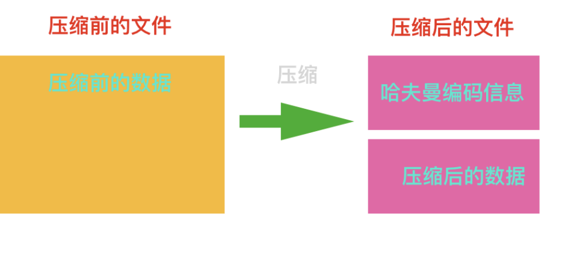
>
> 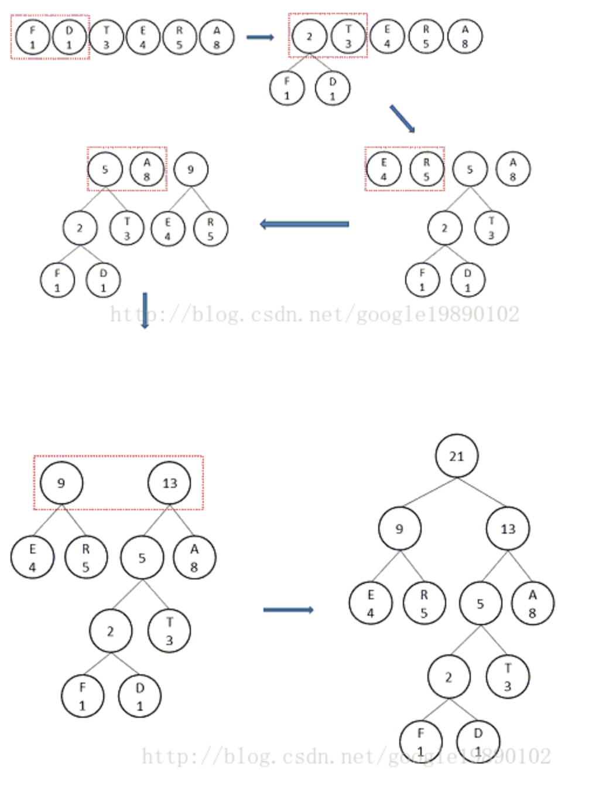
>
> 2. 

## 蓄水池抽样算法（Reservoir Sampling）

**给定一个数据流，数据流长度N很大，且N直到处理完所有数据之前都不可知，请问如何在只遍历一遍数据（O(N)）的情况下，能够随机选取出m个不重复的数据。**

这个场景强调了3件事：

1. 数据流长度N很大且不可知，所以不能一次性存入内存。
2. 时间复杂度为O(N)。
3. 随机选取m个数，每个数被选中的概率为m/N。


链接：https://www.jianshu.com/p/7a9ea6ece2af

```cpp
int[] reservoir = new int[m];

// init
for (int i = 0; i < reservoir.length; i++)
{
    reservoir[i] = dataStream[i];
}

for (int i = m; i < dataStream.length; i++)
{
    // 随机获得一个[0, i]内的随机整数
    int d = rand.nextInt(i + 1);
    // 如果随机整数落在[0, m-1]范围内，则替换蓄水池中的元素
    if (d < m)
    {
        reservoir[d] = dataStream[i];
    }
}
```

算法思路大致如下：

1. 如果接收的数据量小于m，则依次放入蓄水池。
2. 当接收到第i个数据时，i >= m，在[0, i]范围内取以随机数d，若d的落在[0, m-1]范围内，则用接收到的第i个数据替换蓄水池中的第d个数据。
3. 重复步骤2

**当处理完所有的数据时，蓄水池中的每个数据都是以m/N的概率获得的。**

**第i个接收到的数据最后能够留在蓄水池中的概率**=**第i个数据进入过蓄水池的概率*****之后第i个数据不被替换的概率**（第i+1到第N次处理数据都不会被替换）。

1. 当i<=m时，数据直接放进蓄水池，所以**第i个数据进入过蓄水池的概率=1**。
2. 当i>m时，在[1,i]内选取随机数d，如果d<=m，则使用第i个数据替换蓄水池中第d个数据，因此**第i个数据进入过蓄水池的概率=m/i**。
3. 当i<=m时，程序从接收到第m+1个数据时开始执行替换操作，第m+1次x处理会替换池中数据的为m/(m+1)，会替换掉第i个数据的概率为1/m，则第m+1次处理替换掉第i个数据的概率为(m/(m+1))*(1/m)=1/(m+1)，不被替换的概率为1-1/(m+1)=m/(m+1)。依次，第m+2次处理不替换掉第i个数据概率为(m+1)/(m+2)...第N次处理不替换掉第i个数据的概率为(N-1)/N。所以，之后**第i个数据不被替换的概率=m/(m+1)\*(m+1)/(m+2)\*...\*(N-1)/N=m/N**。
4. 当i>m时，程序从接收到第i+1个数据时开始有可能替换第i个数据。则参考上述第3点，**之后第i个数据不被替换的概率=i/N**。
5. 结合第1点和第3点可知，当i<=m时，第i个接收到的数据最后留在蓄水池中的概率=1*m/N=m/N。结合第2点和第4点可知，当i>m时，第i个接收到的数据留在蓄水池中的概率=m/i*i/N=m/N。综上可知，**每个数据最后被选中留在蓄水池中的概率为m/N**。


# Filter/ Listener/Intecepter


1. 过滤器（Filter）：所谓过滤器顾名思义是用来过滤的，Java的过滤器能够为我们提供系统级别的过滤，也就是说，能过滤所有的web请求，这一点，是拦截器无法做到的。在Java Web中，你传入的request,response提前过滤掉一些信息，或者提前设置一些参数，然后再传入servlet或者struts的action进行业务逻辑，比如过滤掉非法url（不是login.do的地址请求，如果用户没有登陆都过滤掉）,或者在传入servlet或者struts的action前统一设置字符集，或者去除掉一些非法字符（聊天室经常用到的，一些骂人的话）。filter 流程是线性的，url传来之后，检查之后，可保持原来的流程继续向下执行，被下一个filter, servlet接收。

2. 监听器（Listener）：Java的监听器，也是系统级别的监听。监听器随web应用的启动而启动。Java的监听器在c/s模式里面经常用到，它会对特定的事件产生产生一个处理。监听在很多模式下用到，比如说观察者模式，就是一个使用监听器来实现的，在比如统计网站的在线人数。又比如struts2可以用监听来启动。Servlet监听器用于监听一些重要事件的发生，监听器对象可以在事情发生前、发生后可以做一些必要的处理。

3. 拦截器（Interceptor）：java里的拦截器提供的是非系统级别的拦截，也就是说，就覆盖面来说，拦截器不如过滤器强大，但是更有针对性。Java中的拦截器是基于Java反射机制实现的，更准确的划分，应该是基于JDK实现的动态代理。它依赖于具体的接口，在运行期间动态生成字节码。拦截器是动态拦截Action调用的对象，它提供了一种机制可以使开发者在一个Action执行的前后执行一段代码，也可以在一个Action执行前阻止其执行，同时也提供了一种可以提取Action中可重用部分代码的方式。在AOP中，拦截器用于在某个方法或者字段被访问之前，进行拦截然后再之前或者之后加入某些操作。java的拦截器主要是用在插件上，扩展件上比如 Hibernate Spring Struts2等，有点类似面向切片的技术，在用之前先要在配置文件即xml，文件里声明一段的那个东西。

   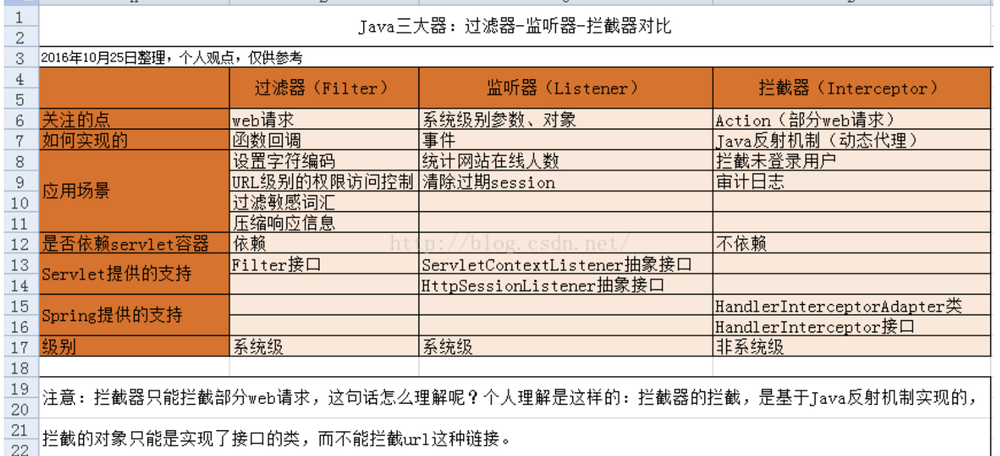


# JWT

https://www.ruanyifeng.com/blog/2018/07/json_web_token-tutorial.html


跨域的服务导向架构，就要求 session 数据共享，每台服务器都能够读取 session。

Example，A 网站和 B 网站是同一家公司的关联服务。现在要求，用户只要在其中一个网站登录，再访问另一个网站就会自动登录，请问怎么实现？


一种解决方案是 session 数据持久化，写入数据库或别的持久层。各种服务收到请求后，都向持久层请求数据。这种方案的优点是架构清晰，缺点是工程量比较大。另外，持久层万一挂了，就会单点失败。

另一种方案是服务器索性不保存 session 数据了，所有数据都保存在客户端，每次请求都发回服务器。JWT 就是这种方案的一个代表。

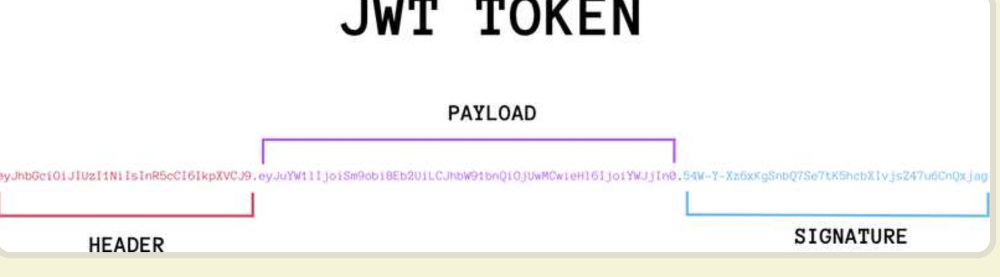

## JWT 的几个特点

（1）JWT 默认是不加密，但也是可以加密的。生成原始 Token 以后，可以用密钥再加密一次。

（2）JWT 不加密的情况下，不能将秘密数据写入 JWT。

（3）JWT 不仅可以用于认证，也可以用于交换信息。有效使用 JWT，可以降低服务器查询数据库的次数。

（4）JWT 的最大缺点是，由于服务器不保存 session 状态，因此无法在使用过程中废止某个 token，或者更改 token 的权限。也就是说，一旦 JWT 签发了，在到期之前就会始终有效，除非服务器部署额外的逻辑。

（5）JWT 本身包含了认证信息，一旦泄露，任何人都可以获得该令牌的所有权限。为了减少盗用，JWT 的有效期应该设置得比较短。对于一些比较重要的权限，使用时应该再次对用户进行认证。

（6）为了减少盗用，JWT 不应该使用 HTTP 协议明码传输，要使用 HTTPS 协议传输。


# REDIS


# Rabbitmq 

## 作用

AMQP，即Advanced Message Queuing Protocol,一个提供统一消息服务的应用层标准高级消息队列协议，是应用层协议的一个开放标准,为面向消息的中间件设计。

RabbitMQ，是一个消息代理和队列服务器，它实现了AMQP标准协议。

分布式消息队列有很多应用场景，比如异步处理、应用解耦、流量削峰等。

#### 1、异步处理

用户注册后需要发送短信和邮件，传统做法是先将用户信息写入数据库，然后发送短信、发送邮件，都完成后返回。

如果用到消息队列，可以先将用户信息写入数据库，然后将注册信息写入消息队列，发送短信、发送邮件或者还有其他的业务逻辑都订阅此消息，完成发送。

#### 2、应用解耦

还是上面的例子，如果在一个大型分布式网站中，用户系统、短信系统、邮件系统可能都是独立的系统服务。

这时候，在用户注册成功后，你可以通过RPC远程调用不同的服务接口，但更好的做法还是通过消息队列，订阅自己感兴趣的数据，日后就算增加或者删减功能，主业务都不用变动。

#### 3、流量削峰

一般在秒杀或者团购活动中，流量激增，应用面临压力过大。可以在应用前端加入消息队列，


链接：https://juejin.im/post/5dc15cdde51d4529e730696d

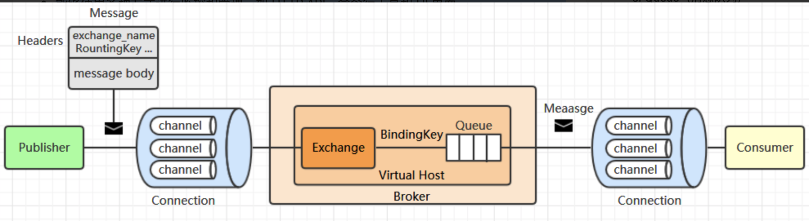

## Exchange

**交换机的属性**

- Name : 交换机名称
- Type : 交换机类型, direct, topic, fanout, headers
- Durability : 是否需要持久化, true为持久化
- Auto Delete : 当最后一个绑定到Exchange上的队列删除后, 自动删除该Exchange
- Internal : 当前Exchange是否用于RabbitMQ内部使用, 默认为False, 这个属性很少会用到
- Arguments : 扩展参数, 用于扩展AMQP协议制定化使用

交换器，消息到达服务的第一站就是交换器，然后根据分发规则，匹配路由键，将消息放到对应队列中。值得注意的是，交换器的类型不止一种。

- Direct 直连交换器，只有在消息中的路由键和绑定关系中的键一致时，交换器才把消息发到相应队列，Direct exchange（直连交换机）是根据消息携带的路由键（routing key）将消息投递给对应队列的，注意 : Direct模式可以使用RabbitMQ自带的Exchange(default Exchange), 所以不需要将Exchange进行任何绑定(binding)操作, 消息传递时, RoutingKey必须完全匹配才会被队列接收, 否则该消息会被抛弃  

- Fanout 广播交换器，只要消息被发送到广播交换器，它会将消息发到所有的队列，Fanout exchange（扇型交换机）将消息路由给绑定到它身上的所有队列

  - 不处理路由键, 只需要简单的将队列绑定到交换机上
  - 发送到交换机的消息都会被转发到与该交换机绑定的所有队列上
  - Fanout交换机转发消息是最快的

- Topic 主题交换器，根据路由键，通配规则(*和#)，将消息发到相应队列，Topic exchange（主题交换机）队列通过路由键绑定到交换机上，然后，交换机根据消息里的路由值，将消息路由给一个或多个绑定队列（模糊匹配）

  - “#” : 匹配一个或多个词
  - “*” : 匹配一个词

  

  Headers exchange（头交换机）类似主题交换机，但是头交换机使用多个消息属性来代替路由键建立路由规则。通过判断消息头的值能否与指定的绑定相匹配来确立路由规则。

  

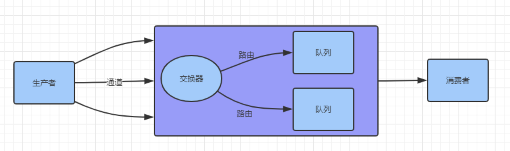

交换器负责接收来自生产者的消息，并将将消息路由到一个或者多个队列中，如果路由不到，则返回给生产者或者直接丢弃，这取决于交换器的 mandatory 属性：

- 当 mandatory 为 true 时：如果交换器无法根据自身类型和路由键找到一个符合条件的队列，则会将该消息返回给生产者；
- 当 mandatory 为 false 时：如果交换器无法根据自身类型和路由键找到一个符合条件的队列，则会直接丢弃该消息。

作者：heibaiying
链接：https://juejin.im/post/5e1302315188253a5d560145
来源：掘金
著作权归作者所有。商业转载请联系作者获得授权，非商业转载请注明出处。


## RabbitMQ常用的5种工作模式

https://juejin.im/post/5e625a216fb9a07c8334e9db

## 持久化

事实上，上图所示只是一个最基本的消息流转过程，交换器和队列这些组件还有一个比较重要的属性：持久化。

默认情况下，重启RabbitMQ服务器之后，我们创建的交换器和队列都会消失不见，当然了，如果里面还有未来得及消费的数据，也将难于幸免。 持久化交换器和队列，为的是在AMQP服务器重启之后，重新创建它们并绑定关系，在RabbitMQ中，设置durable属性为true即可。

不过，除了这些还不够。虽然保证了交换器和队列是安全的，但那些还未来得及消费的数据就变得岌岌可危。所以，我们还要设置消息的投递模式为持久的。

这样，如果RabbitMQ服务器重启的话，我们的策略和相关数据才会确保无忧。所以，我们说能从AMQP服务器崩溃中恢复的消息，称之为持久化消息。那么，它必须保证以下三点：

- 设置投递模式为持久的
- 交换器为持久的
- 队列为持久的

## 消息可靠性传递或回退（生产者端）

生产者发送消息出去之后，不知道到底有没有发送到RabbitMQ服务器， 默认是不知道的。而且有的时候我们在发送消息之后，后面的逻辑出问题了，我们不想要发送之前的消息了，需要撤回该怎么做。

**AMQP 事务机制**

- txSelect  将当前channel设置为transaction模式
- txCommit  提交当前事务
- txRollback  事务回滚

**Confirm 模式**

消息的确认, 是指生产者投递消息后, 如果Broker收到消息, 则会给我们产生一个应答

生产者进行接收应答, 用来确定这条消息是否正常发送到Broker, 这种方式也是消息的可靠性投递的核心保障

- 在channel上开启确认模式 : channel.confirmSelect()
- 在channel上添加监听 : addConfirmListener, 监听成功和失败的返回结果, 根据具体的结果对消息进行重新发送, 或记录日志等后续处理

**Return消息机制**

Return Listener用于处理一些不可路由的消息

正常情况下消息生产者通过指定一个Exchange和RoutingKey, 把消息送到某一个队列中去, 然后消费者监听队列, 进行消费，但在某些情况下, 如果在发送消息的时候, 当前的exchange不存在或者指定的路由key路由不到,这个时候如果我们需要监听这种不可达的消息, 就要使用Return Listener。

在基础API中有一个关键的配置项Mandatory : 如果为true, 则监听器会接收到路由不可达的消息, 然后进行后续处理（补偿或人工处理）, 如果为false, 那么broker端自动删除该消息。

**如何保障消息可靠传递**

- 保障消息的成功发出
- 保障MQ节点的成功接收
- 发送端收到MQ节点(Broker)的确认应答
- 完善的消息补偿机制

方案：

1、消息落库, 对消息状态进行标记


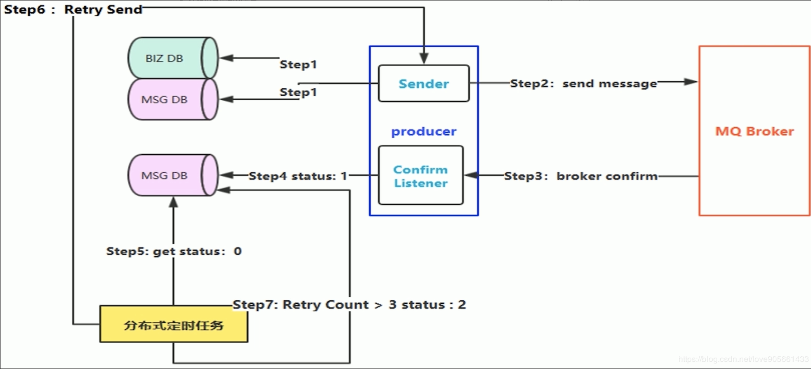


- step1:消息入库
- step2:消息发送
- step3:消费端消息确认
- step4:更新库中消息状态为已确认
- step5:定时任务读取数据库中未确认的消息
- step6:未收到确认结果的消息重新发送
- step7:如果重试几次之后仍然失败, 则将消息状态更改为投递失败的终态, 后面需要人工介入

2、消息的延迟投递, 做二次确认, 回调检查

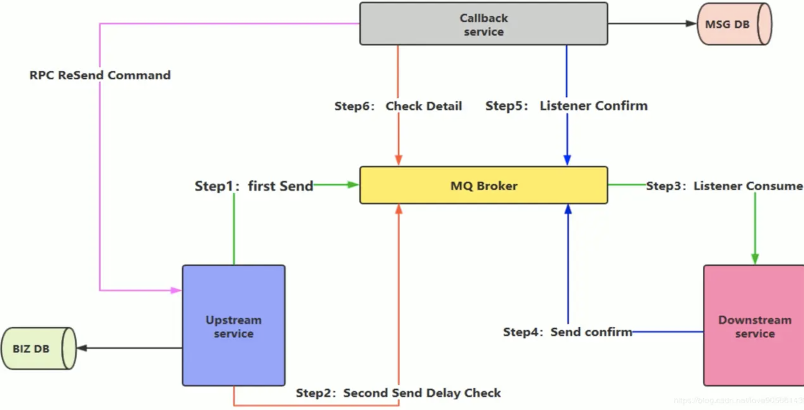


- step1 : 第一次消息发送, 必须业务数据落库之后才能进行消息发送
- step2 : 第二次消息延迟发送, 设定延迟一段时间发送第二次check消息
- step3 : 消费端监听Broker, 进行消息消费
- step4 : 消费成功之后, 发送确认消息到确认消息队列
- step5 : Callback Service监听step4中的确认消息队列, 维护消息状态, 是否消费成功等状态
- step6 : Callback Service监听step2发送的Delay Check的消息队列, 检测内部的消息状态, 如果消息是发送成功状态, 则流程结束, 如果消息是失败状态, 或者查不到当前消息状态时, 会通知生产者, 进行消息重发, 重新上述步骤


# MQ的缺点

如果没有MQ消息队列，那么肯定就不会有当MQ服务宕机的时候，导致整体系统的宕机了。除了宕机这种情况，我们还要考虑到消息有没有重复消费，或者消息丢失了怎么办，或者说其他的服务都消费MQ成功了，但是偏偏还有一个服务消费MQ失败了，这等等一系列的问题。（需要保持最终一致性问题，并且要有业务监控系统。）

## 1.重复消费

因为消费者是隔一段时间来提交自己消费的消息的编号offset的，也就是说如果消费者突然宕机了，那么有可能有的消息已经消费了，但是没有提交到MQ那里让MQ知道，因此当消费者重启后，可能会导致消息的重复消费。 通过业务的判断，来保证代码业务的幂等性。

## 2.消息丢失

### 2.1生产者搞丢了数据

可能是因为网络或者其他的一些问题，导致生产者发送的MQ消息在半路就丢了，没有发送到mq那里去。

因此一般确保MQ消息不丢失，我们需要在生产者发送了MQ消息给MQ之后（MQ将消息持久化），需要MQ返回一个Ack消息给生产者，这样的话生产者就能保证自己的消息已经发送给MQ了，如果一段时间内MQ没有回传消息给到生产者，那么生产者可以选择重发消息。

### 2.2 mq弄丢了消息

可能是因为mq宕机了等等一系列的问题，导致mq的消息丢失了，那么这个时候要开启mq的持久化，将mq消息持久化到磁盘上，这样即使是mq宕机了，也不影响。

### 2.3 消费者将消息搞丢了

一般来说，当消费者消费到一条消息后，会通知MQ说我已经消费到这条消息了，但是如果消费这条消息而且正在处理的时候，消费者宕机了，那么就会导致消息丢失。 消费者应该在消费到消息并且已经处理完了，再通知MQ。（rabbitMQ关掉autoAck模式）（如果是kafka，需要关闭自动提交offset，那么也是在处理完消息后，再返回offset。）

## 3.如果保持MQ消息的顺序性

rabbitMQ在mq里面创建多个队列queue，保证一个队列queue只被一个消费者消费，这样的话就能保证消息的顺序性。


Kafka中可以指定一个key，保证这个key对应的mq消息是进入到一个partition中去，而一个partiton在kafka中是规定了只被一个消费者消费，这样就能保证mq消息的顺序性了。


## 4.消息队列里面堆积了几百万消息

### 4.1

堆积了太多的消息，rabbitMQ里面消息会过期。因此需要只能在晚上来补偿这些消息

### 4.2

kafka堆积了太多消息，那么只能紧急扩容消费端，扩大消费端的消费能力。也可以新建一个topic，partition数量是之前的10倍，然后一个partition只能对应一个消费端，然后又将消费端的性能扩容，紧急的赶紧把这些消息消费掉。当这些消息消费完了之后，再使用之前的架构来消费。


# 分布式

https://doocs.github.io/advanced-java/#/./docs/distributed-system/distributed-system-interview

1. 一致性hash算法

   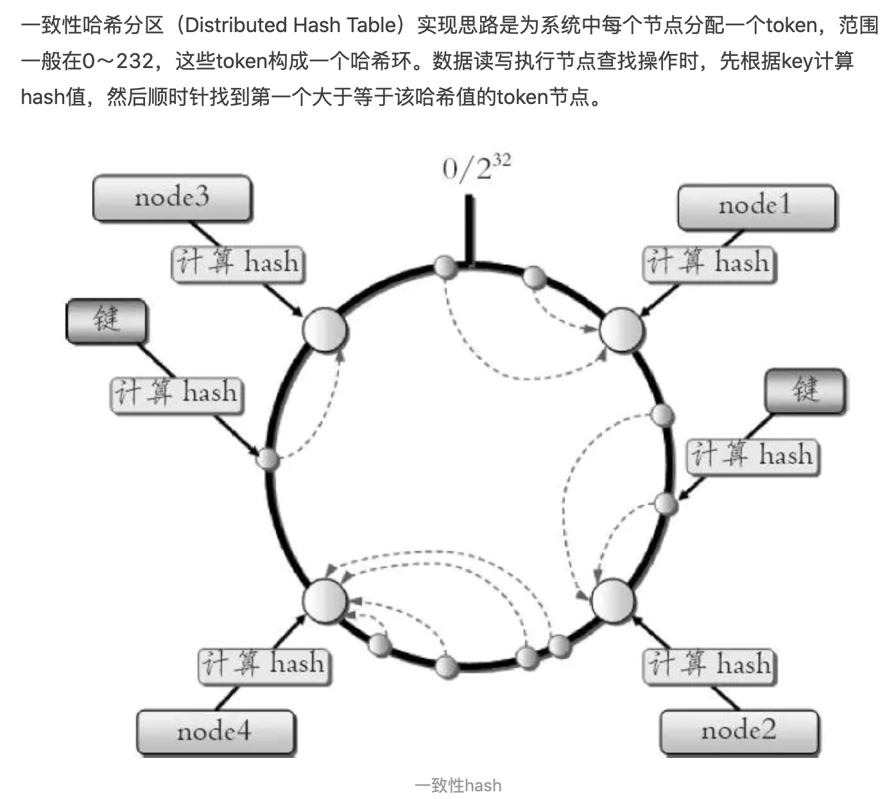
   
   
   
2. XA事务

   https://juejin.im/post/5dcd53d6f265da0beb53cf49

   https://segmentfault.com/a/1190000012534071

   

3. 选举 https://zhuanlan.zhihu.com/p/130332285

4. 分布式事务 https://doocs.github.io/advanced-java/#/./docs/distributed-system/distributed-transaction

5. Redis 分布式锁http://zhangtielei.com/posts/blog-redlock-reasoning.html

6. zk分布式锁 https://zhuanlan.zhihu.com/p/73807097

7. 分布式Session共享解决方案 https://juejin.im/post/5c13bea65188251595128d4b


## 幂等性实现方案


## 乐观锁

如果只是更新已有的数据，没有必要对业务进行加锁，设计表结构时使用乐观锁，一般通过version来做乐观锁，这样既能保证执行效率，又能保证幂等。

## 防重表

使用订单号 orderNo 做为去重表的唯一索引，每次请求都根据订单号向去重表中插入一条数据。第一次请求查询订单支付状态，订单没有支付，进行支付操作，无论成功与否，执行完后更新订单状态为成功或失败，删除去重表中的数据。后续的订单因为表中唯一索引而插入失败，则返回操作失败，直到第一次的请求完成（成功或失败）。


# 分布式锁

对于防重表可以用分布式锁代替，比如 Redis 和 Zookeeper

## **Redis**

1. 订单发起支付请求，支付系统会去 Redis 缓存中查询是否存在该订单号的 Key，如果不存在，则向 Redis 增加 Key 为订单号
2. 查询订单支付状态，如果未支付，则进行支付流程，支付完成后删除该订单号的 key


**Zookeeper**

1. 订单发起支付请求，支付系统会去 Zookeeper 中创建一个 node，如果创建失败，则表示订单已经被支付
2. 如果创建成功，则进行支付流程，支付完成后删除 node

## Token 机制

这种方式分成两个阶段：申请 Token 阶段和支付阶段。 第一阶段，在进入到提交订单页面之前，需要订单系统根据用户信息向支付系统发起一次申请 Token 的请求，支付系统将 Token 保存到 Redis 缓存中，为第二阶段支付使用。 第二阶段，订单系统拿着申请到的 Token 发起支付请求，支付系统会检查 Redis 中是否存在该 Token ，如果存在，表示第一次发起支付请求，删除缓存中 Token 后开始支付逻辑处理；如果缓存中不存在，表示非法请求。

## 消息队列缓冲

将订单的支付请求全部发送到消息队列中，然后使用异步任务处理队列中的数据，过滤掉重复的待支付订单，再进行支付流程。


## Redis分布式锁问题

因为Redis的复制是异步的。

举例来说：

1. 线程A在master节点拿到了锁。
2. master节点在把A创建的key写入slave之前宕机了。
3. slave变成了master节点。
4. 线程B也得到了和A还持有的相同的锁。（因为原来的slave里面还没有A持有锁的信息）


## 服务雪崩的应对策略

针对造成服务雪崩的不同原因, 可以使用不同的应对策略:

1. 流量控制
2. 改进缓存模式
3. 服务自动扩容
4. 服务调用者降级服务

流量控制 的具体措施包括:

- 网关限流
- 用户交互限流
- 关闭重试

因为Nginx的高性能, 目前一线互联网公司大量采用Nginx+Lua的网关进行流量控制, 由此而来的OpenResty也越来越热门.

用户交互限流的具体措施有: 1. 采用加载动画,提高用户的忍耐等待时间. 2. 提交按钮添加强制等待时间机制.

改进缓存模式 的措施包括:

- 缓存预加载
- 同步改为异步刷新

服务自动扩容 的措施主要有:

- AWS的auto scaling

服务调用者降级服务 的措施包括:

- 资源隔离
- 对依赖服务进行分类
- 不可用服务的调用快速失败

资源隔离主要是对调用服务的线程池进行隔离.

我们根据具体业务,将依赖服务分为: 强依赖和若依赖. 强依赖服务不可用会导致当前业务中止,而弱依赖服务的不可用不会导致当前业务的中止.

不可用服务的调用快速失败一般通过 超时机制, 熔断器 和熔断后的 降级方法 来实现.

## 服务熔断Hystrix

## Hystrix的内部处理逻辑

下图为Hystrix服务调用的内部逻辑: 


1. 构建Hystrix的Command对象, 调用执行方法.
2. Hystrix检查当前服务的熔断器开关是否开启, 若开启, 则执行降级服务getFallback方法.
3. 若熔断器开关关闭, 则Hystrix检查当前服务的线程池是否能接收新的请求, 若超过线程池已满, 则执行降级服务getFallback方法.
4. 若线程池接受请求, 则Hystrix开始执行服务调用具体逻辑run方法.
5. 若服务执行失败, 则执行降级服务getFallback方法, 并将执行结果上报Metrics更新服务健康状况.
6. 若服务执行超时, 则执行降级服务getFallback方法, 并将执行结果上报Metrics更新服务健康状况.
7. 若服务执行成功, 返回正常结果.
8. 若服务降级方法getFallback执行成功, 则返回降级结果.
9. 若服务降级方法getFallback执行失败, 则抛出异常.


# 分布式事务

## 二提交

**阶段1：**

  TM通知各个RM准备提交它们的事务分支。如果RM判断自己进行的工作可以被提交，那就就对工作内容进行持久化，再给TM肯定答复；要是发生了其他情况，那给TM的都是否定答复。在发送了否定答复并回滚了已经的工作后，RM就可以丢弃这个事务分支信息。

  以mysql数据库为例，在第一阶段，事务管理器向所有涉及到的数据库服务器发出prepare"准备提交"请求，数据库收到请求后执行数据修改和日志记录等处理，处理完成后只是把事务的状态改成"可以提交",然后把结果返回给事务管理器。

**阶段2**

  TM根据阶段1各个RM prepare的结果，决定是提交还是回滚事务。如果所有的RM都prepare成功，那么TM通知所有的RM进行提交；如果有RM prepare失败的话，则TM通知所有RM回滚自己的事务分支。

​    以mysql数据库为例，如果第一阶段中所有数据库都prepare成功，那么事务管理器向数据库服务器发出"确认提交"请求，数据库服务器把事务的"可以提交"状态改为"提交完成"状态，然后返回应答。如果在第一阶段内有任何一个数据库的操作发生了错误，或者事务管理器收不到某个数据库的回应，则认为事务失败，回撤所有数据库的事务。数据库服务器收不到第二阶段的确认提交请求，也会把"可以提交"的事务回撤。

### 优化

 **只读断言**

   在Phase 1中，RM可以断言“我这边不涉及数据增删改”来答复TM的prepare请求，从而让这个RM脱离当前的全局事务，从而免去了Phase 2。

这种优化发生在其他RM都完成prepare之前的话，使用了只读断言的RM早于AP其他动作（比如说这个RM返回那些只读数据给AP）前，就释放了相关数据的上下文（比如读锁之类的），这时候其他全局事务或者本地事务就有机会去改变这些数据，结果就是无法保障整个系统的可序列化特性——通俗点说那就会有脏读的风险。

**一阶段提交**

   如果需要增删改的数据都在同一个RM上，TM可以使用一阶段提交——跳过两阶段提交中的Phase 1，直接执行Phase 2。

这种优化的本质是跳过Phase 1，RM自行决定了事务分支的结果，并且在答复TM前就清除掉事务分支信息。对于这种优化的情况，TM实际上也没有必要去可靠的记录全局事务的信息，在一些异常的场景下，此时TM可能不知道事务分支的执行结果。 

###  **两阶段提交协议(2PC)存在的问题**

二阶段提交看起来确实能够提供原子性的操作，但是不幸的是，二阶段提交还是有几个缺点的：

**1、同步阻塞问题。**两阶段提交方案下全局事务的ACID特性，是依赖于RM的。例如mysql5.7官方文档关于对XA分布式事务的支持有以下介绍：

https://dev.mysql.com/doc/refman/5.7/en/xa.html

>  A global transaction involves several actions that are transactional in themselves, but that all must either complete successfully as a group, or all be rolled back as a group. In essence, this extends ACID properties “up a level” so that multiple ACID transactions can be executed in concert as components of a global operation that also has ACID properties. (As with nondistributed transactions, [SERIALIZABLE](https://dev.mysql.com/doc/refman/5.7/en/innodb-transaction-isolation-levels.html#isolevel_serializable) may be preferred if your applications are sensitive to read phenomena. [REPEATABLE READ](https://dev.mysql.com/doc/refman/5.7/en/innodb-transaction-isolation-levels.html#isolevel_repeatable-read) may not be sufficient for distributed transactions.)


  大致含义是说，一个全局事务内部包含了多个独立的事务分支，这一组事务分支要不都成功，要不都失败。各个事务分支的ACID特性共同构成了全局事务的ACID特性。也就是将单个事务分支的支持的ACID特性提升一个层次(up a level)到分布式事务的范畴。括号中的内容的意思是： 即使在非分布事务中(即本地事务)，如果对操作读很敏感，我们也需要将事务隔离级别设置为SERIALIZABLE。而对于分布式事务来说，更是如此，可重复读隔离级别不足以保证分布式事务一致性。

   也就是说，如果我们使用mysql来支持XA分布式事务的话，那么最好将事务隔离级别设置为SERIALIZABLE。 地球人都知道，SERIALIZABLE(串行化)是四个事务隔离级别中最高的一个级别，也是执行效率最低的一个级别。

**2、单点故障。**由于协调者的重要性，一旦协调者TM发生故障。参与者RM会一直阻塞下去。尤其在第二阶段，协调者发生故障，那么所有的参与者还都处于锁定事务资源的状态中，而无法继续完成事务操作。（如果是协调者挂掉，可以重新选举一个协调者，但是无法解决因为协调者宕机导致的参与者处于阻塞状态的问题）

**3、数据不一致。**在二阶段提交的阶段二中，当协调者向参与者发送commit请求之后，发生了局部网络异常或者在发送commit请求过程中协调者发生了故障，这回导致只有一部分参与者接受到了commit请求。而在这部分参与者接到commit请求之后就会执行commit操作。但是其他部分未接到commit请求的机器则无法执行事务提交。于是整个分布式系统便出现了数据不一致性的现象。

由于二阶段提交存在着诸如同步阻塞、单点问题等缺陷，所以，研究者们在二阶段提交的基础上做了改进，提出了三阶段提交。 


## **三阶段提交协议(Three-phase commit)**

  三阶段提交（3PC)，是二阶段提交（2PC）的改进版本。参考维基百科：https://en.wikipedia.org/wiki/Three-phase_commit_protocol

与两阶段提交不同的是，三阶段提交有两个改动点。

  1、引入**超时机制**。同时在协调者和参与者中都引入超时机制。

  2、在第一阶段和第二阶段中插入一个**准备阶段**。保证了在最后提交阶段之前各参与节点的状态是一致的。也就是说，除了引入超时机制之外，3PC把2PC的准备阶段再次一分为二，这样三阶段提交就有CanCommit、PreCommit、DoCommit三个阶段。


**CanCommit阶段**

   3PC的CanCommit阶段其实和2PC的准备阶段很像。协调者向参与者发送commit请求，参与者如果可以提交就返回Yes响应，否则返回No响应。

1. **事务询问** 协调者向参与者发送CanCommit请求。询问是否可以执行事务提交操作。然后开始等待参与者的响应。

2. **响应反馈** 参与者接到CanCommit请求之后，正常情况下，如果其自身认为可以顺利执行事务，则返回Yes响应，并进入预备状态。否则反馈No

**PreCommit阶段**

   协调者根据参与者的反应情况来决定是否可以记性事务的PreCommit操作。根据响应情况，有以下两种可能。

  假如协调者从所有的参与者获得的反馈都是Yes响应，那么就会执行事务的预执行。

1. 发送预提交请求 协调者向参与者发送PreCommit请求，并进入Prepared阶段。   

2. 事务预提交 参与者接收到PreCommit请求后，会执行事务操作，并将undo和redo信息记录到事务日志中。

3. 响应反馈 如果参与者成功的执行了事务操作，则返回ACK响应，同时开始等待最终指令。

  假如有任何一个参与者向协调者发送了No响应，或者等待超时之后，协调者都没有接到参与者的响应，那么就执行事务的中断。

1. 发送中断请求 协调者向所有参与者发送abort请求。

2. 中断事务 参与者收到来自协调者的abort请求之后（或超时之后，仍未收到协调者的请求），执行事务的中断。

**doCommit阶段**

  该阶段进行真正的事务提交，也可以分为以下两种情况。

  **Case 1：执行提交**

1. 发送提交请求 协调接收到参与者发送的ACK响应，那么他将从预提交状态进入到提交状态。并向所有参与者发送doCommit请求。

2. 事务提交 参与者接收到doCommit请求之后，执行正式的事务提交。并在完成事务提交之后释放所有事务资源。

3. 响应反馈 事务提交完之后，向协调者发送Ack响应。

4. 完成事务 协调者接收到所有参与者的ack响应之后，完成事务。

  **Case 2：中断事务** 协调者没有接收到参与者发送的ACK响应（可能是接受者发送的不是ACK响应，也可能响应超时），那么就会执行中断事务。

1. 发送中断请求 协调者向所有参与者发送abort请求

2. 事务回滚 参与者接收到abort请求之后，利用其在阶段二记录的undo信息来执行事务的回滚操作，并在完成回滚之后释放所有的事务资源。

3. 反馈结果 参与者完成事务回滚之后，向协调者发送ACK消息

4. 中断事务 协调者接收到参与者反馈的ACK消息之后，执行事务的中断。 


  在doCommit阶段，如果参与者无法及时接收到来自协调者的doCommit或者rebort请求时，会在等待超时之后，会继续进行事务的提交。（其实这个应该是基于概率来决定的，当进入第三阶段时，说明参与者在第二阶段已经收到了PreCommit请求，那么协调者产生PreCommit请求的前提条件是他在第二阶段开始之前，收到所有参与者的CanCommit响应都是Yes。（一旦参与者收到了PreCommit，意味他知道大家其实都同意修改了）所以，一句话概括就是，当进入第三阶段时，由于网络超时等原因，虽然参与者没有收到commit或者abort响应，但是他有理由相信：成功提交的几率很大。 ）


**小结：2PC与3PC的区别 ** https://zhuanlan.zhihu.com/p/35616810

   相对于2PC，3PC主要解决的单点故障问题，并减少阻塞，因为一旦参与者无法及时收到来自协调者的信息之后，他会默认执行commit。而不会一直持有事务资源并处于阻塞状态。但是这种机制也会导致数据一致性问题，因为，由于网络原因，协调者发送的abort响应没有及时被参与者接收到，那么参与者在等待超时之后执行了commit操作。这样就和其他接到abort命令并执行回滚的参与者之间存在数据不一致的情况。

   了解了2PC和3PC之后，我们可以发现，无论是二阶段提交还是三阶段提交都无法彻底解决分布式的一致性问题。Google Chubby的作者Mike Burrows说过， there is only one consensus protocol, and that’s Paxos” – all other approaches are just broken versions of Paxos. 意即世上只有一种一致性算法，那就是Paxos，所有其他一致性算法都是Paxos算法的不完整版。后面的文章会介绍这个公认为难于理解但是行之有效的Paxos算法。  


# 秒杀项目


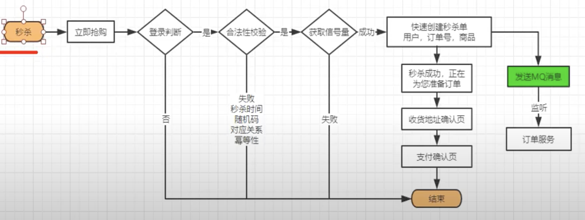


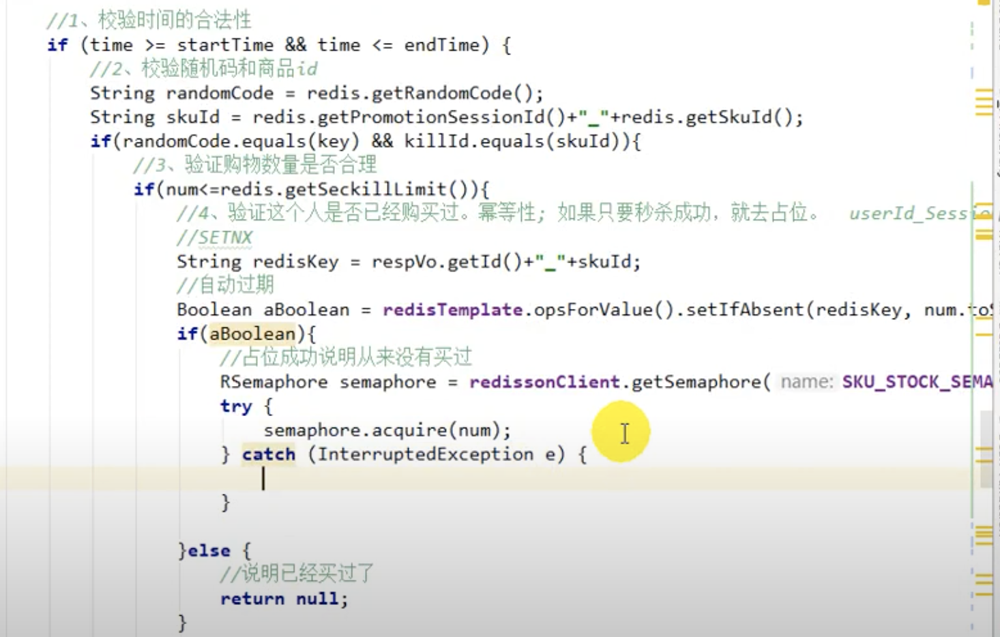

### 拦截器

继承 HandlerInterceptorAdapter # 重写   

> public  **boolean** preHandle(HttpServletRequest request, HttpServletResponse response, Object handler) **throws** Exception 

方法，返回true 表示继续， 返回false 表示不继续

	**if** (handler **instanceof** HandlerMethod)   // 指明拦截的是方法

```java

        // 指明拦截的是方法
        if (handler instanceof HandlerMethod) {
            SeckillUser user = this.getUser(request, response);// 获取用户对象
            UserContext.setUser(user);// 保存用户到ThreadLocal，这样，同一个线程访问的是同一个用户
            HandlerMethod hm = (HandlerMethod) handler;
            // 获取标注了@AccessLimit的方法，没有注解，则直接返回
            AccessLimit accessLimit = hm.getMethodAnnotation(AccessLimit.class);
            // 如果没有添加@AccessLimit注解，直接放行（true）
            if (accessLimit == null) {
                return true;
            }
```

解析请求继承 HandlerMethodArgumentResolver 

```java
 /**
     * 当请求参数为MiaoshaUser时，使用这个解析器处理
     * 客户端的请求到达某个Controller的方法时，判断这个方法的参数是否为MiaoshaUser，
     * 如果是，则这个MiaoshaUser参数对象通过下面的resolveArgument()方法获取，
     * 然后，该Controller方法继续往下执行时所看到的MiaoshaUser对象就是在这里的resolveArgument()方法处理过的对象
     *
     * @param methodParameter
     * @return
     */
    @Override
    public boolean supportsParameter(MethodParameter methodParameter) {
        Class<?> parameterType = methodParameter.getParameterType();
        return parameterType == SeckillUser.class;
    }
 /**
     * 获取MiaoshaUser对象
     *
     * @param methodParameter
     * @param modelAndViewContainer
     * @param nativeWebRequest
     * @param webDataBinderFactory
     * @return
     * @throws Exception
     */
    @Override
    public Object resolveArgument(MethodParameter methodParameter,
                                  ModelAndViewContainer modelAndViewContainer,
                                  NativeWebRequest nativeWebRequest,
                                  WebDataBinderFactory webDataBinderFactory) throws Exception {
        // 获取请求和响应对象
        HttpServletRequest request = nativeWebRequest.getNativeRequest(HttpServletRequest.class);
        HttpServletResponse response = nativeWebRequest.getNativeResponse(HttpServletResponse.class);

        // 从请求对象中获取token（token可能有两种方式从客户端返回，1：通过url的参数，2：通过set-Cookie字段）
        String paramToken = request.getParameter(SeckillUserService.COOKIE_NAME_TOKEN);
        String cookieToken = getCookieValue(request, SeckillUserService.COOKIE_NAME_TOKEN);

        if (StringUtils.isEmpty(cookieToken) && StringUtils.isEmpty(paramToken)) {
            return null;
        }

        // 判断是哪种方式返回的token，并由该种方式获取token（cookie）
        String token = StringUtils.isEmpty(paramToken) ? cookieToken : paramToken;
        // 通过token就可以在redis中查出该token对应的用户对象
        return seckillUserService.getMisaoshaUserByToken(response, token);
    }
```


URL 缓存/页面缓存

```java
@RequestMapping(value = "/to_detail/{goodsId}", produces = "text/html")// 注意这种写法
    @ResponseBody
    public String toDetail(
            HttpServletRequest request,
            HttpServletResponse response,
            Model model,
            SeckillUser user,
            @PathVariable("goodsId") long goodsId) {

        // 1. 根据商品id从redis中取详情数据的缓存
        String html = redisService.get(GoodsKeyPrefix.goodsDetailKeyPrefix, "" + goodsId, String.class);
        if (!StringUtils.isEmpty(html)) {// 如果缓存中数据存在着直接返回
            return html;
        }

        // 2. 如果缓存中数据不存在，则需要手动渲染详情界面数据并返回
        model.addAttribute("user", user);
        // 通过商品id查询
        GoodsVo goods = goodsService.getGoodsVoByGoodsId(goodsId);
        model.addAttribute("goods", goods);

        // 获取商品的秒杀开始与结束的时间
        long startDate = goods.getStartDate().getTime();
        long endDate = goods.getEndDate().getTime();
        long now = System.currentTimeMillis();

        // 秒杀状态; 0: 秒杀未开始，1: 秒杀进行中，2: 秒杀已结束
        int miaoshaStatus = 0;
        // 秒杀剩余时间
        int remainSeconds = 0;

        if (now < startDate) { // 秒杀未开始
            miaoshaStatus = 0;
            remainSeconds = (int) ((startDate - now) / 1000);
        } else if (now > endDate) { // 秒杀已结束
            miaoshaStatus = 2;
            remainSeconds = -1;
        } else { // 秒杀进行中
            miaoshaStatus = 1;
            remainSeconds = 0;
        }

        // 将秒杀状态和秒杀剩余时间传递给页面（goods_detail）
        model.addAttribute("miaoshaStatus", miaoshaStatus);
        model.addAttribute("remainSeconds", remainSeconds);

//        return "goods_detail";

        // 3. 渲染html
        WebContext webContext = new WebContext(request, response, request.getServletContext(), request.getLocale(), model.asMap());
        // (第一个参数为渲染的html文件名，第二个为web上下文：里面封装了web应用的上下文)
        html = thymeleafViewResolver.getTemplateEngine().process("goods_detail", webContext);

        if (!StringUtils.isEmpty(html)) // 如果html文件不为空，则将页面缓存在redis中
            redisService.set(GoodsKeyPrefix.goodsDetailKeyPrefix, "" + goodsId, html);

        return html;
    }

```

对

```java
    @RequestMapping(value = "/to_detail_static/{goodsId}")// 注意这种写法
//    @RequestMapping(value = "/to_detail/{goodsId}")// 注意这种写法
    @ResponseBody
    public Result<GoodsDetailVo> toDetailStatic(SeckillUser user, @PathVariable("goodsId") long goodsId) {

        // 通过商品id再数据库查询
        GoodsVo goods = goodsService.getGoodsVoByGoodsId(goodsId);

        // 获取商品的秒杀开始与结束的时间
        long startDate = goods.getStartDate().getTime();
        long endDate = goods.getEndDate().getTime();
        long now = System.currentTimeMillis();

        // 秒杀状态; 0: 秒杀未开始，1: 秒杀进行中，2: 秒杀已结束
        int miaoshaStatus = 0;
        // 秒杀剩余时间
        int remainSeconds = 0;

        if (now < startDate) { // 秒杀未开始
            miaoshaStatus = 0;
            remainSeconds = (int) ((startDate - now) / 1000);
        } else if (now > endDate) { // 秒杀已结束
            miaoshaStatus = 2;
            remainSeconds = -1;
        } else { // 秒杀进行中
            miaoshaStatus = 1;
            remainSeconds = 0;
        }

        // 服务端封装商品数据直接传递给客户端，而不用渲染页面
        GoodsDetailVo goodsDetailVo = new GoodsDetailVo();
        goodsDetailVo.setGoods(goods);
        goodsDetailVo.setUser(user);
        goodsDetailVo.setRemainSeconds(remainSeconds);
        goodsDetailVo.setSeckillStatus(miaoshaStatus);

        return Result.success(goodsDetailVo);
    }

```

**如何做的IP限流**  

   我的实现思路是放在缓存，每次IP进来都去缓存里访问看看有没有存在此IP，如果存在且还没过期那就不放行，如果不存在或者已经到期就放行，这里其实是针对某一特定IP的频率限制。 

### 分布式Session一致性？

**解决方案：**

- 使用cookie来完成（很明显这种不安全的操作并不可靠）

- 使用Nginx中的ip绑定策略，同一个ip只能在指定的同一个机器访问（不支持负载均衡）

- 利用数据库同步session（效率不高）

- 使用tomcat内置的session同步（同步可能会产生延迟）

- 使用token代替session

- **我们使用spring-session以及集成好的解决方案，存放在redis中**

  链接：https://juejin.im/post/5c13bea65188251595128d4b


### spring-session 

### 工作流程

Tomcat web.xml解析步骤：

```java
contextInitialized(ServletContextEvent arg0); // Listener
init(FilterConfig filterConfig); // Filter
init(ServletConfig config); // Servlet

```


初始化顺序：Listener > Filter > Servlet。

  **如果要实现更加广义上的，比如一秒钟放行1k请求，怎么做**  

   用桶算法去处理，令牌桶/漏桶

## 页面静态化

HTML静态化的好处:

（1）减轻服务器负担，浏览网页无需调用系统数据库。

（2）有利于搜索引擎优化SEO，Baidu、Google都会优先收录静态页面，不仅被收录的快还收录的全；

（3）加快页面打开速度，静态页面无需连接数据库打开速度较动态页面有明显提高；

（4）网站更安全，HTML页面不会受php程序相关漏洞的影响；观看一下大一点的网站基本全是静态页面，而且可以减少攻击，防sql注入。数据库出错时，不影响网站正常访问。

（5）数据库出错时，不影响网站的正常访问。

（6）最主要是可以增加访问速度,减轻服务器负担,当数据量有几万，几十万或是更多的时候你知道哪个更快了. 而且还容易被搜索引擎找到。生成html文章虽操作上麻烦些，程序上繁杂些，但为了更利于搜索，为了速度更快些，更安全，这些牺牲还是值得的。


[https://machenxing.github.io/2019/07/20/%E5%A4%A7%E5%9E%8B%E7%BD%91%E7%AB%99%E7%9A%84%E9%A1%B5%E9%9D%A2%E9%9D%99%E6%80%81%E5%8C%96/](https://machenxing.github.io/2019/07/20/大型网站的页面静态化/)

### 方案一：网页静态HTML化

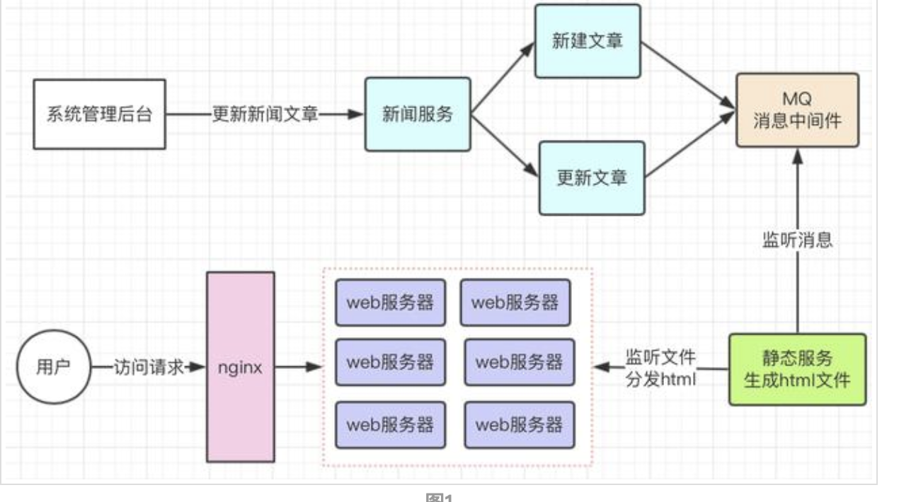

上图的核心思想：

> 1）管理后台调用新闻服务创建文章成功后，发送消息到消息队列
>
> 2）静态服务监听消息，把文章静态化，也就是生成html文件
>
> 3）在静态服务器上面安装一个文件同步工具，此工具的功能可以做到只同步有变动的文件，即做增量同步
>
> 4）通过同步工具把html文件同步到所有的web服务器上面

这样的话就达到了，用户访问一些变化不大的页面时，是直接访问的html文件，直接在web服务器那边直接返回，不需要在访问数据库了，系统吞吐量比较高。

这个方案的问题：

**1、网页布局样式僵化，无法修改**

> 如果产品经理觉得新闻详情页面的布局要调整一下，现在的不够美观，或者加个其他模块，那就坑爹了，我们需要把所有的已经静态html化的文章全部重新静态化。这个是不现实的，因为像网易这么大的体量，新闻量是很大的，会被搞死。

**2、页面会出现暂时间不一致**

> 会出现用户刚刚再看最新的新闻，刷新一下又不存在了。这个是因为同步工具在同步到web服务器是要有时间的，同步到web服务器A上面了，但web服务器B还没有来得及同步。用户在访问的时候通过**nginx进行负载均衡，随机把请求分配给web服务器**的导致的。当然可以调整nginx负载均衡策略去解决。

**3、Html文件太多，无法维护**

> 这个是很明显的问题，html文件会越来越多，对存储空间要求很大，而且每台web服务器都一样，浪费磁盘空间；将来迁移维护也会带来很大的麻烦。

**4、同步工具的不稳定**

> 因为文件一旦多之后，同步工具稳定性就出现了问题

这个方案应该是比较传统的（不推荐）

### 方案二：伪静态化

**什么是伪静态？**

举个例子：我们一般访问一个文章，一般的链接地址为：http://www.xxx.com/news?id=1代表请求id为1的文章。**不过这种链接方式对SEO不是太友好（SEO对网站来说太重要了）**；所以一般进行改造：http://www.xxx.com/news/1.html 这样看上去就是个静态页面。一般我们可以**采用nginx对url进行rewrite**。小伙伴如何有兴趣可以自行了解，比较简单。

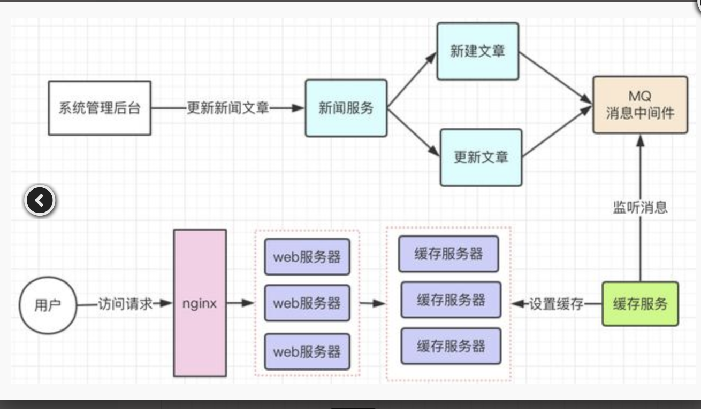

此方案的核心思想

> 1）管理后台调用新闻服务创建文章成功后，发送消息到消息队列
>
> 2）缓存服务监听消息，把文章内容缓存到缓存服务器上面
>
> 3）用户发起请求，web服务器根据id，直接查询缓存服务器
>
> 4）获取数据返回给用户

此方案就解决了方案一的一个大问题，就是html文件多的问题，因为不需要生成html，而且用缓存的方式，解决不需要访问数据库，提升系统吞吐量。

不过此方案的问题：

> 1、**网页布局样式维护成本比较高**，因为此方案照样是把所有的内容放到了缓存中，如果需要修改布局，需要重新设置缓存。
>
> 2、分布式缓存压力比较大，一旦缓存故障就导致所有请求会查询数据库，导致系统崩溃

还有个小问题，就是实时数据处理，就是页面中如价格，库存需要到后台读取的。当然小伙伴也许就会说，也可以处理啊，用户把商品内容请求到后，然后在用浏览器发送异步的ajax请求获得商品数量就好了啊。这样就是无形的增加了一次请求。（此问题可以忽略）

此方案类似很多公司都在使用，如：同程旅游等


### 方案三：布局样式模板化

针对方案二的问题，我们可以采用openresty技术方案进行，利用http模板插件lua脚本进行解决，这里老顾不会介绍openresty+lua技术，有兴趣的小伙伴，可以到访问https://www.roncoo.com/view/139 这个视频课程。

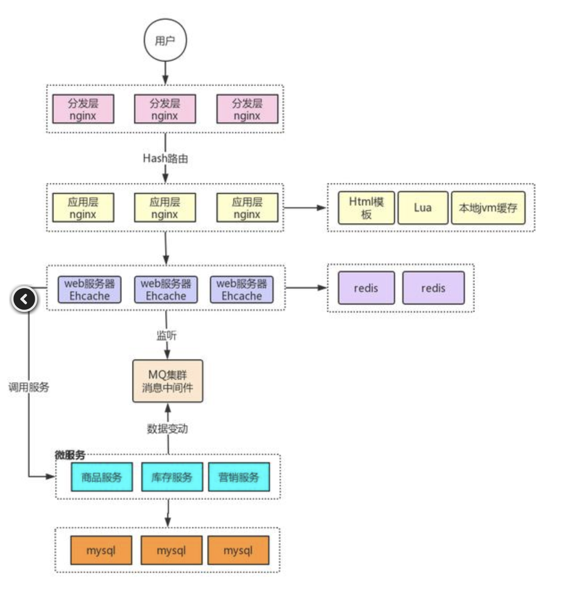

# 分布式锁

zk ， redis ， redlock

# DOCKER


https://cloud.tencent.com/developer/article/1334962

| namespace          | 引入的相关内核版本                   | 被隔离的全局系统资源                                         | 在容器语境下的隔离效果                                       |
| :----------------- | :----------------------------------- | :----------------------------------------------------------- | :----------------------------------------------------------- |
| Mount namespaces   | Linux 2.4.19                         | 文件系统挂接点                                               | 将一个文件系统的顶层目录挂到另一个文件系统的子目录上，使它们成为一个整体，称为挂载。把该子目录称为挂载点。 　　Mount namespace用来隔离文件系统的挂载点, 使得不同的mount namespace拥有自己独立的挂载点信息，不同的namespace之间不会相互影响，这对于构建用户或者容器自己的文件系统目录非常有用。 |
| UTS namespaces     | Linux 2.6.19                         | nodename 和 domainname                                       | UTS，UNIX Time-sharing System namespace提供了主机名和域名的隔离。能够使得子进程有独立的主机名和域名(hostname)，这一特性在Docker容器技术中被用到，使得docker容器在网络上被视作一个独立的节点，而不仅仅是宿主机上的一个进程。 |
| IPC namespaces     | Linux 2.6.19                         | 特定的进程间通信资源，包括System V IPC 和  POSIX message queues | IPC全称 Inter-Process Communication，是Unix/Linux下进程间通信的一种方式，IPC有共享内存、信号量、消息队列等方法。所以，为了隔离，我们也需要把IPC给隔离开来，这样，只有在同一个Namespace下的进程才能相互通信。如果你熟悉IPC的原理的话，你会知道，IPC需要有一个全局的ID，即然是全局的，那么就意味着我们的Namespace需要对这个ID隔离，不能让别的Namespace的进程看到。 |
| PID namespaces     | Linux 2.6.24                         | 进程 ID 数字空间 （process ID number space）                 | PID namespaces用来隔离进程的ID空间，使得不同pid namespace里的进程ID可以重复且相互之间不影响。PID namespace可以嵌套，也就是说有父子关系，在当前namespace里面创建的所有新的namespace都是当前namespace的子namespace。父namespace里面可以看到所有子孙后代namespace里的进程信息，而子namespace里看不到祖先或者兄弟namespace里的进程信息。 |
| Network namespaces | 始于Linux 2.6.24 完成于 Linux 2.6.29 | 网络相关的系统资源                                           | 每个容器用有其独立的网络设备，IP 地址，IP 路由表，/proc/net 目录，端口号等等。这也使得一个 host 上多个容器内的同一个应用都绑定到各自容器的 80 端口上。 |
| User namespaces    | 始于 Linux 2.6.23 完成于 Linux 3.8)  | 用户和组 ID 空间                                             | User namespace用来隔离user权限相关的Linux资源，包括user IDs and group IDs。这是目前实现的namespace中最复杂的一个，因为user和权限息息相关，而权限又事关容器的安全，所以稍有不慎，就会出安全问题。在不同的user namespace中，同样一个用户的user ID 和group ID可以不一样，换句话说，一个用户可以在父user namespace中是普通用户，在子user namespace中是超级用户 |


**有了namespace为什么还要cgroup:**

 Docker 容器使用 linux namespace 来隔离其运行环境，使得容器中的进程看起来就像一个独立环境中运行一样。但是，光有运行环境隔离还不够，因为这些进程还是可以不受限制地使用系统资源，比如网络、磁盘、CPU以及内存 等。关于其目的，一方面，是为了防止它占用了太多的资源而影响到其它进程；另一方面，在系统资源耗尽的时候，linux 内核会触发 OOM，这会让一些被杀掉的进程成了无辜的替死鬼。因此，为了让容器中的进程更加可控，Docker 使用 Linux cgroups 来限制容器中的进程允许使用的系统资源。 

**（2）原理**

  Linux Cgroup 可为系统中所运行任务（进程）的用户定义组群分配资源 — 比如 CPU 时间、系统内存、网络带宽或者这些资源的组合。可以监控管理员配置的 cgroup，拒绝 cgroup 访问某些资源，甚至在运行的系统中动态配置 cgroup。所以，可以将 controll groups 理解为 controller （system resource） （for） （process）groups，也就是是说它以一组进程为目标进行系统资源分配和控制。它主要提供了如下功能： 

- **Resource limitation**: 限制资源使用，比如内存使用上限以及文件系统的缓存限制。
- **Prioritization**: 优先级控制，比如：CPU利用和磁盘IO吞吐。
- **Accounting**: 一些审计或一些统计，主要目的是为了计费。
- **Controll**: 挂起进程，恢复执行进程。

使用 cgroup，系统管理员可更具体地控制对系统资源的分配、优先顺序、拒绝、管理和监控。可更好地根据任务和用户分配硬件资源，提高总体效率。

在实践中，系统管理员一般会利用CGroup做下面这些事：

- 隔离一个进程集合（比如：nginx的所有进程），并限制他们所消费的资源，比如绑定CPU的核。
- 为这组进程分配其足够使用的内存
- 为这组进程分配相应的网络带宽和磁盘存储限制
- 限制访问某些设备（通过设置设备的白名单）

# System design 


## 单点登录

https://zebinh.github.io/2020/03/SSOANDOAuth/


## 百亿级微信红包的高并发资金交易系统设计方案


## 简易RPC 


Netty reactor 模型

加密算法： 对称加密，非对称 背！！！


周五： 背数据库， 背java基础

周六 ： 整理项目

周日 ： 整理项目 jemeter 测压

周一： 背java 背spring 

周二： 背面经

周三： 整理leetcode

