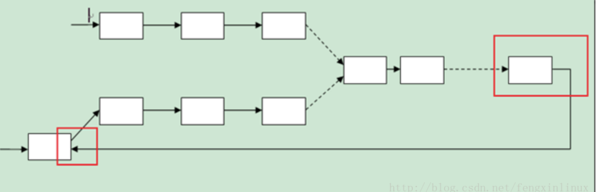
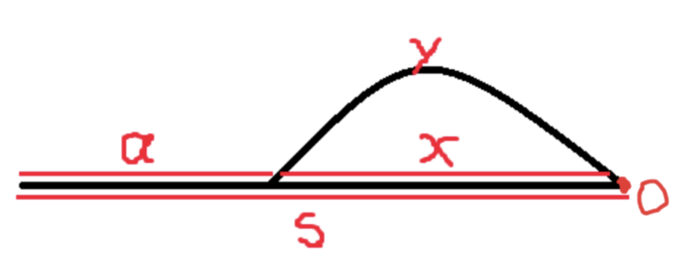

# 3Leetcode Crash

# hash map 	

##### \1 two sum () : (i, target - nums[i])


##### \3 Longest Substring Without Repeating Characters : (can compress to char[]) 2 pointers 

```java
for char j: string

​		i = math.max(i,map.contains(s.charAt(j)))
```

# dp

##### Knapsack 

##### 01背包问题

有N件物品和一个容量为V的背包。第i件物品的费用是c[i]，价值是w[i]。求解将哪些物品装入背包可使价值总和最大。每种物品仅有一件，可以选择放或不放。

```pseudocode
f[i][v] = max(w[i]+f[i+1][v-c[i]],f[i+1][v]) //i: i -- end 将后i件物品放入容量为v的背包中
int [][] f = new int [i][v];
for(int i = N - 1 ; i >= 0 ; i--){
		for(int v = V ;v >= 0;v--){
				 if(i>=N-1) f[i][v] = c[i]>=v? w[i]:0;
			   else f[i][v] = max{f[i+1][v],f[i+1][v-c[i]]+w[i]};
     }
}
return f[0][V-1];


//若只考虑第i件物品的策略（放或不放），那么就可以转化为一个只牵扯前i-1件物品的问题。如果不放第i件物品，那么问题就转化为“前i-1件物品放入容量为v的背包中”，价值为f[i-1][v]；如果放第i件物品，那么问题就转化为“前i-1件物品放入剩下的容量为v-c[i]的背包中”，此时能获得的最大价值就是f[i-1][v-c[i]]再加上通过放入第i件物品获得的价值w[i]。
time O(VN)
space O(VN) 
```

```pseudocode
//optimisation of space to O(N)
int [] f = new int [v];
for(int i = 0 ; i< N ; i++){
		for(int v = V ;v>=0;v--){ //v[i] depends on v-c[i]
	   f[v]=max{f[v],f[v-c[i]]+w[i]};
	}
}
return f[V-1];
```


##### 完全背包问题

有N种物品和一个容量为V的背包，每种物品都有**无限件**可用。第i种物品的费用是c[i]，价值是w[i]。求解将哪些物品装入背包可使这些物品的费用总和不超过背包容量，且价值总和最大。

```java
      f[i][v]=max{f[i-1][v-k*c[i]]+k*w[i]|0<=k*c[i]<=v}  // 和0-1一样 ，加一个参数, 求解状态f[i][v]的时间是O(v/c[i]) 
```

  ```java
  optimisasion :
  
   f[i][v]=max{f[i-1][v],f[i][v-c[i]]+w[i]} // i 将前i件物品放入容量为v的背包中 
  
  ```


​      
##### 多重背包问题

  有N种物品和一个容量为V的背包。第i种物品最多有n[i]件可用，每件费用是c[i]，价值是w[i]。求解将哪些物品装入背包可使这些物品的费用总和不超过背包容量，且价值总和最大。

  ```shell
  f[i][v]=max{f[i-1][v-k*c[i]]+k*w[i]|0<=k<=n[i]} 
  optimazasion:
  复杂度为O(V*Σlog n[i])的01背包问题
  procedure MultiplePack(cost,weight,amount)
      if cost*amount>=V
          CompletePack(cost,weight)
          return
      integer k=1
      while k<amount
          ZeroOnePack(k*cost,k*weight)
          amount=amount-k
          k=k*2
      ZeroOnePack(amount*cost,amount*weight)
      
      monotoic queue O(VN)
  ```


​     
##### \5 Longest Palindromic Substring

 

```c
 bottom-up
  dp[i][j] = Math.max(dp[i-1][j],dp[i][j-1]) if s[i]!=s[j] else 2+dp[i-1][j-1]

  top-down
  memo[i][j] = if(s[i]==s[j]) 2 + memo[i-1][j-1] else Math.max(memo[i-1][j],memo[i][j-1])
   
  expand from middle
  expand(s,i,j) :
    while(i>=0 and j<s.length)
    		s[i-1]==s[j+1]
        count++
    ret count;
   i = 0 -- length 	
  	expand(s,i,i) 
    expand(s,i,i+1)

```


​      

##### \72. Edit Distance 

```
  dp[i][j] = max{ dp[i-1][j],dp[i][j - 1 ]  ,dp[i-1][j-1 ]} +  1  if s[i]==s[j] 
  					=  dp[ i - 1 ][ j - 1 ]
```


```java
class Solution {
    //state dp[i][j]: i-> world length for firt world; j-> world length for seconde
    //recursion:last String world1 == last String world1: dp[i][j]=dp[i-1][j-1]
    //else dp[i][j]= 1+Math.min{dp[i-1][j],dp[i][j-1],dp[i-1][j-1]}
    public int minDistance(String word1, String word2) {
        int[] dp1 = new int[word2.length() + 1];
        int[] dp2 = new int[word2.length() + 1];
        for(int i =0;i<dp1.length;i++){
            dp1[i]=i;
            dp2[i]=i;
        }
        for (int i = 1; i < word1.length()+1; i++)
        {
            dp2[0]=i;
            for (int j = 1; j < word2.length()+1; j++)
            {
                if (word1.charAt(i - 1) == word2.charAt(j - 1))
                    dp2[j] = dp1[j-1];
                else
                    dp2[j] = Math.min(dp2[j-1], Math.min(dp1[j-1], dp1[j])) + 1;
            }
            dp1=Arrays.copyOf(dp2,dp2.length);
        }
        
        return dp2[word2.length()];
    }
}

```


#####   lc\583. Delete Operation for Two Strings

  ```java
  class Solution {
      //if  (word1[j] == word2[i]) dp[i][j] = dp[i-1][j-1]
      // else dp[i][j] = max(dp[i-1][j],dp[i][j-1]) 
      public int minDistance(String word1, String word2) {
          int l1 = word1.length();
          int l2 = word2.length();
          if(l1==0) return l2;
          if(l2==0) return l1;
          int[][] dp = new int [l1+1][l2+1];
          for(int i =0 ; i<=l1; i++ ) {
              for(int j = 0 ; j<=l2 ; j++){
                  if( i==0 ) dp[i][j] = j;
                  else if(j==0) dp[i][j]= i;
                  else dp[i][j]= word1.charAt(i-1)==word2.charAt(j-1)? dp[i-1][j-1]:Math.min(dp[i-1][j],dp[i][j-1])+1;
              }
          }
          return dp[l1][l2];
      }
  }
  ```

​      

##### \91. Decode Ways

``` 
dp[i] = dp[ i - 1 ]  + dp[ i - 2 ]  if(valid(  substring(i- 1 -- i)  ) ) && valid( substring( i-2, i))
```


```java
public class Solution {
    public int numDecodings(String s) {
        if (s == null || s.length() == 0) {
            return 0;
        }
        int n = s.length();
        int[] dp = new int[n + 1];
        dp[0] = 1;
        dp[1] = s.charAt(0) != '0' ? 1 : 0;
        for (int i = 2; i <= n; i++) {
            int first = Integer.valueOf(s.substring(i - 1, i));
            int second = Integer.valueOf(s.substring(i - 2, i));
            if (first >= 1 && first <= 9) {
               dp[i] += dp[i-1];  
            }
            if (second >= 10 && second <= 26) {
                dp[i] += dp[i-2];
            }
        }
        return dp[n];
    }
}
```


#####   \300. Longest Increasing Subsequence

  ```java
  1. dpSolution O(N^2)
  dp[i] = max(dp[j]+1 if(nums[i]>=nums[j]) ) , j = 0--i-1
  
  2. dp with binary search:
  
  tails is an array storing the smallest tail of all increasing subsequences with length i+1 in tails[i].
  For example, say we have nums = [4,5,6,3], then all the available increasing subsequences are:
  
  len = 1   :      [4], [5], [6], [3]   => tails[0] = 3
  len = 2   :      [4, 5], [5, 6]       => tails[1] = 5
  len = 3   :      [4, 5, 6]            => tails[2] = 6
  We can easily prove that tails is a increasing array. Therefore it is possible to do a binary search in tails array to find the one needs update.
  
  Each time we only do one of the two:
  
  (1) if x is larger than all tails, append it, increase the size by 1
  (2) if tails[i-1] < x <= tails[i], update tails[i]
  Doing so will maintain the tails invariant. The the final answer is just the size.
  ```


​        

   

```java
 dp[n]; 
  public int lengthOfLIS(int[] nums) {
      int[] tails = new int[nums.length];
      int size = 0;
      for (int x : nums) {
          int i = 0, j = size;
          while (i < j) {
              int m = (i + j) / 2;
              if (tails[m] < x)
                  i = m + 1;
              else
                  j = m;
          }
          tails[i] = x;
          if (i == size) ++size;
      }
      return size;
  }
  // Runtime: 2 ms
```


##### super egg drop 

``` pseudocode
The dp equation is:
dp[m][k] = dp[m - 1][k - 1] + dp[m - 1][k] + 1,
assume, dp[m-1][k-1] = n0, dp[m-1][k] = n1
the first floor to check is n0+1.
if egg breaks, F must be in [1,n0] floors, we can use m-1 moves and k-1 eggs to find out F is which one.
if egg doesn't breaks and F is in [n0+2, n0+n1+1] floors, we can use m-1 moves and k eggs to find out F is which one.
So, with m moves and k eggs, we can find out F in n0+n1+1 floors, whichever F is.


```

在第i 层drop ， 如果要判断出楼层数，往下最多有dp\[m-1][k-1] 层， 往上最多有dp\[m-1][k] 层

```java
public int superEggDrop(int K, int N) {
        int[][] dp = new int[N + 1][K + 1];
        int m = 0;
        while (dp[m][K] < N) {
            ++m;
            for (int k = 1; k <= K; ++k)
                dp[m][k] = dp[m - 1][k - 1] + dp[m - 1][k] + 1;
        }
        return m;
    }
```


```java
public int superEggDrop(int K, int N) {
        int dp[] = new int[K + 1], m = 0;
        for (m = 0; dp[K] < N; ++m)
            for (int k = K; k > 0; --k)
                dp[k] += dp[k - 1] + 1;
        return m;
    }
```


> `O(KlogN)` Time, `O(K)` Space


​      

#####   \42. Trapping Rain Water

  Given *n* non-negative integers representing an elevation map where the width of each bar is 1, compute how much water it is able to trap after raining.

  Two arrays to be preprocessed : left , right

  ```java
class Solution {

    public int trap(int[] height) {
        if(height.length <=1) return 0;
        int len  = height.length,res=0;
        int [] left = new int [len];
        int [] right = new int [len];
        right[len-1]  = height[len-1];
        for(int i = len -2 ; i>=0 ;i--)
            right [i] = Math.max(right[i+1], height[i]);
		left[0] = height[0];
        for(int i = 1; i< len;i++){
            left[i] = Math.max(height[i],left[i-1]);
            res += Math.min(right[i],left[i]) - height[i];
        }
        return res;
	}
}
  ```


```c++
int trap(vector<int>& height)
{
    int left = 0, right = height.size() - 1;
    int ans = 0;
    int left_max = 0, right_max = 0;
    while (left < right) {
        if (height[left] < height[right]) {
            height[left] >= left_max ? (left_max = height[left]) : ans += (left_max - height[left]);
            ++left;
        }
        else {
            height[right] >= right_max ? (right_max = height[right]) : ans += (right_max - height[right]);
            --right;
        }
    }
    return ans;
} 


```

##### \1423. Maximum Points You Can Obtain from Cards

```java
class Solution {
      // 2 边 取最大 -》 中间取最小

    public int maxScore(int[] cardPoints, int k) {
        int totalSum = 0 ;
        int subArraySum = 0;
        int len = cardPoints.length ;
        int subArrayLen = len - k;
        int min = Integer.MAX_VALUE; 
        for (int i = 0 ; i< len ; i++ ){
            totalSum += cardPoints[i];
            subArraySum += cardPoints[i];
            if( i > subArrayLen - 1 )  
                subArraySum -= cardPoints[i-subArrayLen];
            if( i >= subArrayLen - 1) // len = subArrayLen
                min = Math.min ( subArraySum , min );
        }
        return totalSum - min ; 
        
    }
}
```


\1438. Longest Continuous Subarray With Absolute Diff Less Than or Equal to Limit

一个长度为n的数组num，给出参数k，t，询问是否存在两个数字num[i],num[j]，满足|i-j|<=k,|num[i]-num[j]|<=t，n 1e5。

```JAVA
class Solution {
    public int longestSubarray(int[] A, int limit) {
        Deque<Integer> maxd = new ArrayDeque<>();
        Deque<Integer> mind = new ArrayDeque<>();
        int i = 0, j;
        for (j = 0; j < A.length; ++j) {
            while (!maxd.isEmpty() && A[j] > maxd.peek()) maxd.poll();
            while (!mind.isEmpty() && A[j] < mind.peek()) mind.poll();
            maxd.push(A[j]);
            mind.push(A[j]);
            if (maxd.peekLast() - mind.peekLast() > limit) {
                if (maxd.peekLast() == A[i]) maxd.pollLast();
                if (mind.peekLast() == A[i]) mind.pollLast();
                ++i;
            }
        }
        return j - i;
    }
}
```


一个递减deque 一个递增deque 维护max 和 min

1. Brut-force  O(N^2)  TLE
2. Sliding Window 

```java
boolean find(int [] num, int k , int t )
{
  
}
```


\1424. Diagonal Traverse II

```java
class Solution {
    
    //O(N)
   public int[] findDiagonalOrder(List<List<Integer>> nums) {
		int n = 0, p = 0;
		Map<Integer, ArrayDeque<Integer>> map = new HashMap<>();
		for (int i = 0; i < nums.size(); i++) {
			List<Integer> list = nums.get(i);
			if (list == null) continue;
			for (int j = 0; j < list.size(); j++) {
				n++;
				if (map.get(i + j) == null) {
					ArrayDeque<Integer> arr = new ArrayDeque<Integer>();
					map.put((i + j), arr);
				}
				map.get(i + j).push(list.get(j));
			}
		}
		int[] res = new int[n];
		for (int i = 0; i < 2 * n; i++) {
			if (map.get(i) != null) {
				for (int el : map.get(i))
					res[p++] = el;
			}
		}
		return res;

	}
}
```


\1130. Minimum Cost Tree From Leaf Values

```c
dp[i, j] = dp[i, k] + dp[k + 1, j] + max(A[i, k]) * max(A[k + 1, j])
```

\1000 merge stone

```
Function:
dp[i][j][1] = dp[i][j][K] + sum[i][j] (dp[i][j][K] != max)
dp[i][j][k] = min(dp[i][t][k - 1] + dp[t + 1][j][1]) (t ∈ [i, j) && dp[i][t][k - 1] != max && dp[t+1][j][1] != max && k ∈ [2, K])
```


  # two pointers (dp)

#####   11.Container With Most Water  (brute force O(N^2) : easy)

  ```python
  i=0 , j = nums.length
  while(i!=j):
  		res = min(nums[i],nums[j])*(j-i)
      if(j<i) j--
      else i++
  ```


​      

\15 3Sum (brute force O(N^3)), sort and use 2 pointers O(N^2)


```pseudocode
sort(nums)
​      for(i: nums):
​         	j =i+1, k= nums.length;
​          while(j<k):
​            	if(nums[i]+nums[j]+nums[k]>sum) i++
​              else k--;
```


​    

##### \16. 3Sum Closest

```python
sort(nums)
for(i: nums):
   	j =i+1, k= nums.length;
    while(j<k):
      	if(nums[i]+nums[j]+nums[k]>sum) i++
        else k--;
        
```

##### k-sum

```java
public class Solution {
    int len = 0;
    List<List<Integer>> ans = new ArrayList<>();
    public List<List<Integer>> fourSum(int[] nums, int target) {
        len = nums.length;
        Arrays.sort(nums);
        ksum (nums,target,0,4,new LinkedList<Integer>());
        return ans; 
    }
    private void ksum(int[] nums, int target , int idx , int k, LinkedList<Integer> current ){
        if(k==2){
           int i = idx, j = len - 1;
             while(i<j){
                if(i!=idx && nums[i] == nums[i-1] ) {i++;continue;}
                if(j!=len - 1 && nums[k] == nums[j+1] ) {j--;continue;}
                 int sum = target - nums[i] - nums[j]; 
                 if(sum ==0){
            	    	List<Integer> temp = new ArrayList<>(current);
                    	temp.add(nums[i]);
                    	temp.add(nums[j]);
                        ans.add(temp);
                        i++;
                        j--;
                    //move left bound
            	    } else if (sum > 0) {
            	        i++;
                    //move right bound
            	    } else {
            	        j--;
            	    }
                }
        }
        if(k<=2) return;
        for(int i = idx ; i< len-k+1  ; i++){
            if(i != idx && nums[i] == nums[i-1]) continue;
            current.add (nums[i]);
            ksum(nums,target - nums[i] , i+1 , k-1 , current) ;
            current.removeLast();
        }
        
    
    }

}
      
      
```


\1498. Number of Subsequences That Satisfy the Given Sum Condition

```java
 public int numSubseq(int[] A, int target) {
        Arrays.sort(A);
        int res = 0, n = A.length, l = 0, r = n - 1, mod = (int)1e9 + 7;
        int[] pows = new int[n];
        pows[0] = 1;
        for (int i = 1 ; i < n ; ++i)
            pows[i] = pows[i - 1] * 2 % mod;
        while (l <= r) {
            if (A[l] + A[r] > target) {
                r--;
            } else {
                res = (res + pows[r - l++]) % mod;
            }
        }
        return res;
    }
```


# List

##### \19 Remove Nth Node From End of List


```python
d = head;
i = 1--N
	d = head.next

i=head;
while(j.next!=null):
  i=i.next
  j=j.next
# i is the N-1 th Node From End of List
i.next =i.next.next
```

##### \21 Merge Two Sorted Lists

```java
Node node = new Node;
Node dummy = node;
if(l1.val>l2.val):
		node.next = l2
else
  	node.next = l1;
return dummy.next;

```

##### \24 Swap Nodes in Pairs

```java
    public ListNode swapPairs(ListNode head) {
        if(head == null || head.next ==null) return head;
ListNode next = head.next ; 
        ListNode nnext = next.next; 
    next.next= head;
        head.next = swapPairs(nnext);
    return next;
    }

```

 Non recursion 

```java
 public ListNode swapPairs(ListNode head) {
        if(head == null || head.next ==null) return head; 
        ListNode  next = head.next,nnext = next.next ,ret = head.next; 
        while(head !=null && next != null){
            nnext = next.next ;
            next.next = head;
            if(nnext!=null && nnext.next !=null)  head.next = nnext.next;
            else head.next = nnext;
            head = nnext ; 
            if(head !=null )
            next = head.next; 
        }
    return ret; 
    }
```


##### \23. Merge k Sorted Lists


```java
class Solution {
    public ListNode mergeKLists(ListNode[] lists) {
        if(lists.length==0) return null;
        int interval = 1;
        while(interval<lists.length){
            for (int i = 0; i + interval< lists.length; i=i+interval*2) 
                 lists[i]=mergeTwoLists(lists[i],lists[i+interval]);            
            interval*=2;
        }
    return lists[0];
    }
}
```


​    


​    

##### 判断两个单链表是否相交及找到第一个交点

1. O( N^2 )  

2. 使用栈  相交之后的节点全部一样，从后往前对比，第一个不一样的就是第一个交点

3. 遍历链表记录长度， 长链表先走到起点（同长的起点），一起遍历

   ```java
   public Node intersect( Node node1 , Node node2 ){
     	int len1 = length(node1),len2=length(node2);
     	if( len1 > len2 ){
         int cnt = len1 -len2;	
         while(cnt>0) {
           cnt--;
           node1= node1.next ; 
         }
       } else if( len2 > len1 ){
         int cnt = len2 -len1;	
         while(cnt>0) {
           cnt--;
           node2= node2.next ; 
         }
       } 
     while(node1!=null || node2 != null){
       if(node1 == node2 ) return node1 ;
       node1 = node1.next ;
       node2 = node2.next;
     }
     return null;
   } 
   private int length(Node node){
     int len = 0; 
     while(node != null) {
         node = node.next;
     		len++;
     }
     return len;
   }
   ```

   4. 哈希表法。

      ```java
      HashMap<Node, Integer > hash = new HashMap<>();
      while(node1 != null) {
         hash.put (node1 , 1 );
         node1 = node1.next;
      }
      while(node2 != null) {
      	if(hash.get(node2) ! = null) return node2;
         node2 = node2.next;
      }
      return null;
      
      ```

      

   5. 问题转化为判断一个链表是否有环问题。



​    快慢指针来判断是否有环





慢走了 a+x

快比慢多走了 x+y ， 多走了 a+x

>  y=a  慢指针继续走，和从头开始的慢指针相遇的点就是环入口

##### \86. Partition List

```java
/**
 * Definition for singly-linked list.
 * public class ListNode {
 *     int val;
 *     ListNode next;
 *     ListNode() {}
 *     ListNode(int val) { this.val = val; }
 *     ListNode(int val, ListNode next) { this.val = val; this.next = next; }
 * }
 */
class Solution {
   public ListNode partition(ListNode head, int x) {
    ListNode smallerHead = new ListNode(0), biggerHead = new ListNode(0);
    ListNode smaller = smallerHead, bigger = biggerHead;
    while (head != null) {
        if (head.val < x) {
            smaller.next = head;
            smaller =   smaller.next ;
        } else {
             bigger.next = head;
            bigger =  bigger.next ;
        }
        head = head.next;
    }
    // no need for extra check because of fake heads
    smaller.next = biggerHead.next; // join bigger after smaller
    bigger.next = null; // cut off anything after bigger
    return smallerHead.next;
    }
}
```


# permutation and subsets

22. ##### Generate Parentheses

```python
generate(int left,int right,List<String> res,int n,StringBuilder sb):
			if(right== count)
    				res.add(sb.toString);
      			return 
     	if(left<count)
          		generate( left+1, right, res, n,sb.append("("));
        			sb.removeCharAt(sb.length());
     if(right<left)
      		generate( left, right+1, res, n,sb.append(")"));
          sb.removeCharAt(sb.length());
```


​        
​    


​    

​    

##### \39. Combination Sum

Given a **set** of candidate numbers (`candidates`) **(without duplicates)** and a target number (`target`), find all unique combinations in `candidates` where the candidate numbers sums to `target`.

The **same** repeated number may be chosen from `candidates` unlimited number of times.

```java
class Solution {
 
	public List<List<Integer>> combinationSum(int[] candidates, int target) {
        List<List<Integer>> res = new ArrayList<>();
        List<Integer> tmp = new ArrayList<>();
        combination(candidates,0,target,res,tmp);
        return res;
    }
    private void combination(int [] candidates , int start ,  int target ,  List<List<Integer>> res ,List<Integer> tmp  ){
        if(target ==0 ){
            res.add(new ArrayList<>(tmp));
            return ; 
        }
        if(target < 0 ) {
            return ;
        }
        for(int i=start ; i< candidates.length; i++){
            tmp.add(candidates[i]);
            combination(candidates,i,target-candidates[i],res,tmp);
            tmp.remove(tmp.size()-1);
        }
    }
}
```

##### \40. Combination Sum II

Each number in `candidates` may only be used **once** in the combination.find all unique combinations in `candidates` where the candidate numbers sums to `target`.

```java
class Solution {
	public List<List<Integer>> combinationSum2(int[] candidates, int target) {
        List<List<Integer>> res = new ArrayList<>();
        List<Integer> tmp = new ArrayList<>();
        Arrays.sort(candidates);
        combination(candidates,0,target,res,tmp);
        return res;
    }
    private void combination(int [] candidates , int start ,  int target ,  List<List<Integer>> res ,List<Integer> tmp  ){
        if(target ==0 ){
            res.add(new ArrayList<>(tmp));
            return ; 
        }
        if(target < 0 ) {
            return ;
        }
        for(int i=start ; i< candidates.length; i++){
            if(i!=start&&candidates[i] == candidates[i-1] ) continue;
            tmp.add(candidates[i]);
            combination(candidates,i+1,target-candidates[i],res,tmp);
            tmp.remove(tmp.size()-1);
        }
    }
}
```

​    

##### \46. Permutations


```java
class Solution {
   public List<List<Integer>> permute(int[] nums) {
		List<List<Integer>> l = new ArrayList<List<Integer>>();
		List<Integer> l1 = new ArrayList<>();
		for (int i : nums)
			l1.add(i);
		backtrack(l, nums, new ArrayList<Integer>(), 0, l1);
		return l;

	}

	private void backtrack(List<List<Integer>> l, int[] nums, ArrayList<Integer> arrayList, int size,
			List<Integer> toAdd) {
		if (size == nums.length) {
			l.add(new ArrayList<Integer>(arrayList));
			return;
		}
		for (int i = 0; i < toAdd.size(); i++) {
			arrayList.add(toAdd.get(i));
			List<Integer> left = new ArrayList<Integer>(toAdd);
			left.remove(toAdd.get(i));
			backtrack(l, nums, arrayList, size + 1, left);
			arrayList.remove(size);
		}

	}
}
```


```java
class Solution {
  public List<List<Integer>> permute(int[] nums) {
   List<List<Integer>> list = new ArrayList<>();
   // Arrays.sort(nums); // not necessary
   backtrack(list, new ArrayList<>(), nums);
   return list;
}

private void backtrack(List<List<Integer>> list, List<Integer> tempList, int [] nums){
   if(tempList.size() == nums.length){
      list.add(new ArrayList<>(tempList));
   } else{
      for(int i = 0; i < nums.length; i++){ 
         if(tempList.contains(nums[i])) continue; // element already exists, skip
         tempList.add(nums[i]);
         backtrack(list, tempList, nums);
         tempList.remove(tempList.size() - 1);
      }
   }
}


}
```


##### \47. Permutations II

```java
public class Solution {
   public List<List<Integer>> permuteUnique(int[] nums) {
    List<List<Integer>> list = new ArrayList<>();
    Arrays.sort(nums);
    backtrack(list, new ArrayList<>(), nums, new boolean[nums.length]);
    return list;
}

private void backtrack(List<List<Integer>> list, List<Integer> tempList, int [] nums, boolean [] used){
    if(tempList.size() == nums.length){
        list.add(new ArrayList<>(tempList));
    } else{
        for(int i = 0; i < nums.length; i++){
            if(used[i] || i > 0 && nums[i] == nums[i-1] && !used[i - 1]) continue;
            used[i] = true; 
            tempList.add(nums[i]);
            backtrack(list, tempList, nums, used);
            used[i] = false; 
            tempList.remove(tempList.size() - 1);
        }
    }
}

}
```

```java
class Solution {
   public List<List<Integer>> subsetsWithDup(int[] nums) {
    List<List<Integer>> list = new ArrayList<>();
    Arrays.sort(nums);
    backtrack(list, new ArrayList<>(), nums, 0);
    return list;
}

private void backtrack(List<List<Integer>> list, List<Integer> tempList, int [] nums, int start){
    list.add(new ArrayList<>(tempList));
    for(int i = start; i < nums.length; i++){
        if(i > start && nums[i] == nums[i-1]) continue; // skip duplicates
        tempList.add(nums[i]);
        backtrack(list, tempList, nums, i + 1);
        tempList.remove(tempList.size() - 1);
    }
} 
}
```


##### \82. Remove Duplicates from Sorted List II

```java
class Solution {
   public ListNode deleteDuplicates(ListNode head) {
        if(head==null) return null;
        ListNode FakeHead=new ListNode(0,head);
        ListNode pre=FakeHead;
        ListNode cur=head;
        while(cur!=null){
            while(cur.next!=null&&cur.val==cur.next.val){
                cur=cur.next;
            }
            if(pre.next==cur){
                pre=pre.next;
            }
            else{
                pre.next=cur.next;
            }
            cur=cur.next;
        }
        return FakeHead.next;
    }
}
```


# Divide and conqurer


​    
​    
34. ##### Find First and Last Position of Element in Sorted Array

```java
[left, right)
 left = 0 ; right = nusm.length;
//find the first element 
while(left< right){
	int mid = left + ( right - left )/2 ;
  if(nums[mid] < target)  // if(nusm[mid]<= left)
    	left = mid + 1  ;
  else 
      right = mid ; 
  
}
return left; 
//find the last element 
    
```

33. ##### Search in Rotated Sorted Array

```java
 public int search(int[] nums, int target) {
    int lo = 0, hi = nums.length ;
      // [lo,hi]
    while (lo < hi) {
        int mid = lo + (hi - lo) / 2;
        int num = nums[mid]; 
        //nums [ mid ] 和 target 不在同一段
        if ((nums[mid] < nums[0]) != (target < nums[0])) 
            num = target < nums[0] ? Integer.MIN_VALUE : Integer.MAX_VALUE;
        if (num < target)
            lo = mid + 1;
        else if (num >= target)
            hi = mid ;
    }
       if(lo < nums.length && nums[lo]==target) return lo; 
    return -1;
   }
}
```

```java
class Solution {
   public int search(int[] nums, int target) {
         if(nums.length == 0 ) return -1;
         if(nums[0] == target ) return 0;
         int lo = 0, hi = nums.length ;
         while( lo< hi ){
             int mid = lo + (hi - lo) / 2;
             if(nums[mid] == target) 
                 return mid;
             if(nums[mid]>=nums[0] ) {// 0--mid increasing ,mid+1 .. end unknown
                if(target>nums[0] && target < nums[mid] ) hi=mid ;
                else lo = mid+1;
             }
             else if(nums[mid]<nums[0] ) {// mid--end increasing ,0  -- mid-1 unknown
                if(target<nums[0] && target > nums[mid] ) lo = mid + 1;
                else hi = mid;
             }
         }
        return lo <nums.length && nums[lo] == target ? lo:-1;
   }
}

```


​    
​    
# NEXT PERMUTATION

We need to find the first pair of two successive numbers a*[*i*] and a*[*i*−1], from the right, which satisfy a[i] > a[i-1] Now, no rearrangements to the right of a*[*i*−1] can create a larger permutation since that subarray consists of numbers in descending order. Thus, we need to rearrange the numbers to the right of a[i-1] including itself.

Now, what kind of rearrangement will produce the next larger number? We want to create the permutation just larger than the current one. Therefore, we need to replace the number a[i-1] with the number which is just larger than itself among the numbers lying to its right section, say a[j].

We swap the numbers a[i-1] and a[j]. We now have the correct number at index *i−1. But still the current permutation isn't the permutation that we are looking for. We need the smallest permutation that can be formed by using the numbers only to the right of a*[*i*−1]. Therefore, we need to place those numbers in ascending order to get their smallest permutation.

But, recall that while scanning the numbers from the right, we simply kept decrementing the index until we found the pair a[i]*a*[*i*] and a[i-1]*a*[*i*−1] where, a[i] > a[i-1]*a*[*i*]>*a*[*i*−1]. Thus, all numbers to the right of a[i-1]*a*[*i*−1] were already sorted in descending order. Furthermore, swapping a[i-1]*a*[*i*−1] and a[j]*a*[*j*] didn't change that order. Therefore, we simply need to reverse the numbers following a[i-1]*a*[*i*−1] to get the next smallest lexicographic permutation.


# Greedy

##### lc 321 

```java
class Solution {
	// N = n1 + n2
	// loop i 0 -- k O(K)
	// 1. create max of one array with i digits O(N)
	// 2. nums2 with k - i digits
	// merge (max(nums1, i) max(nums2,k-i)) O(N*N) ?

	public int[] maxNumber(int[] nums1, int[] nums2, int k) {
		int n = nums1.length;
		int m = nums2.length;
		int[] ans = new int[k];
		for (int i = Math.max(0, k - m); i <= k && i <= n; ++i) {
			int[] candidate = merge(maxArray(nums1, i), maxArray(nums2, k - i), k);
			if (greater(candidate, 0, ans, 0))
				ans = candidate;
		}
		return ans;
	}

	private int[] merge(int[] nums1, int[] nums2, int k) {
		int[] ans = new int[k];
		for (int i = 0, j = 0, r = 0; r < k; ++r)
			ans[r] = greater(nums1, i, nums2, j) ? nums1[i++] : nums2[j++];
		return ans;
	}

	public boolean greater(int[] nums1, int i, int[] nums2, int j) {
		while (i < nums1.length && j < nums2.length && nums1[i] == nums2[j]) {
			i++;
			j++;
		}
		return j == nums2.length || (i < nums1.length && nums1[i] > nums2[j]);
	}

	public int[] maxArray(int[] nums, int k) {
		int n = nums.length;
		int[] ans = new int[k];
		for (int i = 0, j = 0; i < n; ++i) {
			while (n - i + j > k && j > 0 && ans[j - 1] < nums[i])
				j--;
			if (j < k)
				ans[j++] = nums[i];
		}
		return ans;
	}
}
```

##### \45. Jump Game II

Given an array of non-negative integers, you are initially positioned at the first index of the array.Each element in the array represents your maximum jump length at that position.Your goal is to reach the last index in the minimum number of jumps.

```java
class Solution {
  public int jump(int[] A) {
	int jumps = 0, curEnd = 0, curFarthest = 0;
	for (int i = 0; i < A.length - 1; i++) {
		curFarthest = Math.max(curFarthest, i + A[i]);
		if (i == curEnd) {
			jumps++;
			curEnd = curFarthest;
		}
	}
	return jumps;
}
}
```


```python
 def jump(self, nums):
        if len(nums) <= 1: return 0
        l, r = 0, nums[0]
        times = 1
        while r < len(nums) - 1:
            times += 1
            nxt = max(i + nums[i] for i in range(l, r + 1))
            l, r = r, nxt
        return times
```


# Array

##### \974. Subarray Sums Divisible by K

```java
class Solution {
   public int subarraysDivByK(int[] A, int K) {
		int prefix = 0, res = 0;
		int[] remainder = new int[K];
		remainder[0] = 1;
		for (int ele : A) {
			prefix = (prefix + ele%K + K) % K;
			res += remainder[prefix];
			remainder[prefix]++;
		}
		return res;
	}

}
```


##### \768. Max Chunks To Make Sorted 2

SOlution 1 O(N*LOG N ) 

In Ver 1, the basic idea is to use max[] array to keep track of the max value until the current position, and compare it to the sorted array. If the max[i] equals the element at index i in the sorted array, then the final count++.
Here the only difference is that we need to a variable 'upperLimit' to help determine whether the current point is the correct division position.

For example,

```
original:     2, 1, 4, 4, 3, 5, 7, 6
max:          2, 2, 4, 4, 4, 5, 7, 7
sorted:       1, 2, 3, 4, 4, 5, 6, 7
```

```java
class Solution {
    public int maxChunksToSorted(int[] arr) {
        int res =0 , max = 0;
        int [] arrCopy = Arrays.copyOf(arr, arr.length);
        Arrays.sort(arrCopy); 
        Map<Integer,Integer> m = new HashMap<>();
        for(int i  = arr.length -1 ; i>=0;i--)
            m.put(arrCopy[i],i); 
        
        for(int i = 0 ; i< arr.length ; i++) {
            max =Math.max(m.get(arr[i]),max);
            m.put(arr[i],m.get(arr[i])+1);
            if(i == max )  res ++;
            
        }
        return res;
    }
}
```

##### Sol 2 . O(N )

Algorithm: Iterate through the array, each time all elements to the left are smaller (or equal) to all elements to the right, there is a new chunck.
Use two arrays to store the left max and right min to achieve O(n) time complexity. Space complexity is O(n) too.
This algorithm can be used to solve ver1 too.

```java
class Solution {
    public int maxChunksToSorted(int[] arr) {
        int n = arr.length;
        int[] maxOfLeft = new int[n];
        int[] minOfRight = new int[n];

        maxOfLeft[0] = arr[0];
        for (int i = 1; i < n; i++) {
            maxOfLeft[i] = Math.max(maxOfLeft[i-1], arr[i]);
        }

        minOfRight[n - 1] = arr[n - 1];
        for (int i = n - 2; i >= 0; i--) {
            minOfRight[i] = Math.min(minOfRight[i + 1], arr[i]);
        }

        int res = 0;
        for (int i = 0; i < n - 1; i++) {
            if (maxOfLeft[i] <= minOfRight[i + 1]) res++;
        }

        return res + 1;
    }
}
```

##### \238. Product of Array Except Self

```java
Solution1. 
class Solution {
    public int[] productExceptSelf(int[] nums) {

        // The length of the input array
        int length = nums.length;

        // The left and right arrays as described in the algorithm
        int[] L = new int[length];
        int[] R = new int[length];

        // Final answer array to be returned
        int[] answer = new int[length];

        // L[i] contains the product of all the elements to the left
        // Note: for the element at index '0', there are no elements to the left,
        // so L[0] would be 1
        L[0] = 1;
        for (int i = 1; i < length; i++) {

            // L[i - 1] already contains the product of elements to the left of 'i - 1'
            // Simply multiplying it with nums[i - 1] would give the product of all
            // elements to the left of index 'i'
            L[i] = nums[i - 1] * L[i - 1];
        }

        // R[i] contains the product of all the elements to the right
        // Note: for the element at index 'length - 1', there are no elements to the right,
        // so the R[length - 1] would be 1
        R[length - 1] = 1;
        for (int i = length - 2; i >= 0; i--) {

            // R[i + 1] already contains the product of elements to the right of 'i + 1'
            // Simply multiplying it with nums[i + 1] would give the product of all
            // elements to the right of index 'i'
            R[i] = nums[i + 1] * R[i + 1];
        }

        // Constructing the answer array
        for (int i = 0; i < length; i++) {
            // For the first element, R[i] would be product except self
            // For the last element of the array, product except self would be L[i]
            // Else, multiple product of all elements to the left and to the right
            answer[i] = L[i] * R[i];
        }

        return answer;
    }
}

Sol 2. . 
class Solution {
    public int[] productExceptSelf(int[] nums) {

        // The length of the input array 
        int length = nums.length;

        // Final answer array to be returned
        int[] answer = new int[length];

        // answer[i] contains the product of all the elements to the left
        // Note: for the element at index '0', there are no elements to the left,
        // so the answer[0] would be 1
        answer[0] = 1;
        for (int i = 1; i < length; i++) {

            // answer[i - 1] already contains the product of elements to the left of 'i - 1'
            // Simply multiplying it with nums[i - 1] would give the product of all 
            // elements to the left of index 'i'
            answer[i] = nums[i - 1] * answer[i - 1];
        }

        // R contains the product of all the elements to the right
        // Note: for the element at index 'length - 1', there are no elements to the right,
        // so the R would be 1
        int R = 1;
        for (int i = length - 1; i >= 0; i--) {

            // For the index 'i', R would contain the 
            // product of all elements to the right. We update R accordingly
            answer[i] = answer[i] * R;
            R *= nums[i];
        }

        return answer;
    }
}
```

##### \689. Maximum Sum of 3 Non-Overlapping Subarrays

```pseudocode
题目是求三个无重叠子数组的最大和
其实可以拓展到N个无重叠子数组的最大和
1，定义如下：
sums[i]代表以nums[i]结尾的前k个数的和
dp[i][j]代表截止到nums[i]形成的第j个无重叠子数组的最大和
path[i][j]代表截止到nums[i]形成的第j个无重叠子数组以哪个下标为结尾，用来回溯路径
2，状态转移方程为
dp[i][j] = max{dp[i - 1][j], sums[i] + dp[i - k][j - 1]};
对应的path[i][j] = path[i - 1][j]或i


```

```c++
class Solution {
public:
    vector<int> maxSumOfNSubarrays(vector<int>& nums, int k, int n) {
        if (k < 1 || n * k > nums.size()) return {};
        int N = nums.size();
        int s = 0;
        for (int i = 0; i < k; ++i) {
            s += nums[i];
        }
        // 计算每个数的前k个数的前缀和
        vector<int> sums(N, 0);
        sums[k - 1] = s;
        for (int i = k; i < N; ++i) {
            s += nums[i] - nums[i - k];
            sums[i] = s;
        }
        // 动态规划
        vector<vector<int> > dp(N, vector<int>(n + 1, 0));
        vector<vector<int> > path(N, vector<int>(n + 1, 0));
        dp[k - 1][1] = sums[k - 1];
        path[k - 1][1] = k - 1;
        for (int i = k; i < N; ++i) {
            for (int j = 1; j <= n; ++j) {
                dp[i][j] = dp[i - 1][j];
                path[i][j] = path[i - 1][j];
                if (sums[i] + dp[i - k][j - 1] > dp[i][j]) {
                    dp[i][j] = sums[i] + dp[i - k][j - 1];
                    path[i][j] = i;
                }
            }
        }
        // 路径回溯
        vector<int> res;
        int ind = path[N - 1][n];
        res.push_back(ind - k + 1);
        for (int i = n - 1; i > 0; --i) {
            ind = path[ind - k][i];
            res.push_back(ind - k + 1);
        }
        reverse(res.begin(), res.end());
        return res;
    }
    vector<int> maxSumOfThreeSubarrays(vector<int>& nums, int k) {
        // 本题就是n=3的特殊情况，因此调用以下函数即可
        return maxSumOfNSubarrays(nums, k, 3);
    }
};


```


##### \204. Count Primes

```java
public class Solution {
    public int countPrimes(int n) {
        boolean[] notPrime = new boolean[n];
        int count = 0;
        for (int i = 2; i < n; i++) {
            if (notPrime[i] == false) {
                count++;
                for (long j = i; i*j < n; j+=1) {
                    notPrime[(int)(i*j)] = true;
                }
            }
        }
        
        return count;
    }
}
```


##### \128. Longest Consecutive Sequence

```java
class Solution {
   public int longestConsecutive(int[] nums) {
            Set<Integer> set = new HashSet<>();
            for(int n : nums) 
                set.add(n);
            int best = 0;
            for(int n : set) {
                if(!set.contains(n - 1)) {  // only check for one direction
                    int m = n + 1;
                    while(set.contains(m)) {
                        m++;
                    }
                    best = Math.max(best, m - n);
                }
            }
            return best;
        }
}
```


Dp


# Sliding window


##### \239. Sliding Window Maximum

Monotonic decreasing Deque. 

1. 超出idx 就polllast 
2. 结果解释peeklast

```java
class Solution {
    public int[] maxSlidingWindow(int[] nums, int k) {
		int p = 0;
		int[] res = new int[nums.length - k + 1];
		Deque<Integer> deque = new ArrayDeque<Integer>(k); // k elements
		for (int j = 0; j < nums.length; j++) {
			while (!deque.isEmpty() && nums[deque.peekFirst()] <= nums[j]) // Monotonic decreasing stack
				deque.pollFirst();
			deque.push(j); // push current idx
			if (deque.peekLast() + k <= j) // not valid idx
				deque.pollLast(); // remove the button element
			if (j < k - 1) // invalid
				continue;
			res[p++] = nums[deque.peekLast()];
		}
		return res;
    }
}
```


##### \84. Largest Rectangle in Histogram

```java

class Solution {
  public  int largestRectangleArea(int[] heights) {
		int len = heights.length, area = 0;
		int[] copy = new int[len + 1];
		for (int i = 0; i < len; i++)
			copy[i] = heights[i];
      Deque<Integer> stack = new ArrayDeque<Integer>(len + 1);
      for (int i = 0; i <= len; i++) {
          System.out.println(stack);
			int idx = i;
			while (!stack.isEmpty() && copy[stack.peek()] > copy[i]) {
				idx = stack.pop();
				area = Math.max(copy[idx] * (i - idx), area);
			}
			copy[idx] = copy[i];
			stack.push(idx);
		}
		return area;
	}
}
```


##### \76. Minimum Window Substring

Given a string S and a string T, find the minimum window in S which will contain all the characters in T in complexity O(n).

**Example:**

```sql
Input: S = "ADOBECODEBANC", T = "ABC"
Output: "BANC"
```

```java
class Solution {
   public  String minWindow(String s, String t) {
		Map<Character, Integer> map = new HashMap<>();
		for (char c : t.toCharArray()) map.compute(c, (k, v) -> v == null ? 1 : v + 1);
		int start = 0, end = 0, min = Integer.MAX_VALUE, len = s.length(), count = t.length(), res = 0;
		if (len < count || count == 0) return "";
		while (end < len) {
			Character current = s.charAt(end);
			if (map.getOrDefault(current, 0) > 0)  count--;
			map.compute(current, (k, v) -> v == null ? -1 : v - 1);
			while (count == 0 && start <= end) { // valid
				if (min > end - start + 1) {
					min = end - start + 1;
					res = start;
				}
				Character cur = s.charAt(start);
				if (map.get(cur) >= 0)
					count++;
				map.compute(cur, (k, v) -> v + 1);
				start++;
			}
			end++;
		}
		return min==Integer.MAX_VALUE?"":s.substring(res, res + min);
	}
}
```


# Bit Manipulation

##### \1434. Number of Ways to Wear Different Hats to Each Other 

bit mask  recursion

```java
class Solution {
    // all mask : 0x11111111111 assignedPeople: 0x1
    
      public int numberWays(List<List<Integer>> hats) {
        int n = hats.size();
        List<Integer>[] h2p = new List[41]; // h2p[i] indicates the list of people who can wear i_th hat
        for (int i = 1; i <= 40; i++) h2p[i] = new ArrayList<>();
        for (int i = 0; i < n; i++)
            for (int hat : hats.get(i))
                h2p[hat].add(i); //ok
        Integer[][] dp = new Integer[41][1024];
        return dfs(h2p, (1 << n) - 1, 1, 0, dp);
    }
    // dfs(...hat, assignedPeople...) number of ways to assign up to `hat` different hats to n people keep in mind that `assignedPeople` is
    //     the mask of list of people were assigned hat
    int dfs(List<Integer>[] h2p, int allMask, int hat, int assignedPeople, Integer[][] dp) {
        if (assignedPeople == allMask) return 1; // Check if assigned different hats to all people
        if (hat > 40) return 0; // no more hats to process
        if (dp[hat][assignedPeople] != null) return dp[hat][assignedPeople];
        int ans = dfs(h2p, allMask, hat + 1, assignedPeople, dp); // Don't wear this hat
        for (int p : h2p[hat]) {
            if (((assignedPeople >> p) & 1) == 1) continue; // Skip if person `p` was assigned hat
            ans += dfs(h2p, allMask, hat + 1, assignedPeople | (1 << p), dp); // Wear this hat for p_th person
            ans %= 1_000_000_007;
        }
        return dp[hat][assignedPeople] = ans;
    }
}
```

dp:

```java
    //dp[i][j]: nums of ways to assign i hats ->  people in state j  , O( 2 ^ j * i )
    //   dp[i+1][j] = (dp[i+1][j] + dp[i][j^index]) % MOD;


   class Solution {
    
    private static int MOD = 1000000007;

    public int numberWays(List<List<Integer>> hats) {
        int n = hats.size();
        List<Integer>[] h = new List[40];
        for (int i = 0; i < 40; i++) h[i] = new ArrayList<>();
        for (int i = 0; i < hats.size(); i++) {
            for (int hat : hats.get(i)) {
                h[hat - 1].add(i); // convert to 0-indexed
            }
        }

        int[][] dp = new int[41][1 << n];
        dp[0][0] = 1;

        for (int i = 0; i < 40; i++) {
            for (int j = 0; j < 1 << n; j++) {
                dp[i+1][j] = dp[i][j];
                for (int people: h[i]) {
                    int index = 1 << people; 
                    if ((j & index) > 0) {
                        dp[i+1][j] = (dp[i+1][j] + dp[i][j^index]) % MOD;
                    }
                }
            }
        }
        
        return dp[40][(1 << n) - 1];        
    }
}

```


\421. Maximum XOR of Two Numbers in an Array

```java
class Solution {
    public int findMaximumXOR(int[] nums) {
        int result=0, mask=0;
        for(int i = 31; i >=0; i--){
            mask =   (1<<i) | mask;
            Set<Integer> s =new HashSet<>();
            for(int num : nums) s.add(num&mask);
            int max = result|1<<i;
            for(int el : s){
                if(s.contains(el^max)){
                    result = max;
                    break;
                }
            } 
        }
        return result;
 
    }
}
```


# Stack

##### \32 Longest Valid Parentheses


 The DP idea is :

If s[i] is '(', set longest[i] to 0,because any string end with '(' cannot be a valid one.

Else if s[i] is ')'

   If s[i-1] is '(', longest[i] = longest[i-2] + 2

   Else if s[i-1] is ')' **and s[i-longest[i-1]-1] == '('**, longest[i] = longest[i-1] + 2 + longest[i-longest[i-1]-2]

For example, input "()(())", at i = 5, longest array is [0,2,0,0,2,0], longest[5] = longest[4] + 2 + longest[1] = 6.

```java
//dp solution 

int longestValidParentheses(string s) {
        if(s.length() <= 1) return 0;
        int curMax = 0;
        vector<int> longest(s.size(),0);
        for(int i=1; i < s.length(); i++){
            if(s[i] == ')' && i-longest[i-1]-1 >= 0 && s[i-longest[i-1]-1] == '('){
                    longest[i] = longest[i-1] + 2 + ((i-longest[i-1]-2 >= 0)?longest[i-longest[i-1]-2]:0);
                    curMax = max(longest[i],curMax);
            }
        }
        return curMax;
    }
```


```java
public class Solution {
    public int longestValidParentheses(String s) {
        int maxans = 0;
        Stack<Integer> stack = new Stack<>();
        stack.push(-1);
        for (int i = 0; i < s.length(); i++) {
            if (s.charAt(i) == '(') {
                stack.push(i);
            } else {
                stack.pop();
                if (stack.empty()) {
                    stack.push(i);
                } else {
                    maxans = Math.max(maxans, i - stack.peek());
                }
            }
        }
        return maxans;
    }
}
```


# GRAPHE 

##### \332. Reconstruct Itinerary

```java
class Solution {
	Map<String, PriorityQueue<String>> map;
    LinkedList<String> res;
    public List<String> findItinerary(List<List<String>> tickets) {
        map = new HashMap<>();
        res = new LinkedList<>();
        
        //1. Build the graph
        for(List<String> ticket : tickets){
            String from = ticket.get(0), to = ticket.get(1);
            if(!map.containsKey(from)) map.put(from, new PriorityQueue<>());
            map.get(from).offer(to);
        }
        
        //2. Call dfs from JFK
        dfs("JFK");
        return res;
    }
    
    void dfs(String from){
        System.out.println(from);
        PriorityQueue<String> arrivals = map.get(from);
        while(arrivals != null && !arrivals.isEmpty()){
            dfs(arrivals.poll());
        }
        res.addFirst(from);

    }
    
}
```


# TREE

##### \94. Binary Tree Inorder Traversal

not recursive 

```java
/**
 * Definition for a binary tree node.
 * public class TreeNode {
 *     int val;
 *     TreeNode left;
 *     TreeNode right;
 *     TreeNode() {}
 *     TreeNode(int val) { this.val = val; }
 *     TreeNode(int val, TreeNode left, TreeNode right) {
 *         this.val = val;
 *         this.left = left;
 *         this.right = right;
 *     }
 * }
 */
public class Solution {
    public List < Integer > inorderTraversal(TreeNode root) {
        List < Integer > res = new ArrayList < > ();
        Stack < TreeNode > stack = new Stack < > ();
        TreeNode curr = root;
        while (curr != null || !stack.isEmpty()) {
            while (curr != null) {
                stack.push(curr);
                curr = curr.left;
            }
            curr = stack.pop();
            res.add(curr.val);
            curr = curr.right;
        }
        return res;
    }
}
```


##### \145. Binary Tree Postorder Traversal

```java
/**
 * Definition for a binary tree node.
 * public class TreeNode {
 *     int val;
 *     TreeNode left;
 *     TreeNode right;
 *     TreeNode() {}
 *     TreeNode(int val) { this.val = val; }
 *     TreeNode(int val, TreeNode left, TreeNode right) {
 *         this.val = val;
 *         this.left = left;
 *         this.right = right;
 *     }
 * }
 */
class Solution {
    public List<Integer> postorderTraversal(TreeNode root) {
        LinkedList<TreeNode> list = new LinkedList<>();
        List<Integer> ans = new LinkedList<Integer>();
        if(root ==null) return ans;
        list.offer(root);
        TreeNode previous =new TreeNode(-9203) ; 
        while(!list.isEmpty()){
            TreeNode node = list.peek();
            if((node.left==null&&node.right==null )||previous ==node.right ||previous == node.left){
                previous=list.pollFirst();
                ans.add(previous.val);
            }else{
                if(node.right != null) list.push(node.right);
                if(node.left != null) list.push(node.left);
            }
        }
        return ans;
    }
}
```


##### \96. Unique Binary Search Trees


```c
G(n) = G(0) * G(n-1) + G(1) * G(n-2) + … + G(n-1) * G(0) 

```

```java
class Solution {
    public int numTrees(int n) {
        int [] dp= new int [n+1];
        if(n<=2) return n;
        dp[0]=1;dp[1]=1;dp[2]=2;
        for(int k=3;k<=n;k++){
            int sum = 0 ;
            for(int i = 0 ; i<k;i++ )
                sum+= dp[i]*dp[k-1-i];
            dp[k]=sum;
        }
        return dp[n];
    }
}
```


##### \98. Validate Binary Search Tree


```java
/**
 * Definition for a binary tree node.
 * public class TreeNode {
 *     int val;
 *     TreeNode left;
 *     TreeNode right;
 *     TreeNode() {}
 *     TreeNode(int val) { this.val = val; }
 *     TreeNode(int val, TreeNode left, TreeNode right) {
 *         this.val = val;
 *         this.left = left;
 *         this.right = right;
 *     }
 * }
 */
class Solution {
    public boolean isValidBST(TreeNode root) {
        return helper(root,null,null);
    }
    private boolean helper(TreeNode root,Integer max,Integer min){
        if(root==null) return true;
        if(max!=null&&root.val>=max||min!=null&&root.val<=min) return false;
        return helper(root.left,root.val,min)&&helper(root.right,max,root.val);
    }
}
```


\101. Symmetric Tree

```java
/**
 * Definition for a binary tree node.
 * public class TreeNode {
 *     int val;
 *     TreeNode left;
 *     TreeNode right;
 *     TreeNode() {}
 *     TreeNode(int val) { this.val = val; }
 *     TreeNode(int val, TreeNode left, TreeNode right) {
 *         this.val = val;
 *         this.left = left;
 *         this.right = right;
 *     }
 * }
 */
class Solution {
    public boolean isSymmetric(TreeNode root) {
    Queue<TreeNode> q = new LinkedList<>();
    q.add(root);
    q.add(root);
    while (!q.isEmpty()) {
        TreeNode t1 = q.poll();
        TreeNode t2 = q.poll();
        if (t1 == null && t2 == null) continue;
        if (t1 == null || t2 == null) return false;
        if (t1.val != t2.val) return false;
        q.add(t1.left);
        q.add(t2.right);
        q.add(t1.right);
        q.add(t2.left);
    }
    return true;
}
}
```


```java
public boolean isSymmetric(TreeNode root) {
    return isMirror(root, root);
}

public boolean isMirror(TreeNode t1, TreeNode t2) {
    if (t1 == null && t2 == null) return true;
    if (t1 == null || t2 == null) return false;
    return (t1.val == t2.val)
        && isMirror(t1.right, t2.left)
        && isMirror(t1.left, t2.right);
}
```

##### \103. Binary Tree Zigzag Level Order Traversal

```java
/**
 * Definition for a binary tree node.
 * public class TreeNode {
 *     int val;
 *     TreeNode left;
 *     TreeNode right;
 *     TreeNode() {}
 *     TreeNode(int val) { this.val = val; }
 *     TreeNode(int val, TreeNode left, TreeNode right) {
 *         this.val = val;
 *         this.left = left;
 *         this.right = right;
 *     }
 * }
 */
class Solution {
    public List<List<Integer>> zigzagLevelOrder(TreeNode root) {
        List<List<Integer>> res = new ArrayList<>();
        if(root == null) return res; 
        LinkedList<TreeNode> queue = new LinkedList<>();
        boolean left2right = false;
        queue.add(root); 
        while(!queue.isEmpty()){
            int size = queue.size();
            List<Integer> level = new ArrayList<>();
            for(int i = 0 ; i< size ;i++){
                TreeNode node = queue.remove();
                level.add(node.val);
                if(node.right!=null)
                    queue.offer(node.right);
                if(node.left!=null)
                    queue.offer(node.left);
            }
           // level.reverse();?
           if(!left2right) Collections.reverse(level);
            left2right= !left2right;
            res.add(level);
        }
        return res ; 
    }
}
```


##### \104. Maximum Depth of Binary Tree

```java
/**
 * Definition for a binary tree node.
 * public class TreeNode {
 *     int val;
 *     TreeNode left;
 *     TreeNode right;
 *     TreeNode(int x) { val = x; }
 * }
 */
class Solution {
    public int maxDepth(TreeNode root) {
        if(root == null ) return 0; 
        return 1+Math.max( maxDepth(root.left),maxDepth(root.right));
            
    }
    
}
```


##### \111. Minimum Depth of Binary Tree


```java
/**
 * Definition for a binary tree node.
 * public class TreeNode {
 *     int val;
 *     TreeNode left;
 *     TreeNode right;
 *     TreeNode() {}
 *     TreeNode(int val) { this.val = val; }
 *     TreeNode(int val, TreeNode left, TreeNode right) {
 *         this.val = val;
 *         this.left = left;
 *         this.right = right;
 *     }
 * }
 */
class Solution {
    public int minDepth(TreeNode root) {
        if(root == null ) return 0;
        if(root.left==null ) return 1+ minDepth(root.right);
        if(root.right==null ) return 1+ minDepth(root.left);
        return 1+ Math.min(minDepth(root.right),minDepth(root.left));
    }
}
```


##### \108. Convert Sorted Array to Binary Search Tree

```java
/**
 * Definition for a binary tree node.
 * public class TreeNode {
 *     int val;
 *     TreeNode left;
 *     TreeNode right;
 *     TreeNode() {}
 *     TreeNode(int val) { this.val = val; }
 *     TreeNode(int val, TreeNode left, TreeNode right) {
 *         this.val = val;
 *         this.left = left;
 *         this.right = right;
 *     }
 * }
 */
class Solution {
    public TreeNode sortedArrayToBST(int[] nums) {
        return build (nums,0,nums.length-1);
       
    }
    private TreeNode build(int [] nums,  int start, int end ){
        if(end < start ){
            return null;
        }
        int mid =start + (end-start)/2;
        TreeNode treeNode = new TreeNode(nums[mid] );
        treeNode.left = build(nums, start , mid-1);
        treeNode.right = build(nums, mid+1 , end);
        return treeNode;
        
    }
}
```


##### \124. Binary Tree Maximum Path Sum

```java
/**
 * Definition for a binary tree node.
 * public class TreeNode {
 *     int val;
 *     TreeNode left;
 *     TreeNode right;
 *     TreeNode() {}
 *     TreeNode(int val) { this.val = val; }
 *     TreeNode(int val, TreeNode left, TreeNode right) {
 *         this.val = val;
 *         this.left = left;
 *         this.right = right;
 *     }
 * }
 */

class Solution {
	int result = Integer.MIN_VALUE;
	public int maxPathSum(TreeNode root) {
        traverse(root);
		return result;
	}
	int traverse(TreeNode root) {
		if (root == null) return 0;
		int left = traverse(root.left);
		int right = traverse(root.right);
		int max = Math.max(root.val + left, root.val + right);
        max = Math.max(root.val,max);
        result = Math.max(result, left + right + root.val); //if choose 2 children 
        result = Math.max(result, max); //max (node, node+left , node + right )
		return max;
	}
}
```

##### \226. Invert Binary Tree

```java
/**
 * Definition for a binary tree node.
 * public class TreeNode {
 *     int val;
 *     TreeNode left;
 *     TreeNode right;
 *     TreeNode() {}
 *     TreeNode(int val) { this.val = val; }
 *     TreeNode(int val, TreeNode left, TreeNode right) {
 *         this.val = val;
 *         this.left = left;
 *         this.right = right;
 *     }
 * }
 */
class Solution {
   public TreeNode invertTree(TreeNode root) {
     if (root == null)  return null;
    TreeNode left = invertTree(root.left);
    TreeNode right = invertTree(root.right);
    root.left = right;
    root.right = left;
    return root;
    }
}
```


##### \113. Path Sum II

```java
/**
 * Definition for a binary tree node.
 * public class TreeNode {
 *     int val;
 *     TreeNode left;
 *     TreeNode right;
 *     TreeNode() {}
 *     TreeNode(int val) { this.val = val; }
 *     TreeNode(int val, TreeNode left, TreeNode right) {
 *         this.val = val;
 *         this.left = left;
 *         this.right = right;
 *     }
 * }
 */
class Solution {
    List<List<Integer>>  res = new ArrayList<>();
    public List<List<Integer>> pathSum(TreeNode root, int sum) {
        pathSum(root, sum , new LinkedList<Integer>());
        return res;
    }
    public void pathSum(TreeNode root, int sum , LinkedList<Integer> tmp ) {
        if(root == null ) return ;
        tmp.add(root.val);
        if(root.right ==null && root.left ==null) {
            if(root.val == sum) 
                res.add(new ArrayList<>(tmp));
        }
        pathSum(root.left,sum-root.val,tmp);
        pathSum(root.right,sum-root.val,tmp);
        tmp.remove(tmp.size()-1);

    }
}
```


##### \834. Sum of Distances in Tree


```java
class Solution {
    int[] ans, count;
    List<Set<Integer>> graph;
    int N;
    public int[] sumOfDistancesInTree(int N, int[][] edges) {
        this.N = N;
        graph = new ArrayList<Set<Integer>>();
        ans = new int[N];
        count = new int[N];
        Arrays.fill(count, 1);

        for (int i = 0; i < N; ++i)
            graph.add(new HashSet<Integer>());
        for (int[] edge: edges) {
            graph.get(edge[0]).add(edge[1]);
            graph.get(edge[1]).add(edge[0]);
        }
        dfs(0, -1);
        dfs2(0, -1);
        return ans;
    }

  //postorder
    public void dfs(int node, int parent) {
        for (int child: graph.get(node))
            if (child != parent) {
                dfs(child, node);
                count[node] += count[child];
                ans[node] += ans[child] + count[child]; //children count + children ans 
            }
    }

  //preorder
    public void dfs2(int node, int parent) {
        for (int child: graph.get(node))
            if (child != parent) {
                ans[child] = ans[node] - count[child] + N - count[child];// gain N-count[child] , lost count[child] from ans[node]
                dfs2(child, node);
            }
    }
}
```


##### \684. Redundant Connection

In this problem, a tree is an **undirected** graph that is connected and has no cycles.

union - find 

```java
class Solution {
    int MAX_EDGE_VAL = 1000;

    public int[] findRedundantConnection(int[][] edges) {
        DSU dsu = new DSU(MAX_EDGE_VAL + 1);
        for (int[] edge: edges) {
            if (!dsu.union(edge[0], edge[1])) return edge;
        }
        throw new AssertionError();
    }
}

class DSU {
    int[] parent;
    int[] rank;

    public DSU(int size) {
        parent = new int[size];
        for (int i = 0; i < size; i++) parent[i] = i;
        rank = new int[size];
    }

    public int find(int x) {
        if (parent[x] != x) parent[x] = find(parent[x]);
        return parent[x];
    }

    public boolean union(int x, int y) {
        int xr = find(x), yr = find(y);
        if (xr == yr) {
            return false;
        } else if (rank[xr] < rank[yr]) {
            parent[xr] = yr;
        } else if (rank[xr] > rank[yr]) {
            parent[yr] = xr;
        } else {
            parent[yr] = xr;
            rank[xr]++;
        }
        return true;
    }
}
```


##### \685. Redundant Connection II


```java
class Solution {  
    int[] anc;//并查集
    int[] parent;// record the father of every node to find the one with 2 fathers,记录每个点的父亲，为了找到双入度点
    public int[] findRedundantDirectedConnection(int[][] edges) {
        anc=new int[edges.length+1];
        parent=new int[edges.length+1];
        int[] edge1=null;
        int[] edge2=null;
        int[] lastEdgeCauseCircle=null;
        for (int[] pair:edges){
            int u=pair[0];
            int v=pair[1];
            
            if(anc[u]==0) anc[u]=u;
            if(anc[v]==0) anc[v]=v;//init the union-find set  初始化并查集
                
            if (parent[v]!=0){// node v already has a father, so we just skip the union of this edge and check if there will be a circle ，跳过 edge2,并记下 edge1,edge2
                edge1=new int[]{parent[v],v};
                edge2=pair;
            } else {
                parent[v]=u;
                int ancU=find(u);
                int ancV=find(v);
                if(ancU!=ancV){
                    anc[ancV]=ancU;
                } else { //meet a circle , 碰到了环
                    lastEdgeCauseCircle=pair;
                }
            }
        }
        if (edge1!=null&&edge2!=null) return lastEdgeCauseCircle==null?edge2:edge1; //如果是情况2、3，则根据有没有碰到环返回 edge1 或 edge2
        else return lastEdgeCauseCircle; //否则就是情况1，返回那个导致环的最后出现的边。
    }
     
    private int find(int node){
        if (anc[node]==node) return node;
        anc[node]=find(anc[node]);
        return anc[node];
    }
}
```


```java
/**
 * Definition for a binary tree node.
 * public class TreeNode {
 *     int val;
 *     TreeNode left;
 *     TreeNode right;
 *     TreeNode() {}
 *     TreeNode(int val) { this.val = val; }
 *     TreeNode(int val, TreeNode left, TreeNode right) {
 *         this.val = val;
 *         this.left = left;
 *         this.right = right;
 *     }
 * }
 */
class Solution {
    // build according to preorder ...
    /* 
     Node build(i:int ,s:int , e:int  ){   
        find j in [s,e] : inorder [j] = preorder[i] ;
        Node l = build();
        Node r = build();
               
     }
     */
   public TreeNode buildTree(int[] preorder, int[] inorder) {
    Map<Integer, Integer> inMap = new HashMap<Integer, Integer>();
    
    for(int i = 0; i < inorder.length; i++) {
        inMap.put(inorder[i], i);
    }

    TreeNode root = buildTree(preorder, 0, preorder.length - 1, inorder, 0, inorder.length - 1, inMap);
    return root;
}

public TreeNode buildTree(int[] preorder, int preStart, int preEnd, int[] inorder, int inStart, int inEnd, Map<Integer, Integer> inMap) {
    if(preStart > preEnd || inStart > inEnd) return null;
    int inRoot = inMap.get(preorder[preStart]);
    int numsLeft = inRoot - inStart;
    TreeNode left = buildTree(preorder, preStart + 1, preStart + numsLeft, inorder, inStart, inRoot - 1, inMap);
    TreeNode right = buildTree(preorder, preStart + numsLeft + 1, preEnd, inorder, inRoot + 1, inEnd, inMap);
    return new TreeNode(preorder[preStart],left,right);
}
}
```


 \889. Construct Binary Tree from Preorder and Postorder Traversal

```java

// pre : (root) (left) (right)
// post: (left) (right) (root)
class Solution {
    int preIndex = 0, posIndex = 0;
    public TreeNode constructFromPrePost(int[]pre, int[]post) {
        TreeNode root = new TreeNode(pre[preIndex++]); // construt the root 
        if (root.val != post[posIndex])
            root.left = constructFromPrePost(pre, post);
        if (root.val != post[posIndex])
            root.right = constructFromPrePost(pre, post);
        posIndex++;
        return root;
    }
}
```


# GCD AND LCM


```java
// 递归法求最大公约数
	public static int maxCommonDivisor(int m, int n) {
		if (m < n) {// 保证m>n,若m<n,则进行数据交换
			int temp = m;
			m = n;
			n = temp;
		}
		if (m % n == 0) {// 若余数为0,返回最大公约数
			return n;
		} else { // 否则,进行递归,把n赋给m,把余数赋给n
			return maxCommonDivisor(n, m % n);
		}
	}
// 循环法求最大公约数
	public static int maxCommonDivisor2(int m, int n) {
		if (m < n) {// 保证m>n,若m<n,则进行数据交换
			int temp = m;
			m = n;
			n = temp;
		}
		while (m % n != 0) {// 在余数不能为0时,进行循环
			int temp = m % n;
			m = n;
			n = temp;
		}
		return n;// 返回最大公约数
	}

	// 求最小公倍数
	public static int minCommonMultiple(int m, int n) {
		return m * n / maxCommonDivisor(m, n);
	}
 

```

# 约瑟夫环


ByteDance

### 数组试题---两个有序数组中第K大的元素


arr1.length = m ; 

arr2.length = n ;  

1. merge 取n-k    --   time & spaceO（m+n）

2. divede and conquerer :  log( m+n ) 

   ```java
   
   ```

